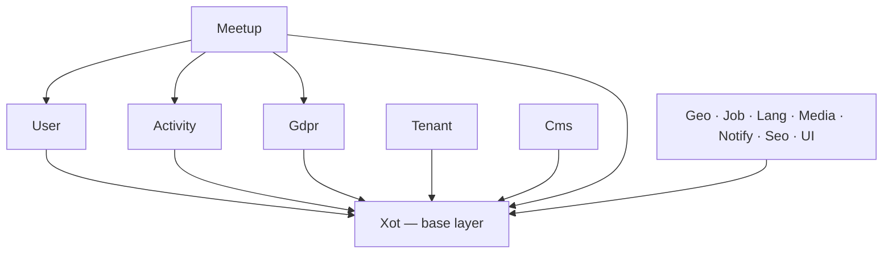
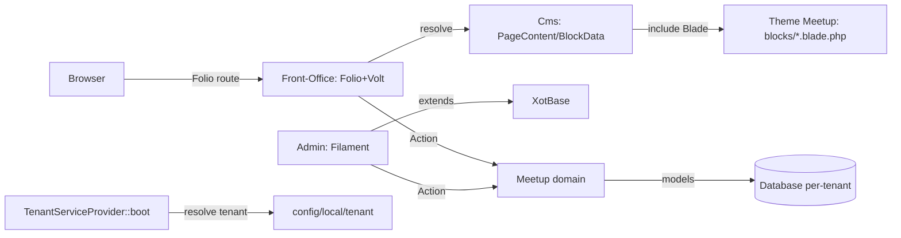

# Architecture Spine — LaravelPizza

## Design Paradigm

**Modular Monolith** via `nwidart/laravel-modules`: ogni dominio (Meetup, Cms, User, Tenant, Xot, Activity, Gdpr, Geo, Job, Lang, Media, Notify, Seo, UI) è un modulo Laravel indipendente sotto `laravel/Modules/{Nome}/app/{Actions,Datas,Filament,Models,Services}`.

Front-office e admin sono **due runtime separati sullo stesso codebase**:
- **Front-office**: Folio (routing file-based) + Volt (componenti dichiarativi) — nessun controller/route tradizionale. Il contenuto delle pagine pubbliche è **CMS-driven da JSON** (`config/local/{tenant}/database/content/pages/*.json`), risolto a runtime da `Modules\Cms\View\Components\PageContent` verso Blade component nel tema (`Themes/Meetup/resources/views/components/blocks/`).
- **Admin**: Filament, con ogni estensione obbligata a passare per l'astrazione `XotBase*` (`Modules\Xot\Filament\...`), mai le classi Filament dirette.

La business logic vive in **Action** (`Spatie\QueueableAction`), mai in Volt/Filament/controller — confermato nel codice (`RegisterAttendeeToEventAction`, `RegisterWidget::submit()`).

## Invariants & Rules

### AD-1 — Nessun controller/route tradizionale in front-office [ADOPTED]

- **Binds:** tutte le pagine pubbliche
- **Prevents:** la reintroduzione di `web.php`/controller per pagine che devono restare Folio+Volt+JSON, che romperebbe l'uniformità di routing e il modello CMS-driven
- **Rule:** ogni nuova pagina pubblica è un file JSON in `config/local/{tenant}/database/content/pages/` + (se serve un nuovo blocco) un Blade component in `Themes/Meetup/resources/views/components/blocks/`; mai un controller o una entry in `routes/web.php` per servire contenuto pubblico.

### AD-2 — XotBase obbligatorio per ogni estensione Filament [ADOPTED]

- **Binds:** tutti i moduli con superficie Filament
- **Prevents:** l'estensione diretta di `Filament\Resources\Resource`/`Page`/`Widget`, che rompe le convenzioni condivise (traduzioni, XotData, ecc.) già centralizzate in Xot
- **Rule:** ogni Resource/Page/Widget/ListRecords estende l'equivalente `Modules\Xot\Filament\...XotBase*`, mai la classe Filament nativa.

### AD-3 — Mutazione di stato solo via Action, un solo proprietario per invariante [ADOPTED + esteso]

- **Binds:** tutta la business logic (front-office e admin)
- **Prevents:** (a) logica di business inline in Volt/Livewire/Filament che diverge da modulo a modulo e non è riusabile/testabile in isolamento; (b) due Action che ricalcolano lo stesso invariante in modo indipendente e divergono nel tempo (es. "evento pieno" verificato sia in `RegisterAttendeeToEventAction` sia in una futura Action di promozione da lista d'attesa, con logiche leggermente diverse); (c) un percorso di mutazione che scavalca l'Action (es. `$record->update()` diretto da un Filament Resource su un'entità con invarianti) e quindi salta anche l'activity log
- **Rule:** ogni operazione che muta stato è una classe `Action` con `use Spatie\QueueableAction\QueueableAction` e metodo `execute()`; invarianti violati lanciano eccezioni di dominio (`DomainException` o sottoclassi), non `return false`/flag silenziose. Transazioni DB esplicite quando l'operazione tocca più tabelle. **Ogni invariante di business ha un solo metodo autorevole che lo verifica** (es. `Event::isFull()` è l'unica fonte di verità sulla capienza; ogni Action che deve controllarlo chiama questo metodo, non lo ricalcola). Per le entità che portano invarianti (Event, EventUser, Registration/Iscrizione), è vietata la mutazione diretta via `$record->update()`/`save()` da un Filament Resource: anche l'admin passa da un'Action.

### AD-4 — Direzione di dipendenza tra moduli

- **Binds:** tutti i moduli
- **Prevents:** dipendenze circolari introdotte inconsapevolmente da story future (oggi non esiste alcun tooling — deptrac o regola phpstan — che le impedisca automaticamente: è un rischio reale, non teorico)
- **Rule:** `Xot` non dipende da nessun altro modulo applicativo (è il layer di base). `User`, `Activity`, `Gdpr`, `Tenant` possono dipendere solo da `Xot`. `Meetup` può dipendere da `Xot`, `User`, `Activity`, `Gdpr`; non viceversa. `Cms` non dipende da `Meetup` (il rendering CMS è agnostico rispetto al dominio Meetup). **Regola di default per ogni modulo non esplicitamente nominato qui** (`Geo`, `Job`, `Lang`, `Media`, `Notify`, `Seo`, `UI`): è un modulo di supporto, può dipendere solo da `Xot`, mai da un modulo di dominio (`Meetup`, `Cms`) né da un altro modulo di supporto — questo chiude il caso in cui due story indipendenti introducano `Meetup→Seo` e `Seo→Meetup` restando ciascuna "conforme per omissione". Qualunque nuova dipendenza che violi questo grafo richiede un aggiornamento esplicito di questo AD, non un'eccezione silenziosa.



### AD-5 — Content block CMS: JSON come trusted input

- **Binds:** `Modules\Cms`, tema Meetup
- **Prevents:** l'introduzione non necessaria di un layer di validazione/whitelist se il modello di trust resta invariato (nessun editor pubblico/non tecnico modifica il JSON)
- **Rule:** la chiave `view` in un content block JSON è renderizzata direttamente (`BlockData` verifica solo `view()->exists($view)`, nessun registry type→view). Questo è accettato **solo finché** il JSON resta editabile esclusivamente da chi ha accesso a filesystem/deploy. **Gate esplicito, verificabile in code review**: qualunque Filament Resource o UI che permetta di modificare il campo `view`/content_blocks JSON tramite interfaccia admin (anche solo un textarea) invalida questo AD nel momento stesso in cui viene introdotta, e deve introdurre nella stessa PR un registry/whitelist dei tipi di blocco ammessi — non è accettabile shippare l'editing UI senza il registry "in un secondo momento".

### AD-6 — Autenticazione custom, non da package standard [ADOPTED]

- **Binds:** `Modules\User`, `Modules\Gdpr`
- **Prevents:** l'introduzione di un secondo meccanismo di auth (es. Breeze) in parallelo a quello esistente, che frammenterebbe il modello utente
- **Rule:** login/registrazione passano per widget Filament custom (`RegisterWidget` ecc.) integrati in pagine Folio, mai un package di scaffolding auth standard (Breeze/Fortify/Jetstream — nessuno dei tre è nel progetto).

### AD-7 — Multi-tenancy risolta a boot, non a middleware [ADOPTED]

- **Binds:** `Modules\Tenant`, tutti i moduli con config per-tenant
- **Prevents:** logica di risoluzione tenant duplicata in middleware o altrove, che divergerebbe dalla risoluzione già centralizzata
- **Rule:** l'unico punto di risoluzione tenant è `TenantServiceProvider::boot()` → `GetTenantNameAction`, che deriva il tenant da `config('app.url')`/`SERVER_NAME` matchando a ritroso una cartella `config/local/{tenant}`. Nuova logica tenant-aware si aggancia a questo, non lo duplica. **Questa risoluzione vale solo nel contesto HTTP/boot iniziale** (`SERVER_NAME` disponibile): qualunque Job in coda o Comando Artisan che deve operare su un tenant specifico **deve ricevere il tenant esplicitamente al dispatch** (es. come proprietà del Job), mai ri-derivarlo da `GetTenantNameAction` in un worker — un worker non ha `SERVER_NAME` e risolverebbe silenziosamente il tenant sbagliato (default/localhost).

### AD-9 — Risoluzione tema pubblico via configurazione tenant [ADOPTED]

- **Binds:** tutto il front-office
- **Prevents:** l'hardcoding di `Themes/Meetup` in un modulo o vista, che romperebbe la possibilità di servire tenant diversi con temi diversi dalla stessa codebase (CLAUDE.md la marca esplicitamente CRITICAL)
- **Rule:** il tema pubblico si ricava sempre dalla catena `APP_URL` → cartella tenant (`config/local/{tenant}`) → chiave `pub_theme` in `xra.php` → `Themes/{pub_theme}`; il namespace delle view è sempre `pub_theme::`, mai un riferimento diretto a `Themes\Meetup\...` o `Themes::` cablato nel codice.

### AD-8 — Una tabella, una migrazione [ADOPTED]

- **Binds:** tutti i moduli
- **Prevents:** più file `create_{table}_table.php` per la stessa tabella, che rompe la tracciabilità dello schema
- **Rule:** ogni tabella ha una sola migrazione di creazione (`XotBaseMigration` + `tableCreate()`); modifiche successive sono migrazioni `add_{column}_to_{table}.php` con `tableUpdate()`.

## Consistency Conventions

| Concern | Convention |
| --- | --- |
| Naming (entità, file, namespace) | PSR-4 per modulo (`Modules\{Nome}\...`); Action in `app/Actions/{Area}/{Verbo}{Entità}Action.php`; DTO in `app/Datas/` estendono `Spatie\LaravelData\Data` |
| Relazioni many-to-many | `belongsToManyX()` del trait `RelationX` (mai `belongsToMany()` nativo) |
| Traduzioni | Chiavi prefissate per modulo (`trans('meetup::events.title')`), mai stringhe hardcoded in Blade/Volt |
| Localizzazione URL | `LaravelLocalization::localizeUrl()`/`getCurrentLocale()`/`getLocalizedURL()` (mai costruzione manuale di URL localizzati) |
| SVG/icone | File `.svg` in `Modules/Meetup/resources/svg/`, mai inline in Blade; richiamati via `<x-filament::icon icon="meetup-{nome}" />` |
| Strict typing | `declare(strict_types=1);` in ogni file PHP; PHPStan livello 10 come gate di qualità |
| Service Provider | Struttura minimale (`$name`, `$module_dir`, `$module_ns`); mai un `boot()`/`register()` che chiama solo `parent::` |
| Errori/invarianti di business | Eccezioni di dominio dalle Action (AD-3), mai flag di ritorno silenziose |

## Stack

| Name | Version |
| --- | --- |
| PHP | ^8.2 |
| Laravel | ^12.0 |
| Filament | ^5.0 |
| Livewire | ^4.0 |
| Laravel Folio | * (installato) |
| Livewire Volt | * (installato) |
| nwidart/laravel-modules | ^12.0 |
| spatie/laravel-data | 4.20.0 |
| spatie/laravel-queueable-action | 2.17.0 |
| mcamara/laravel-localization | v2.3.0 |
| Tailwind CSS | 4.x (tema Meetup) |
| Alpine.js | (tema Meetup) |
| Pest | test framework di progetto |

## Structural Seed

```text
laravel/
  Modules/
    Xot/            # base layer: XotBase*, RelationX, helper condivisi
    User/            # autenticazione custom, profili
    Tenant/          # risoluzione multi-tenant, config per-tenant
    Activity/        # event sourcing / activity log
    Gdpr/            # consensi, RegisterWidget (auth+consenso)
    Cms/             # PageContent, BlockData, rendering JSON→Blade
    Meetup/          # dominio core: Event, EventUser, Actions/Event/*
    Geo, Job, Lang, Media, Notify, Seo, UI   # moduli di supporto
  Themes/
    Meetup/
      resources/
        views/
          pages/               # route Folio
          components/blocks/   # Blade component per i content block CMS
          filament/widgets/    # widget auth/registrazione custom
config/
  local/{tenant}/
    xra.php                    # pub_theme e config tenant-specifiche
    database/content/pages/*.json   # contenuto CMS front-office
```



## Capability → Architecture Map

| Capability / Area | Lives in | Governed by |
| --- | --- | --- |
| Amministrazione Eventi/Sedi/Relatori/Sponsor (PRD FR-1–4) | `Modules\Meetup\Filament\...` | AD-2, AD-3 |
| Scoperta pubblica Eventi (PRD FR-5–8) | `Themes/Meetup/resources/views/pages/events*` | AD-1 |
| Iscrizione (PRD FR-9–11) | `Modules\Meetup\Actions\Event\RegisterAttendeeToEventAction` | AD-3 |
| Pagine CMS (PRD FR-12–14) | `Modules\Cms\View\Components\PageContent`, `config/local/{tenant}/database/content/pages/*.json` | AD-1, AD-5 |
| Localizzazione (PRD FR-15–17) | tutti i moduli front-office | Convenzione "Localizzazione URL" |
| Qualità/Conformità (PRD FR-18–21) | tema Meetup, Seo module | Fuori scope di questa spine (vedi Deferred) |

## Deferred

- **Registry/whitelist dei tipi di content block CMS**: da introdurre solo se il modello di trust del JSON cambia (es. editor non tecnico) — vedi AD-5. Non necessario oggi.
- **Enforcement automatico dei confini tra moduli** (deptrac o regola phpstan custom per AD-4): non implementato; oggi la regola è documentata ma non verificata da tooling. Da valutare se le violazioni diventano ricorrenti.
- **Deployment & ambienti**: oggi il progetto gira solo in locale (`APP_URL=http://laravelpizza.local`, `APP_ENV=local`); questa spine non fissa un invariante di hosting/CI-CD perché non esiste ancora una decisione presa — resta una domanda aperta di prodotto (vedi PRD §8, Domanda Aperta #2), non un invariante architetturale da fissare ora.
- **Schema di validazione FR-19 (soglia WCAG)**: lo strumento/soglia esatti restano da fissare in fase tecnica (ereditato da PRD/UX come assumption), fuori dall'altitudine di questa spine.
- **Cleanup working tree non correlato all'architettura**: verificato che `origin/dev` (HEAD) è pulito, ma **402 file PHP in `laravel/Modules/` hanno marker di conflitto Git (`<<<<<<<`) nel working tree locale non committato**, inclusi file core come `XotBaseServiceProvider.php` — probabile esito di un merge risolto male e mai ripulito. Non è un invariante architetturale né un problema della storia del repo, ma va risolto prima di qualunque commit da questa cartella locale.
- **AD-4 (confini moduli)**: enforcement automatico non implementato. Se in futuro le violazioni diventano ricorrenti, valutare `deptrac` (ancora lo standard PHP) o `PHPArkitect` (alternativa PHP-nativa senza YAML, più coerente con la filosofia "tutto in PHP" del progetto).
- **Stack**: alcune righe (Folio, Volt, Alpine.js, Pest) non hanno una versione pinnata esplicita — rischio di stale drift al prossimo `composer update`; non bloccante ora, da rivedere se serve riproducibilità stretta.
