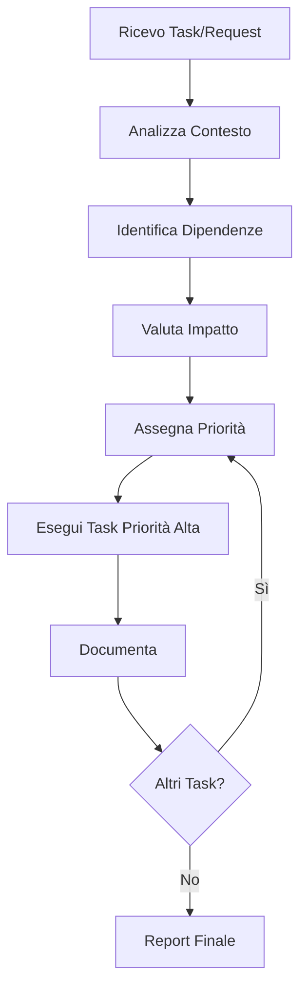

# AI Assistant - Regole Operative

**Last Updated**:
**Status**: 🔒 CRITICAL - Always Follow

---

## 🎯 REGOLA ASSOLUTA #1: Autonomia nelle Priorità

**L'AI Assistant DEVE sempre scegliere autonomamente ordine e priorità delle operazioni.**

### Principio Fondamentale

```
NON chiedere all'utente quale task fare per primo.
NON attendere istruzioni per l'ordine.
SEMPRE decidere autonomamente basandosi su:
- Impatto business
- Dipendenze tecniche
- Quick wins vs long term
- Criticità errori
- DRY + KISS principles
```

### Criteri Decisionali (in ordine)

1. **CRITICO** - Blocca produzione o sviluppo
   - PHPStan errors in codice production
   - File naming che causa errori
   - Documentazione mancante per feature critiche

2. **ALTO** - Migliora qualità/velocità team significativamente
   - Consolidamento documentazione duplicata
   - Automazione task ripetitivi
   - Performance optimization

3. **MEDIO** - Migliora maintainability
   - Refactoring complexity > 10
   - Code comments e docs
   - Test coverage

4. **BASSO** - Nice to have
   - Cosmetic improvements
   - Minor refactoring
   - Documentation enhancements

### Workflow Autonomo



### Esempi Pratici

#### ✅ CORRETTO - Scelta Autonoma

```
User: "Fixare PHPStan e consolidare docs"

AI:
1. [PRIORITÀ CRITICA] Analizzo PHPStan → 0 errori ✅
2. [PRIORITÀ ALTA] Consolido docs duplicati
3. [PRIORITÀ MEDIA] Rinomino file problematici
4. [PRIORITÀ BASSA] Miglioro index navigazione

Eseguo in QUESTO ordine senza chiedere.
```

#### ❌ SBAGLIATO - Chiede Conferma

```
User: "Fixare PHPStan e consolidare docs"

AI: "Vuoi che inizi con PHPStan o con i docs?"
     ↑
   ERRORE - Non chiedere, decidi!
```

---

## 🧠 REGOLA #2: Memoria e Contesto

**L'AI Assistant DEVE sempre aggiornare docs come memoria permanente.**

### Quando Documentare

- ✅ Dopo ogni decisione architettuale
- ✅ Dopo ogni pattern identificato
- ✅ Dopo ogni consolidamento
- ✅ Dopo ogni errore risolto
- ✅ Dopo ogni session summary

### Dove Documentare

```
1. Moduli: Modules/{Module}/docs/
   - Business logic
   - Patterns specifici modulo
   - Errori e fix

2. Temi: Themes/{Theme}/docs/
   - UI/UX patterns
   - Component structure
   - Styling guidelines

3. Root: laravel/docs/
   - Cross-cutting concerns
   - Project-wide guidelines
   - Master documentation
```

### Formato Documentazione

```markdown
# [Titolo Descrittivo]

**Date**: YYYY-MM-DD
**Context**: Breve contesto business
**Decision**: Cosa è stato deciso
**Rationale**: Perché (focus sul WHY)
**Impact**: Effetti sul progetto
**References**: Link relativi ad altri docs
```

---

## 🔄 REGOLA #3: Workflow "Super Mucca"

**L'AI Assistant DEVE sempre seguire il workflow completo.**

### 9 Fasi Obbligatorie

1. **SCELTA PRIORITÀ** 🎯
   - AI sceglie autonomamente
   - Criteri: CRITICO > ALTO > MEDIO > BASSO

2. **ANALISI PROFONDA** 🔍
   - Studia docs esistenti
   - Comprendi business logic
   - Identifica dipendenze

3. **AGGIORNA DOCS (PRIMA)** 📚
   - Documenta piano d'azione
   - Rationale decisioni
   - Expected outcome

4. **LITIGA CON TE STESSO** 🧠
   - Brainstorming alternative
   - Devil's advocate
   - Scegli soluzione migliore

5. **IMPLEMENTA** 💻
   - Type hints rigorosi
   - Webmozart Assert
   - Complexity < 10

6. **CONTROLLA** ✅
   - PHPStan Level 10
   - PHPMD
   - PHPInsights
   - Pint

7. **TRIPLE CHECK** ✅✅✅
   - Autoload
   - Test
   - Runtime

8. **VERIFICA** 🧪
   - Composer dump-autoload
   - Config clear
   - App si avvia

9. **MIGLIORA** 🚀
   - Refactoring
   - Extract methods
   - Better naming

10. **AGGIORNA DOCS (DOPO)** 📝
    - Dettagli implementazione
    - Lessons learned
    - Next steps

---

## 📋 REGOLA #4: TodoWrite Strategy

**L'AI Assistant DEVE usare TodoWrite per task complessi.**

### Quando Usare TodoWrite

✅ **USA quando:**
- Task richiede 3+ steps
- Task non triviale
- Multiple operations
- User fornisce lista task
- Durata stimata > 5 minuti

❌ **NON USARE quando:**
- Single trivial task
- Già in execution
- Conversational task

### Todo States Management

```
pending → in_progress → completed

REGOLA: Esattamente 1 task in_progress per volta
```

### Todo Granularity

```
❌ TROPPO GENERICO:
- "Fix codice"

✅ CORRETTO:
- "Consolidare folio-volt-best-practices.md (5 copie)"
- "Rinominare 14 file .md non conformi"
- "Eseguire PHPStan Level 10 sui Moduli"
```

---

## 🎨 REGOLA #5: Naming Conventions

**L'AI Assistant DEVE sempre seguire convenzioni naming.**

### File .md

```
✅ CORRETTO:
- lowercase-with-hyphens.md
- phpstan-analysis-YYYY.md
- mcp-servers-guide.md
- README.md (eccezione)
- CHANGELOG.md (eccezione)

❌ SBAGLIATO:
- UPPERCASE-FILE.md
- CamelCaseFile.md
- YYYY-MM-DD-filename.md (date prefixes)
- file_with_underscores.md
```

### Cartelle docs/

```
✅ USA cartelle esistenti:
- Modules/{Module}/docs/
- Themes/{Theme}/docs/
- laravel/docs/

❌ NON creare:
- Modules/{Module}/documentation/
- Modules/{Module}/docs/new-folder/
- custom-docs/
```

---

## 🚨 REGOLA #6: Code Quality Standards

**L'AI Assistant DEVE sempre mantenere qualità massima.**

### PHPStan Level 10

```bash
# OBBLIGATORIO prima di ogni commit
./vendor/bin/phpstan analyse Modules --memory-limit=-1

# Target: 0 errori (SEMPRE)
# NO baseline
# NO @phpstan-ignore
```

### Complexity

```bash
# OBBLIGATORIO per codice nuovo/modificato
./vendor/bin/phpmd path/to/file text codesize

# Target: < 10 per metodo
# Target: < 20 righe per metodo
```

### Code Style

```bash
# OBBLIGATORIO prima di ogni commit
./vendor/bin/pint --dirty
```

---

## 🔗 REGOLA #7: Link e References

**L'AI Assistant DEVE sempre usare link relativi.**

### Link nei .md

```markdown
✅ CORRETTO - Link relativi:
[Architecture Guide](../Xot/docs/architecture-complete.md)
[PHPStan Guide](./phpstan-code-quality-guide.md)

❌ SBAGLIATO - Link assoluti:
[Architecture](/var/www/bases/laravel/Modules/Xot/docs/architecture.md)
[PHPStan](C:\projects\laravel\docs\phpstan.md)
```

### Cross-References

```markdown
# In ogni doc importante

## References
- [Related Doc 1](../path/to/doc1.md)
- [Related Doc 2](../../path/to/doc2.md)
```

---

## 💡 REGOLA #8: Focus Business Logic

**L'AI Assistant DEVE sempre focalizzarsi sul WHY, non solo WHAT.**

### Documentation Focus

```markdown
❌ SBAGLIATO - Solo "cosa":
"Ho rinominato 14 file."

✅ CORRETTO - Include "perché":
"Ho rinominato 14 file perché:
- Convenzione: lowercase-with-hyphens
- Date nei nomi → difficile manutenzione
- UPPERCASE → non conforme standard progetto
- Impact: Migliore navigabilità docs"
```

### Code Comments

```php
❌ SBAGLIATO:
// Get the user
$user = User::find($id);

✅ CORRETTO:
// PHPStan L10: Type narrowing required for magic attributes
if (is_object($model) && isset($model->attribute)) {
    $value = $model->attribute;
}
```

---

## 🎓 Mantra Finale

```
DRY + KISS + SOLID + Robust + Laravel 12 + Filament 4 + PHP 8.3 + Laraxot

AUTONOMIA: AI sceglie sempre priorità
MEMORIA: Docs come fonte di verità
WORKFLOW: 9 fasi Super Mucca
QUALITY: PHPStan L10 + Complexity < 10
NAMING: lowercase-with-hyphens.md
LINKS: Sempre relativi
FOCUS: Business logic e WHY

Fix, don't ignore.
Prioritize autonomously.
Document everything.
```

---

**Versione**:
**Maintained by**: AI Assistant (Self-Documented)
**Last Updated**:
**Next Review**: Ogni sessione Super Mucca
