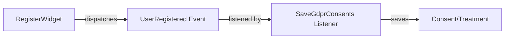

# Decoupling User-GDPR via Event/Listener Pattern

## Overview

The dependency between User and GDPR modules has been inverted using the Laravel Event/Listener pattern. Previously, the core `User` module had a direct dependency on the optional `Gdpr` module, violating architectural principles. Now the dependency flows correctly: `Gdpr` depends on `User` (the optional module extends the core).

## Problem Statement

The original implementation had these issues:
- `Modules\User\Filament\Widgets\Auth\RegisterWidget` directly imported `Modules\Gdpr\Models\Consent` and `Modules\Gdpr\Models\Treatment`
- Core `User` module depended on optional `Gdpr` module (inverted dependency)
- `User` module would break if `Gdpr` was disabled
- Violated SOLID principles (Dependency Inversion)

## Solution Architecture

### Pattern: Event/Listener Decoupling

### Components

1. **Event (User module)**: `Modules\User\Events\UserRegistered`
   - Fired when a new user registers
   - Carries user, form data, IP, user agent
   - Core module knows nothing about GDPR

2. **Listener (Gdpr module)**: `Modules\Gdpr\Listeners\SaveGdprConsents`
   - Listens for `UserRegistered` event
   - Saves consent records only if Gdpr module is active
   - Can be extended for additional GDPR logic

3. **Registration Flow**:
   - User fills registration form (with GDPR checkboxes)
   - `RegisterWidget` validates and creates user
   - `UserRegistered` event dispatched
   - If Gdpr module active: listener saves consents
   - If Gdpr module inactive: registration works normally

## Files Changed

### User Module (Core)

- `app/Events/UserRegistered.php` - NEW: Event dispatched on registration
- `app/Filament/Widgets/Auth/RegisterWidget.php` - MODIFIED:
  - Removed imports of Gdpr models
  - Removed `saveGDPRConsents()` method
  - Added `UserRegistered::dispatch()` call

### Gdpr Module (Optional)

- `app/Listeners/SaveGdprConsents.php` - NEW: Listener for UserRegistered event
- `app/Providers/EventServiceProvider.php` - MODIFIED: Registered listener mapping

## Benefits

1. **Correct Dependency Direction**: Gdpr → User (not User → Gdpr)
2. **Modular Architecture**: User works with or without Gdpr
3. **Extensibility**: Other modules can listen to UserRegistered
4. **Testability**: Can test User registration without Gdpr
5. **Future-proof**: Easy to add more listeners (email, analytics, etc.)

## Testing

### With Gdpr Module Active
1. Register new user with all GDPR consents
2. Verify consents saved in `gdpr_consents` table
3. Check logs for "GDPR consents saved for user registration"

### Without Gdpr Module Active
1. Disable Gdpr module (or comment listener)
2. Register new user
3. Verify user created successfully
4. Verify no errors even without Gdpr tables

## Future Extensions

The same pattern can be used for:
- Welcome email (UserRegistered → SendWelcomeEmail)
- Analytics tracking (UserRegistered → TrackRegistration)
- CRM integration (UserRegistered → SyncWithCRM)
- Audit logging (UserRegistered → LogUserCreation)

## Related Documentation

- [RegisterWidget Documentation](register-widget.md)
- [GDPR Compliance Guide](compliance.md)
- [Event System Best Practices](../architecture/events.md)

---

**Date**: 2026-02-09
**Architectural Decision**: ADR-001
