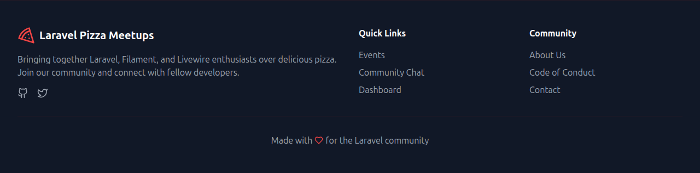
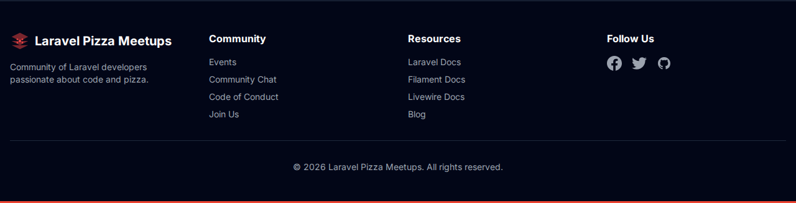

# Footer Logo Comparison: Production vs Local

This directory contains the visual comparison and technical analysis of the footer logo between the live production site and the local theme implementation.

## 🖼️ Screenshots

- **Production Site (Target)**: 
- **Local Site (Current)**: 

## 🔍 Identified Differences

### 1. Logo Icon
- **Production**: Uses a solid red pizza slice icon (fill-based).
- **Local**: Uses a red "layers" icon (three stacked diamonds). 
- **Action**: Replace the local SVG with the official pizza slice icon.

### 2. Branding Text
- **Production**: "Laravel Pizza Meetups" on a single line.
- **Local**: "Laravel Pizza Meetups" on a single line (consistent).
- **Note**: The header logo currently uses two lines, which should also be unified to a single line for total parity.

### 3. Navigation Links
- **Production**: "Quick Links" (Events, Community Chat, Dashboard) and "Community" (About Us, Code of Conduct, Contact).
- **Local**: "Community" (Events, Community Chat, Code of Conduct, Join Us) and "Resources".
- **Action**: Align column titles and link groupings to match the production information architecture.

### 4. Footer Bottom Bar
- **Production**: "Made with ❤️ for the Laravel community".
- **Local**: "© 2026 Laravel Pizza Meetups. All rights reserved."
- **Action**: Add the "Made with" credit line.

## 🛠️ Technical Reference
- **File to Modify**: `laravel/Themes/Meetup/resources/views/components/sections/footer.blade.php`
- **Component to Use**: `<x-ui.logo>` (must be updated to match production's SVG path).

---
*For more technical details, see [differenze-grafica-approfondimento](../../differenze-grafica-approfondimento.md)*
