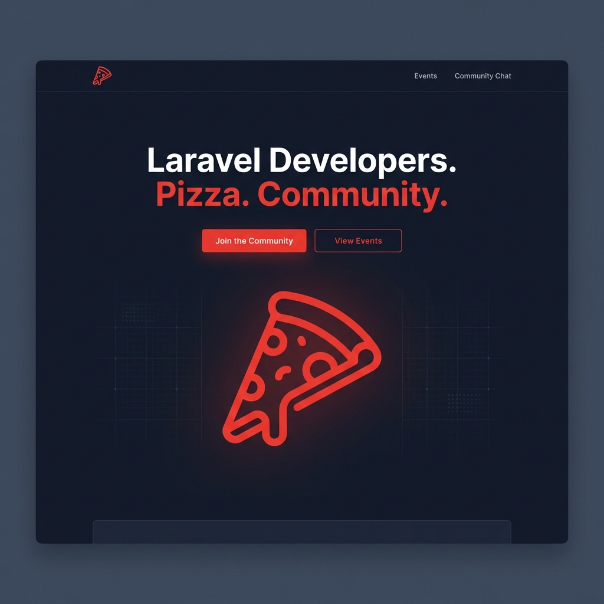

# Visual Parity Progress: Laravel Pizza

This document tracks our progress in achieving 1:1 visual parity between the local development environment (`http://127.0.0.1:8002/it`) and the live site (`https://laravelpizza.com/`).

## Current State Analysis

Based on previous agent reports and architectural analysis:
- **Layout**: `x-layouts.main` is correctly configured with `bg-slate-900` and `text-white`.
- **Issues Identified**:
  - `logo.svg` is returning 404.
  - Some components still use blue accents instead of the signature Laravel red (#dc2626).
  - Content in some sections might be using generic "Business feature" placeholders.

## Target State Mockup

We are aiming for a premium, high-fidelity reproduction of the original community site.

## Action Plan

### 1. Theme and Assets
- [x] Fix `logo.svg` path in `header.json`.
- [ ] Ensure all red accents use `#dc2626` (Tailwind `red-600`).
- [x] Run `npm run build && npm run copy` in `Themes/Meetup` to sync compiled assets.
- [x] Fix `Page` component translation logic for localized block arrays.

### 2. Content Alignment (JSON)
- [ ] Review `home.json` content blocks to ensure they focus on "Meetups", "Pizza", and "Community".
- [ ] Update `header.json` and `footer.json` with correct navigation links (Events, Community Chat).

### 3. Rendering Logic
- [ ] Verify `x-section` component in `Modules/Cms` handles dark theme specific data attributes.

---

> [!TIP]
> Always execute `npm run build && npm run copy` after modifying Tailwind classes in Blade files to ensure the public assets are updated.
