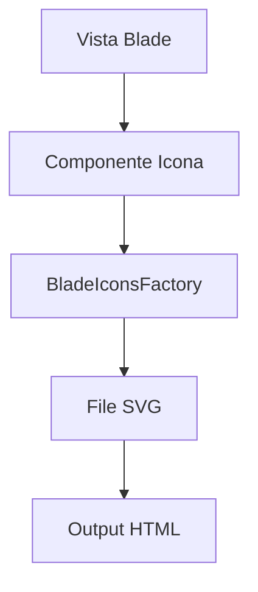

# Architettura Tecnica del Sistema

## Introduzione
Questo documento descrive l'architettura tecnica del sistema, con particolare attenzione al sistema di gestione delle icone Blade e alla sua integrazione nel framework Laravel.

## Componenti del Sistema

### Sistema di Icone Blade
Il sistema di icone Blade è un componente fondamentale che permette una gestione modulare e flessibile delle icone SVG. Per una comprensione completa, consultare:

1. [Documentazione del Modulo Xot](xot-module-documentation.md)
   - Panoramica generale del sistema
   - Struttura e organizzazione
   - Best practices

2. [Implementazione delle Icone](laravel/Modules/Xot/docs/custom-icons-implementation.md)
   - Dettagli tecnici di implementazione
   - Guide pratiche
   - Esempi di codice

3. [Registrazione delle Icone](laravel/Modules/Xot/docs/registerBladeIcons.md)
   - Processo di registrazione
   - Analisi del codice
   - Considerazioni filosofiche

## Architettura del Sistema

### Livelli di Astrazione
1. **Livello di Presentazione**
   - Viste Blade
   - Componenti
   - Icone SVG

2. **Livello di Servizio**
   - Service Provider
   - Factory Pattern
   - Dependency Injection

3. **Livello di Configurazione**
   - File di configurazione
   - Struttura delle directory
   - Gestione dei percorsi

## Flusso dei Dati

## Integrazione con Laravel
Il sistema si integra con Laravel attraverso:
1. Service Provider personalizzati
2. Sistema di view di Blade
3. Gestione delle configurazioni

## Best Practices Tecniche
1. **Modularità**
   - Separazione delle responsabilità
   - Componenti riutilizzabili
   - Struttura modulare

2. **Performance**
   - Ottimizzazione dei file SVG
   - Caching delle icone
   - Lazy loading

3. **Manutenibilità**
   - Documentazione completa
   - Codice pulito e organizzato
   - Test automatizzati

## Risorse Aggiuntive
- [Panoramica delle Blade Icons](laravel/Modules/Xot/docs/blade-icons-overview.md)
- [Documentazione del Modulo Xot](xot-module-documentation.md)
- [Implementazione delle Icone](laravel/Modules/Xot/docs/custom-icons-implementation.md)

## Conclusione
Questa architettura tecnica è stata progettata per:
1. Fornire una soluzione scalabile e manutenibile
2. Facilitare l'integrazione di nuove funzionalità
3. Garantire performance ottimali
4. Supportare lo sviluppo futuro 