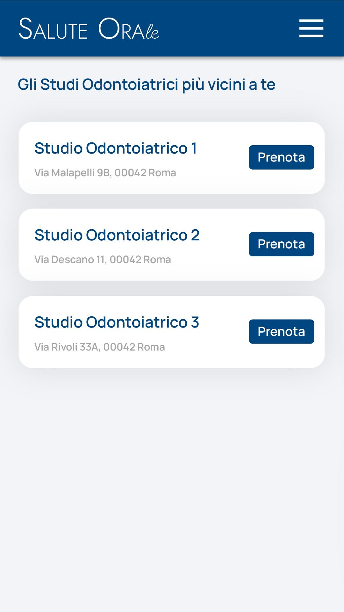

# Immagine 10

## Descrizione
Questa è l'immagine 10 dalla collezione di immagini. Quest'immagine potrebbe rappresentare contenuti relativi al progetto exabroker.

## Differenze tra versione Mobile e Desktop

### Versione Mobile
- Layout a singola colonna per ottimizzare lo spazio su schermi piccoli
- Immagine a piena larghezza per massimizzare la visibilità
- Elementi dell'interfaccia compatti e impilati verticalmente
- Font size ottimizzati per la lettura su dispositivi mobili

### Versione Desktop
- Layout a due colonne che sfrutta lo spazio orizzontale disponibile
- Immagine posizionata a sinistra (occupa 2/3 dello spazio)
- Pannello informativo a destra (occupa 1/3 dello spazio)
- Interfaccia più spaziosa con maggiori dettagli visibili contemporaneamente
- Navigazione più intuitiva grazie al maggiore spazio disponibile

## Note Tecniche
- L'immagine viene ridimensionata in modo responsivo per adattarsi alle diverse dimensioni dello schermo
- Vengono utilizzate media query CSS per alternare tra layout mobile e desktop
- Tailwind CSS è utilizzato per lo styling dell'interfaccia

# Analisi dell'interfaccia "Gli Studi Odontoiatrici più vicini a te"

## Descrizione dell'immagine mobile

L'interfaccia mostrata nell'immagine è una schermata mobile dell'applicazione "Salute Orale" che visualizza i risultati della ricerca di studi odontoiatrici. Gli elementi principali sono:

1. **Header**: Barra superiore blu scuro con il logo "SALUTE ORAle" a sinistra e un'icona menu a destra.
2. **Titolo**: "Gli Studi Odontoiatrici più vicini a te" che indica chiaramente il contenuto della pagina.
3. **Lista risultati**: Tre schede bianche con i dettagli degli studi odontoiatrici:
   - Nome dello studio (Studio Odontoiatrico 1, 2, 3)
   - Indirizzo completo (Via, numero civico, CAP, città)
   - Pulsante "Prenota" per ciascuno studio
4. **Sfondo**: Grigio chiaro che offre un buon contrasto con le schede bianche.

## Versione Desktop Immaginata

Per la versione desktop, propongo le seguenti modifiche ed estensioni:

1. **Layout a 2 colonne**:
   - Colonna sinistra: Lista degli studi odontoiatrici (60% della larghezza)
   - Colonna destra: Mappa interattiva che mostra la posizione degli studi elencati (40% della larghezza)

2. **Header espanso**:
   - Menu di navigazione completo invece dell'icona hamburger
   - Breadcrumb che mostra il percorso di navigazione (Home > Cerca > Risultati)
   - Opzione di filtro rapido nella parte superiore

3. **Schede risultati arricchite**:
   - Aggiunta di informazioni supplementari come:
     - Valutazione media (stelle)
     - Numero di recensioni
     - Orari di apertura
     - Specializzazioni disponibili
     - Distanza dalla posizione attuale
   - Miniatura dell'esterno dello studio o logo
   - Indicatore di disponibilità (es. "Prima disponibilità: domani alle 14:00")

4. **Filtri avanzati**:
   - Barra laterale a sinistra con opzioni di filtro per:
     - Distanza
     - Valutazione minima
     - Disponibilità (oggi, questa settimana)
     - Specializzazioni
     - Convenzioni con assicurazioni

5. **Funzionalità di ordinamento**:
   - Possibilità di ordinare i risultati per distanza, valutazione, disponibilità

6. **Footer**:
   - Informazioni di contatto
   - Link alle pagine informative
   - Cookie policy e privacy

## Consigli e Riflessioni

### Ottimizzazioni UX/UI

1. **Interattività e feedback**:
   - Le schede dei risultati hanno effetti hover che le sollevano leggermente, fornendo un feedback visivo
   - Le animazioni di ingresso progressive creano un effetto piacevole senza appesantire la pagina
   - I pulsanti "Prenota" cambiano stato al passaggio del mouse per aumentare il feedback visivo

2. **Accessibilità**:
   - Il contrasto tra testo e sfondo è ottimale per la leggibilità
   - I pulsanti principali sono sufficientemente grandi per una facile interazione su dispositivi touch
   - Andrebbero aggiunti attributi ARIA per supportare gli screen reader

3. **Geolocalizzazione e contesto**:
   - Implementare un indicatore che mostra come sono stati filtrati i risultati ("Risultati per: 00042 Roma")
   - Aggiungere un pulsante per modificare rapidamente i parametri di ricerca
   - Mostrare la distanza effettiva di ogni studio dalla posizione dell'utente

4. **Prenotazione semplificata**:
   - Il pulsante "Prenota" è ben visibile e posizionato strategicamente
   - Nella versione desktop, si potrebbe aggiungere una visualizzazione rapida degli slot disponibili

### Considerazioni tecniche

1. **Performance**:
   - Le animazioni SVG di sfondo sono leggere e non interferiscono con il caricamento principale
   - Le transizioni sui componenti interattivi utilizzano proprietà CSS ottimizzate (transform, opacity)
   - Caricamento progressivo degli elementi per dare priorità ai contenuti principali

2. **Responsive design**:
   - Le schede dei risultati si adattano elegantemente passando da layout orizzontale a verticale su schermi molto piccoli
   - La versione desktop mantiene la semplicità dell'interfaccia mobile aggiungendo contenuti contestuali

3. **Caching locale**:
   - Implementare il caching dei risultati della ricerca per consentire la consultazione offline
   - Salvare le ricerche recenti per un accesso rapido

4. **Metadati e SEO**:
   - Utilizzare schema.org per strutturare i dati degli studi dentistici
   - Implementare tag meta dinamici basati sui risultati della ricerca

### Miglioramenti suggeriti

1. **Informazioni ampliate**:
   - Aggiungere la possibilità di vedere foto degli interni degli studi
   - Mostrare i profili dei dentisti che operano nello studio
   - Indicare le tecnologie disponibili (radiografia digitale, laser, ecc.)

2. **Sistema di recensioni integrato**:
   - Consentire agli utenti di lasciare recensioni dopo gli appuntamenti
   - Mostrare recensioni verificate con badge speciali

3. **Integrazione calendario**:
   - Permettere di aggiungere direttamente l'appuntamento al calendario del dispositivo
   - Inviare promemoria automatici prima dell'appuntamento

4. **Percorsi e trasporti**:
   - Aggiungere indicazioni su come raggiungere lo studio con diversi mezzi di trasporto
   - Informazioni sui parcheggi disponibili nelle vicinanze

5. **Funzionalità social**:
   - Opzione per condividere uno studio con amici o familiari
   - Integrazione con app di messaggistica per inviare rapidamente l'indirizzo

La pagina dei risultati è un punto critico nell'esperienza utente di questa applicazione. Un buon design deve bilanciare la quantità di informazioni mostrate con la semplicità di comprensione e interazione. La versione attuale mobile è pulita ed efficace, mentre quella desktop può sfruttare lo spazio aggiuntivo per offrire più contenuti contestuali senza compromettere l'usabilità.