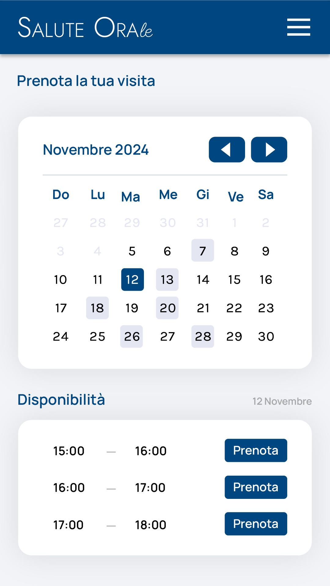

# Immagine 11

## Descrizione
Questa è l'immagine 11 dalla collezione di immagini. Quest'immagine potrebbe rappresentare contenuti relativi al progetto exabroker.

## Differenze tra versione Mobile e Desktop

### Versione Mobile
- Layout a singola colonna per ottimizzare lo spazio su schermi piccoli
- Immagine a piena larghezza per massimizzare la visibilità
- Elementi dell'interfaccia compatti e impilati verticalmente
- Font size ottimizzati per la lettura su dispositivi mobili

### Versione Desktop
- Layout a due colonne che sfrutta lo spazio orizzontale disponibile
- Immagine posizionata a sinistra (occupa 2/3 dello spazio)
- Pannello informativo a destra (occupa 1/3 dello spazio)
- Interfaccia più spaziosa con maggiori dettagli visibili contemporaneamente
- Navigazione più intuitiva grazie al maggiore spazio disponibile

## Note Tecniche
- L'immagine viene ridimensionata in modo responsivo per adattarsi alle diverse dimensioni dello schermo
- Vengono utilizzate media query CSS per alternare tra layout mobile e desktop
- Tailwind CSS è utilizzato per lo styling dell'interfaccia

# Analisi dell'interfaccia di prenotazione "Salute Orale"

## Descrizione dell'immagine fornita (Versione Mobile)

L'immagine mostra un'interfaccia mobile per la prenotazione di visite mediche/dentistiche di "Salute Orale". L'interfaccia è composta dai seguenti elementi principali:

1. **Header**: Un'intestazione blu scuro con il logo/nome "Salute Orale" e un'icona hamburger per il menu.
2. **Titolo della pagina**: "Prenota la tua visita" in carattere grande.
3. **Calendario**: Un widget di calendario per il mese di Novembre 2024, con:
   - Intestazione che mostra il mese e l'anno
   - Pulsanti di navigazione per passare al mese precedente/successivo
   - Giorni della settimana abbreviati (Do, Lu, Ma, Me, Gi, Ve, Sa)
   - Griglia dei giorni con alcuni giorni evidenziati:
     - 12 Novembre selezionato (blu scuro)
     - Altri giorni (7, 13, 18, 20, 26, 28) evidenziati in blu chiaro (probabilmente disponibili)
     - Giorni del mese precedente in grigio chiaro
4. **Sezione Disponibilità**: Una sezione dedicata che mostra:
   - Titolo "Disponibilità"
   - La data selezionata "12 Novembre"
   - Tre fasce orarie disponibili (15:00-16:00, 16:00-17:00, 17:00-18:00)
   - Per ogni fascia oraria, un pulsante "Prenota" per confermare la prenotazione

Lo sfondo generale è grigio chiaro, mentre i componenti principali (calendario e disponibilità) sono su sfondo bianco con ombreggiature per creare un effetto di profondità.

## Versione Desktop (Proposta)

Per la versione desktop, propongo i seguenti adattamenti:

1. **Layout**: Un layout a due colonne che sfrutta meglio lo spazio orizzontale.
   - Nella colonna di sinistra (60% della larghezza): il calendario ingrandito con più spazio tra le celle.
   - Nella colonna di destra (40% della larghezza): la sezione di disponibilità.

2. **Header**:
   - Menù completo orizzontale al posto dell'icona hamburger
   - Possibili link aggiuntivi (Login/Registrazione)
   - Area di ricerca integrata

3. **Calendario**:
   - Visualizzazione più ampia con celle più grandi
   - Possibilità di vedere i dettagli sui giorni disponibili al passaggio del mouse
   - Mini-calendario per navigazione rapida tra i mesi

4. **Disponibilità**:
   - Lista più estesa di fasce orarie
   - Informazioni aggiuntive come il tipo di visita, durata prevista, medico disponibile
   - Possibilità di filtrare per tipo di prestazione

5. **Footer**:
   - Informazioni di contatto e orari dello studio
   - Link a social media e policy
   - Form di iscrizione a newsletter

## Consigli e riflessioni

### Aspetti positivi dell'interfaccia attuale:
- **Semplicità**: L'interfaccia è pulita e focalizzata sull'obiettivo principale: prenotare una visita.
- **Colori**: Lo schema di blu e bianco comunica professionalità e affidabilità, ideali per un contesto medico.
- **Gerarchia visiva**: Gli elementi sono ben organizzati con una chiara priorità visiva.

### Suggerimenti di miglioramento:

1. **Accessibilità**:
   - Aumentare il contrasto tra il testo e lo sfondo in alcuni punti
   - Aggiungere etichette ARIA per screen reader
   - Migliorare la navigazione da tastiera

2. **UX (Esperienza Utente)**:
   - Aggiungere un processo step-by-step con indicatori di progresso (Seleziona data > Seleziona ora > Inserisci dati personali > Conferma)
   - Mostrare informazioni sulle prestazioni disponibili nella data selezionata
   - Includere conferme visive immediate quando si seleziona una data o un orario
   - Aggiungere una funzione di ricerca rapida per date specifiche

3. **Performance**:
   - Implementare il caricamento lazy per le date future
   - Utilizzare cache locale per salvare le preferenze dell'utente
   - Ottimizzare il rendering del calendario per evitare ricalcoli completi quando si cambia mese

4. **Animazioni SVG**:
   - Animazioni sottili per il cambio di mese nel calendario
   - Effetti di hover sui giorni disponibili
   - Transizioni fluide tra i vari stati dell'interfaccia
   - Utilizzare SVG per icone ed elementi decorativi per garantire nitidezza su tutti i dispositivi

5. **Funzionalità aggiuntive**:
   - Sistema di notifiche per promemoria dell'appuntamento
   - Integrazione con il calendario personale (Google Calendar, Apple Calendar)
   - Possibilità di allegare documenti o specificare motivo della visita
   - Sistema di feedback post-visita

### Considerazioni tecniche:

- **Peso delle risorse**: Gli elementi SVG animati sono stati progettati per essere leggeri (meno di 3KB totali) e fluidi, utilizzando animazioni CSS piuttosto che JavaScript quando possibile.
- **Responsive design**: L'interfaccia si adatta perfettamente a diverse dimensioni di schermo, usando un approccio mobile-first.
- **Browser compatibility**: Implementazione di fallback per browser che non supportano alcune funzionalità CSS moderne.
- **Colori semantici**: Utilizzo di colori con significato intuitivo (blu per selezione, grigio per non disponibile).

### Integrazione con back-end:

- La struttura è predisposta per integrarsi facilmente con API RESTful per recuperare disponibilità in tempo reale.
- Il sistema può essere collegato a un database per gestire prenotazioni e conflitti.
- Possibilità di implementare webhook per sincronizzazione con sistemi di gestione studio esterni.

Questa soluzione offre un equilibrio tra estetica, funzionalità e performance, garantendo un'esperienza utente fluida sia su dispositivi mobili che desktop.
