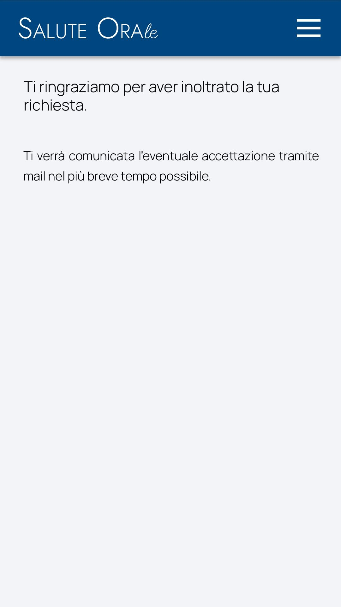

# Immagine 12

## Descrizione
Questa è l'immagine 12 dalla collezione di immagini. Quest'immagine potrebbe rappresentare contenuti relativi al progetto exabroker.

## Differenze tra versione Mobile e Desktop

### Versione Mobile
- Layout a singola colonna per ottimizzare lo spazio su schermi piccoli
- Immagine a piena larghezza per massimizzare la visibilità
- Elementi dell'interfaccia compatti e impilati verticalmente
- Font size ottimizzati per la lettura su dispositivi mobili

### Versione Desktop
- Layout a due colonne che sfrutta lo spazio orizzontale disponibile
- Immagine posizionata a sinistra (occupa 2/3 dello spazio)
- Pannello informativo a destra (occupa 1/3 dello spazio)
- Interfaccia più spaziosa con maggiori dettagli visibili contemporaneamente
- Navigazione più intuitiva grazie al maggiore spazio disponibile

## Note Tecniche
- L'immagine viene ridimensionata in modo responsivo per adattarsi alle diverse dimensioni dello schermo
- Vengono utilizzate media query CSS per alternare tra layout mobile e desktop
- Tailwind CSS è utilizzato per lo styling dell'interfaccia

# Analisi della pagina di conferma prenotazione "Salute Orale"

## Descrizione dell'immagine fornita (Versione Mobile)

L'immagine mostra una pagina di conferma dopo l'invio di una richiesta di prenotazione per il servizio "Salute Orale". La schermata mobile presenta:

1. **Header**: L'intestazione blu scuro con il logo/nome "Salute Orale" e un'icona hamburger per il menu.

2. **Messaggio di conferma**: Costituito da due paragrafi:
   - Un messaggio principale di ringraziamento: "Ti ringraziamo per aver inoltrato la tua richiesta."
   - Un messaggio informativo sul prossimo passo: "Ti verrà comunicata l'eventuale accettazione tramite mail nel più breve tempo possibile."

3. **Sfondo**: Uno sfondo grigio chiaro che occupa il resto della pagina.

La schermata è minimalista e focalizzata esclusivamente sul messaggio di conferma, senza altri elementi distrattivi o call-to-action.

## Versione Desktop (Proposta)

Per la versione desktop, propongo i seguenti miglioramenti e adattamenti:

1. **Layout**: Mantenere il layout centrato ma con una larghezza massima per il contenuto, garantendo una buona leggibilità anche su schermi grandi.

2. **Header**:
   - Menù completo orizzontale al posto dell'icona hamburger
   - Logo posizionato a sinistra e menù di navigazione a destra
   - Possibile aggiunta di un pulsante per l'accesso all'area riservata

3. **Sezione di conferma**:
   - Aggiunta di un'icona/animazione di spunta verde per confermare visivamente la ricezione della richiesta
   - Box contenitore con ombreggiatura per dare profondità
   - Maggiore spaziatura tra i componenti

4. **Informazioni aggiuntive**:
   - Sezione con informazioni di contatto dello studio
   - Timeline del processo di prenotazione (Richiesta inviata → Conferma via email → Visita)
   - FAQ comuni sul processo di prenotazione

5. **Call-to-action**:
   - Pulsante per tornare alla home
   - Opzione per aggiungere l'appuntamento al proprio calendario (anche se in attesa di conferma)
   - Link per modificare/cancellare la richiesta

6. **Footer**:
   - Informazioni di contatto e orari dello studio
   - Link a social media
   - Link a privacy policy e termini di servizio

## Consigli e riflessioni

### Aspetti positivi dell'interfaccia attuale:
- **Semplicità**: L'interfaccia è estremamente pulita e comunica chiaramente la conferma dell'invio della richiesta.
- **Chiarezza del messaggio**: Il testo è diretto e informa l'utente sul prossimo passo del processo.
- **Assenza di distrazioni**: Non ci sono elementi che possano confondere l'utente in questo momento critico della conversione.

### Suggerimenti di miglioramento:

1. **Feedback visivo**:
   - Aggiungere un'animazione o un'icona di spunta per confermare visivamente il successo dell'operazione
   - Utilizzare un colore distintivo (verde) per indicare il successo
   - Implementare un'animazione subtile per celebrare il completamento dell'azione

2. **Gestione delle aspettative**:
   - Fornire una stima dei tempi di attesa per la conferma via email
   - Aggiungere informazioni su cosa aspettarsi nella mail di conferma
   - Suggerire all'utente di controllare la cartella spam se non riceve la conferma

3. **Funzionalità aggiuntive**:
   - Possibilità di salvare un promemoria dell'appuntamento richiesto
   - Opzione per ricevere notifiche SMS come alternativa all'email
   - Riepilogo delle informazioni inviate nella richiesta

4. **Navigation path**:
   - Aggiungere un pulsante per tornare alla home o alla pagina dei servizi
   - Includere un breadcrumb per mostrare il percorso dell'utente
   - Fornire link ad altre pagine rilevanti (es. informazioni preparatorie per la visita)

5. **Animazioni SVG**:
   - Implementare elementi SVG animati sullo sfondo per un effetto visivamente più gradevole
   - Usare un'animazione per il checkmark che conferma l'invio riuscito
   - Animare gradualmente la comparsa del messaggio di conferma

### Considerazioni tecniche:

- **Peso della pagina**: Mantenere il peso totale della pagina sotto i 100KB per garantire un caricamento rapido.
- **Accessibilità**: Assicurarsi che i colori utilizzati abbiano contrasto sufficiente e che tutti gli elementi siano accessibili tramite tastiera e screen reader.
- **Responsive design**: La versione desktop dovrebbe adattarsi fluidamente a diverse dimensioni di schermo.
- **Browser compatibility**: Testare le animazioni SVG sui browser più diffusi, implementando fallback quando necessario.

### Elementi SVG animati proposti:

1. **Checkmark animato**:
   - Un cerchio che si disegna progressivamente
   - Seguito da un checkmark che appare al centro
   - L'animazione dovrebbe durare meno di 2 secondi per non rallentare la percezione dell'utente

2. **Elementi di sfondo**:
   - Forme geometriche in blu molto chiaro (quasi trasparenti)
   - Animazioni lente di fluttuazione o rotazione
   - Posizionate strategicamente per non interferire con il contenuto principale

3. **Pulsante interattivo**:
   - Un pulsante "Torna alla home" con effetti hover subtili
   - Feedback visivo al click attraverso un'animazione di compressione

### Integrazione con il processo di prenotazione:

- La pagina dovrebbe essere parte di un flusso coerente che include:
  1. Selezione del servizio desiderato
  2. Selezione di data e ora
  3. Inserimento dei dati personali
  4. Pagina di conferma (questa)
  5. Email di conferma definitiva

- Ogni passaggio dovrebbe mantenere lo stesso stile visivo e tone of voice per un'esperienza utente coerente.

Questa soluzione per la pagina di conferma mantiene la semplicità dell'originale, aggiungendo elementi visivi e funzionali che migliorano l'esperienza utente e forniscono maggiori informazioni, mantenendo al contempo un design pulito e professionale adatto a un contesto medico.
