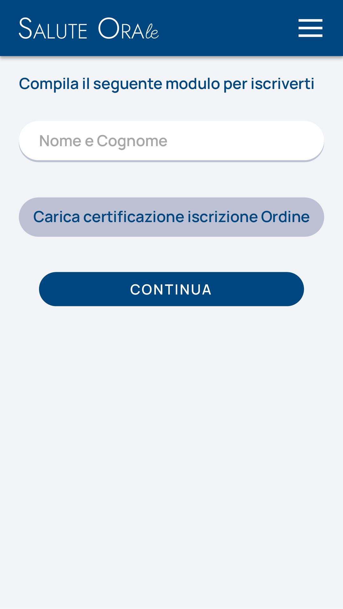

# Immagine 13

## Descrizione
Questa è l'immagine 13 dalla collezione di immagini. Quest'immagine potrebbe rappresentare contenuti relativi al progetto exabroker.

## Differenze tra versione Mobile e Desktop

### Versione Mobile
- Layout a singola colonna per ottimizzare lo spazio su schermi piccoli
- Immagine a piena larghezza per massimizzare la visibilità
- Elementi dell'interfaccia compatti e impilati verticalmente
- Font size ottimizzati per la lettura su dispositivi mobili

### Versione Desktop
- Layout a due colonne che sfrutta lo spazio orizzontale disponibile
- Immagine posizionata a sinistra (occupa 2/3 dello spazio)
- Pannello informativo a destra (occupa 1/3 dello spazio)
- Interfaccia più spaziosa con maggiori dettagli visibili contemporaneamente
- Navigazione più intuitiva grazie al maggiore spazio disponibile

## Note Tecniche
- L'immagine viene ridimensionata in modo responsivo per adattarsi alle diverse dimensioni dello schermo
- Vengono utilizzate media query CSS per alternare tra layout mobile e desktop
- Tailwind CSS è utilizzato per lo styling dell'interfaccia

# Analisi dell'interfaccia di registrazione "Salute Orale"

## Descrizione dell'immagine mobile

L'immagine mostra un'interfaccia mobile per la registrazione alla piattaforma "Salute Orale". L'interfaccia presenta i seguenti elementi:

1. **Header**: Un'intestazione con il logo "SALUTE ORAle" in bianco su sfondo blu scuro, con un pulsante menu (hamburger) nell'angolo superiore destro.
2. **Titolo**: "Compila il seguente modulo per iscriverti" in blu scuro.
3. **Form di registrazione** con:
   - Campo di input per "Nome e Cognome" (campo di testo con bordi arrotondati)
   - Pulsante grigio "Carica certificazione iscrizione Ordine" (per caricare documenti)
   - Pulsante blu scuro "CONTINUA" (call-to-action principale)
4. **Sfondo**: Sfondo grigio chiaro con una "wave" blu nella parte superiore che crea un effetto ondulato.

## Versione Desktop (proiezione)

Per la versione desktop, consiglierei le seguenti modifiche:

1. **Layout**:
   - Mantenere l'header con il logo a sinistra e il menu completo (non hamburger) a destra
   - Posizionare il form al centro della pagina con una larghezza massima (max-width)
   - Aumentare leggermente le dimensioni dei campi e dei pulsanti
   - Aggiungere più spazio tra gli elementi (padding/margin)

2. **Navigazione**:
   - Sostituire il menu hamburger con una barra di navigazione orizzontale
   - Aggiungere link rapidi come "Chi siamo", "Contatti", "FAQ"

3. **Form**:
   - Mantenere la stessa disposizione verticale del form
   - Potenzialmente aggiungere campi aggiuntivi (email, telefono) se necessari
   - Aggiungere tooltips o informazioni di aiuto per i campi più complessi

4. **Background**:
   - Estendere l'effetto onda su tutta la larghezza dello schermo
   - Considerare l'aggiunta di elementi decorativi ai lati del form

## Consigli e riflessioni

### Aspetti positivi
1. **Design pulito**: L'interfaccia è minimalista e focalizzata sull'obiettivo principale (la registrazione).
2. **Colori coerenti**: La palette blu/bianco/grigio trasmette professionalità e affidabilità, appropriata per un servizio medico.
3. **Call-to-action chiara**: Il pulsante "CONTINUA" è ben visibile e posizionato correttamente.
4. **Elementi arrotondati**: I bordi arrotondati degli input e pulsanti rendono l'interfaccia più moderna e accogliente.

### Suggerimenti di miglioramento

1. **Feedback visivo**:
   - Aggiungere animazioni o transizioni sui pulsanti per migliorare il feedback all'interazione
   - Implementare validazione del form in tempo reale con indicatori visivi

2. **Accessibilità**:
   - Aumentare il contrasto tra testo e sfondo in alcuni elementi
   - Aggiungere etichette (label) esplicite per i campi di input
   - Implementare messaggi di errore chiari e accessibili

3. **UX enhancements**:
   - Aggiungere un indicatore di progresso per i form multi-step
   - Implementare un uploader drag-and-drop per i documenti
   - Aggiungere un tooltip o info-button che spieghi quali certificati sono accettati

4. **Performance**:
   - Ottimizzare l'animazione SVG dello sfondo per dispositivi a basse prestazioni
   - Implementare caricamento lazy per risorse non critiche
   - Minimizzare il CSS e JavaScript per migliorare il tempo di caricamento

5. **Branding**:
   - Considerare l'aggiunta di un logo o icona più distintiva
   - Mantenere coerenza visiva con altri materiali del brand

## Note tecniche
- L'animazione SVG dell'onda è stata implementata con CSS keyframes per garantire fluidità
- Si è optato per un approccio minimalista al JavaScript per massimizzare le performance
- L'utilizzo di bordi completamente arrotondati (rounded-full) crea un design coeso e moderno
- La scelta di Tailwind CSS consente una rapida iterazione e personalizzazione del design