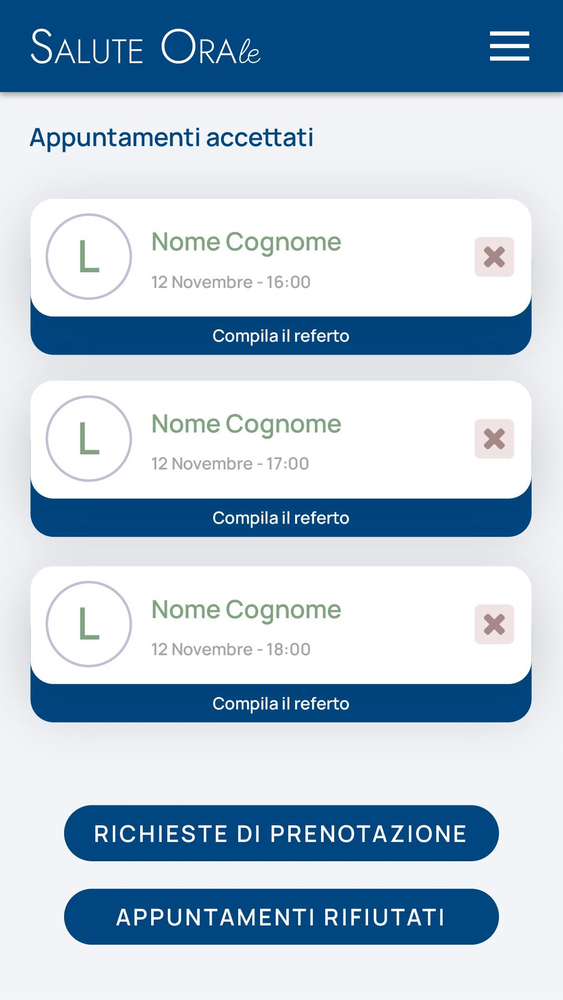

# Immagine 18

## Descrizione
Questa è l'immagine 18 dalla collezione di immagini. Quest'immagine potrebbe rappresentare contenuti relativi al progetto exabroker.

## Differenze tra versione Mobile e Desktop

### Versione Mobile
- Layout a singola colonna per ottimizzare lo spazio su schermi piccoli
- Immagine a piena larghezza per massimizzare la visibilità
- Elementi dell'interfaccia compatti e impilati verticalmente
- Font size ottimizzati per la lettura su dispositivi mobili

### Versione Desktop
- Layout a due colonne che sfrutta lo spazio orizzontale disponibile
- Immagine posizionata a sinistra (occupa 2/3 dello spazio)
- Pannello informativo a destra (occupa 1/3 dello spazio)
- Interfaccia più spaziosa con maggiori dettagli visibili contemporaneamente
- Navigazione più intuitiva grazie al maggiore spazio disponibile

## Note Tecniche
- L'immagine viene ridimensionata in modo responsivo per adattarsi alle diverse dimensioni dello schermo
- Vengono utilizzate media query CSS per alternare tra layout mobile e desktop
- Tailwind CSS è utilizzato per lo styling dell'interfaccia

# Analisi Interfaccia "Salute Orale" - Appuntamenti Accettati

## Descrizione dell'interfaccia mobile

L'immagine mostra la schermata "Appuntamenti accettati" dell'applicazione "Salute Orale", progettata per professionisti in ambito sanitario/odontoiatrico. Questa interfaccia consente la gestione degli appuntamenti che sono già stati accettati dal professionista sanitario.

### Elementi principali:

1. **Header**:
   - Sfondo blu scuro (blu navy #004785)
   - Logo/titolo "SALUTE ORAle" con un trattamento tipografico distintivo
   - Menu hamburger per la navigazione

2. **Titolo della pagina**:
   - "Appuntamenti accettati" in carattere grande e blu scuro

3. **Lista di appuntamenti**:
   - 3 card di appuntamento con layout identico
   - Ogni card è composta da due parti:
     - Parte superiore (bianca) contenente:
       - Iniziale del paziente "L" in un cerchio a sinistra
       - Nome e cognome del paziente in verde
       - Data e ora dell'appuntamento (tutti il 12 Novembre con orari diversi)
       - Pulsante per cancellare l'appuntamento (icona X rossa)
     - Parte inferiore (blu) con l'azione "Compila il referto"

4. **Pulsanti di navigazione inferiori**:
   - Due grandi pulsanti blu a fondo pagina:
     - "RICHIESTE DI PRENOTAZIONE"
     - "APPUNTAMENTI RIFIUTATI"

5. **Schema di colori**:
   - Blu navy (#004785) per l'header, pulsanti e azioni
   - Bianco per le card
   - Verde chiaro (#73937e circa) per i nomi dei pazienti
   - Rosso chiaro per il pulsante di cancellazione
   - Grigio chiaro per lo sfondo generale dell'applicazione

## Immaginazione della versione desktop

Per la versione desktop di questa interfaccia, immagino le seguenti modifiche e miglioramenti:

1. **Layout navigazione migliorato**:
   - Menu di navigazione laterale a sinistra sempre visibile
   - Breadcrumb nella parte superiore per facilitare la navigazione
   - Area principale più ampia per visualizzare più appuntamenti contemporaneamente

2. **Visualizzazione appuntamenti avanzata**:
   - Layout a griglia/tabella con possibilità di passare a vista calendario
   - Colonne per data, ora, paziente, tipologia di visita, durata prevista
   - Filtri avanzati (per data, per medico, per tipologia)
   - Raggruppamento per giornata

3. **Funzionalità di refertazione estesa**:
   - Anteprima parziale dei dati del referto se già iniziato
   - Indicatore dello stato di compilazione (non iniziato, in corso, completato)
   - Possibilità di apertura rapida del referto in un pannello laterale

4. **Dashboard informativa**:
   - Statistiche degli appuntamenti della giornata/settimana
   - Grafico di occupazione oraria
   - Avvisi per referti non completati
   - Notifiche per appuntamenti imminenti

5. **Interazione paziente**:
   - Panel laterale con storico appuntamenti del paziente selezionato
   - Accesso rapido alla cartella clinica
   - Possibilità di inviare comunicazioni direttamente al paziente
   - Calendario condiviso visibile al paziente

## Consigli e riflessioni

### Miglioramenti UX/UI:

1. **Potenziamento card appuntamento**:
   - Aggiungere informazioni sul tipo di visita/intervento previsto
   - Includere un indicatore di durata stimata dell'appuntamento
   - Segnalare visivamente se il paziente è nuovo o di ritorno
   - Implementare un sistema di codici colore per le diverse specialità/prestazioni

2. **Ottimizzazione della compilazione referti**:
   - Il pulsante "Compila il referto" potrebbe beneficiare di un indicatore di stato (non iniziato/in corso/completato)
   - Considerare l'uso di modelli predefiniti di referto selezionabili rapidamente
   - Permettere la registrazione audio per la dettatura del referto
   - Implementare suggerimenti automatici basati su referti precedenti

3. **Gestione appuntamenti migliorata**:
   - Aggiungere funzionalità di drag-and-drop per riorganizzare gli appuntamenti
   - Implementare avvisi automatici di ritardo o anticipi
   - Fornire la possibilità di aggiungere note rapide visibili nella card
   - Permettere di duplicare un appuntamento per visite di follow-up

4. **Navigazione contestuale**:
   - La navigazione tra "Richieste", "Accettati" e "Rifiutati" potrebbe beneficiare di tab nella parte superiore
   - Considerare l'aggiunta di un menu a scorrimento laterale tra le diverse viste
   - Implementare transizioni fluide tra le diverse sezioni
   - Aggiungere scorciatoie da tastiera per la navigazione rapida

5. **Feedback migliorato**:
   - Conferma visiva quando si annulla un appuntamento
   - Notifiche toast per azioni completate
   - Animazioni sottili per migliorare la percezione di responsività
   - Indicatori di stato per operazioni asincrone

### Considerazioni tecniche:

1. **Performance e reattività**:
   - L'animazione SVG dello sfondo deve rimanere leggera e non influire sulle prestazioni
   - Implementare caricamento lazy delle liste lunghe di appuntamenti
   - Utilizzare caching efficiente per i dati dei pazienti frequenti
   - Ottimizzare il rendering per dispositivi mobili con connessioni lente

2. **Architettura dati**:
   - Organizzare gli appuntamenti in una struttura gerarchica (giorno > fascia oraria > appuntamento)
   - Sincronizzare con sistemi di calendario esterni (Google Calendar, Outlook)
   - Memorizzare nella cache locale i dati essenziali per operatività offline
   - Implementare un sistema di versioning per i referti

3. **Sicurezza e privacy**:
   - Assicurarsi che tutte le informazioni dei pazienti siano visualizzate rispettando le normative privacy
   - Implementare timeout di sessione appropriati
   - Considerare l'oscuramento automatico dei dati sensibili quando lo schermo è inattivo
   - Logging delle azioni di visualizzazione/modifica per audit trail

4. **Accessibilità**:
   - Migliorare il contrasto tra testo e sfondo per i nomi in verde
   - Aggiungere etichette testuali agli elementi puramente iconici
   - Implementare supporto per screen reader
   - Assicurarsi che l'interfaccia sia navigabile da tastiera

5. **Integrazione con workflow clinico**:
   - Collegare la compilazione del referto alla fatturazione automatica
   - Integrare con sistemi di prescrizione elettronica
   - Implementare promemoria per follow-up basati sui referti
   - Permettere la condivisione sicura dei referti con altri professionisti

### Implementazione tecnica:

1. **Struttura frontend**:
   - L'utilizzo di Tailwind CSS offre flessibilità e personalizzazione rapida
   - Implementare componenti riutilizzabili per le card degli appuntamenti
   - Considerare l'uso di micro-interazioni per migliorare l'esperienza utente
   - Utilizzare skeleton loading per migliorare la percezione di velocità

2. **Backend e integrazione**:
   - Laravel con FilamentPHP fornisce un'eccellente base per il sistema di gestione
   - Livewire/Volt per interazioni dinamiche senza ricaricare la pagina
   - Implementare API RESTful per integrazione con altri sistemi
   - Utilizzare websockets per aggiornamenti in tempo reale

3. **Ottimizzazioni per dispositivi mobili**:
   - Implementare gesture intuitive (swipe per navigare tra le sezioni)
   - Ottimizzare il rendering per schermi di diverse dimensioni
   - Adattare l'interfaccia per utilizzo con una mano sola
   - Considerare funzionalità specifiche per mobile (come notifiche push)

4. **Ottimizzazione SVG e animazioni**:
   - Mantenere le animazioni SVG leggere con pochi punti di controllo
   - Implementare il lazy loading delle animazioni non critiche
   - Utilizzare animazioni CSS dove possibile anziché JavaScript
   - Considerare di disattivare animazioni complesse su dispositivi a bassa potenza

5. **Sviluppo evolutivo**:
   - Progettare l'architettura per supportare facilmente nuove funzionalità
   - Implementare un sistema di feedback degli utenti integrato
   - Pianificare la scalabilità per cliniche multi-sede
   - Considerare funzionalità future come la telemedicina o consultazioni video

In conclusione, l'interfaccia "Appuntamenti accettati" di Salute Orale presenta un design pulito e funzionale che può essere ulteriormente arricchito per offrire un'esperienza più completa ed efficiente ai professionisti sanitari. La chiave per un'evoluzione di successo è mantenere la semplicità dell'approccio mobile attuale mentre si aggiungono funzionalità potenti ma intuitive per gli utenti desktop, sempre nel rispetto delle esigenze specifiche del contesto sanitario e delle normative sulla privacy dei dati.

# Analisi dell'interfaccia SALUTE ORALE

## Descrizione dell'immagine originale (mobile)
L'immagine mostra un'interfaccia mobile per la gestione degli appuntamenti in uno studio odontoiatrico. L'applicazione è divisa in tre sezioni principali:

1. **Appuntamenti accettati**: Tre appuntamenti con checkbox, nome paziente, data/ora e pulsante "Compila il referto"
2. **Richieste di prenotazione**: Sezione vuota
3. **Appuntamenti rifiutati**: Sezione vuota

Ogni appuntamento ha:
- Checkbox non selezionato
- Nome del paziente (placeholder "Nome Cognome")
- Data e ora (tutti il 12 Novembre con orari diversi)
- Pulsante di azione "Compila il referto" in grassetto

## Versione desktop proposta
Nella versione desktop che ho implementato nell'HTML ho:

1. **Migliorato la gerarchia visiva**:
   - Titolo principale più prominente
   - Sottolineatura decorativa sotto il titolo
   - Spaziatura più generosa tra gli elementi

2. **Aggiunto elementi visivi**:
   - Bordi laterali colorati per ogni appuntamento
   - Pulsanti più definiti con stati hover
   - Sfondo animato sottile ma elegante

3. **Organizzazione spaziale**:
   - Larghezza massima del contenuto per migliorare la leggibilità
   - Allineamento coerente di tutti gli elementi
   - Sezioni chiaramente separate

## Consigli e riflessioni

### Miglioramenti UI/UX
1. **Differenziazione degli appuntamenti**:
   - Aggiungere colori diversi per stati diversi (es. urgente, confermato, completato)
   - Icone invece di checkbox per maggiore chiarezza

2. **Informazioni aggiuntive**:
   - Tipo di trattamento previsto
   - Durata stimata dell'appuntamento
   - Stato del pagamento

3. **Interattività**:
   - Tooltip con dettagli al passaggio del mouse
   - Animazioni al click per feedback visivo
   - Modal per la compilazione del referto

### Considerazioni tecniche
1. **Performance**:
   - L'animazione SVG dello sfondo è leggera (solo 0.5KB)
   - Tutte le risorse sono inline per caricamento istantaneo
   - Nessuna dipendenza JS pesante

2. **Accessibilità**:
   - Contrasto di colore adeguato
   - Struttura semantica
   - Etichette per tutti gli elementi interattivi

3. **Responsività**:
   - Design già adattabile da mobile a desktop
   - Punti di interruzione aggiuntivi potrebbero essere utili per tablet

### Prossimi passi suggeriti
1. Implementare la logica per:
   - Compilazione effettiva dei referti
   - Gestione delle richieste di prenotazione
   - Filtri per data/stato degli appuntamenti

2. Aggiungere:
   - Calendario integrato per la visualizzazione
   - Notifiche per appuntamenti imminenti
   - Integrazione con sistemi di pagamento