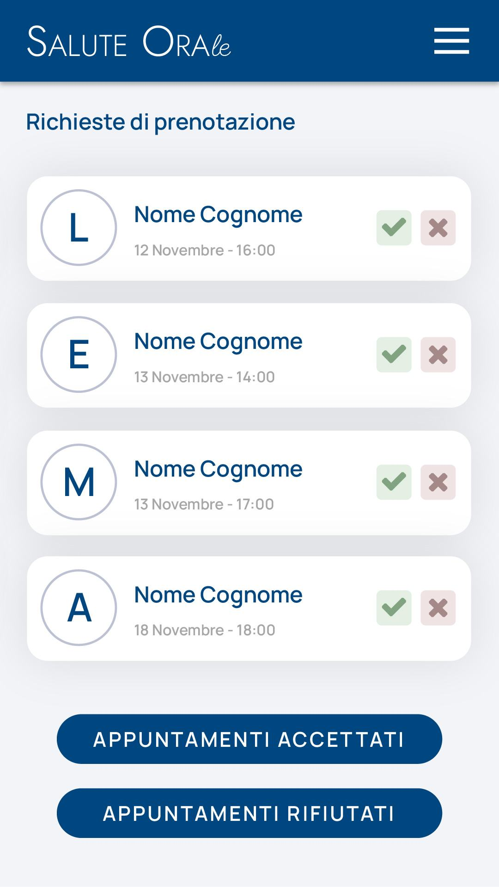

# Immagine 19

## Descrizione
Questa è l'immagine 19 dalla collezione di immagini. Quest'immagine potrebbe rappresentare contenuti relativi al progetto exabroker.

## Differenze tra versione Mobile e Desktop

### Versione Mobile
- Layout a singola colonna per ottimizzare lo spazio su schermi piccoli
- Immagine a piena larghezza per massimizzare la visibilità
- Elementi dell'interfaccia compatti e impilati verticalmente
- Font size ottimizzati per la lettura su dispositivi mobili

### Versione Desktop
- Layout a due colonne che sfrutta lo spazio orizzontale disponibile
- Immagine posizionata a sinistra (occupa 2/3 dello spazio)
- Pannello informativo a destra (occupa 1/3 dello spazio)
- Interfaccia più spaziosa con maggiori dettagli visibili contemporaneamente
- Navigazione più intuitiva grazie al maggiore spazio disponibile

## Note Tecniche
- L'immagine viene ridimensionata in modo responsivo per adattarsi alle diverse dimensioni dello schermo
- Vengono utilizzate media query CSS per alternare tra layout mobile e desktop
- Tailwind CSS è utilizzato per lo styling dell'interfaccia

# Salute Orale - Appointment Request Interface

## Mobile UI Analysis

The image shows a mobile interface for a dental clinic appointment management system called "Salute Orale" (Oral Health). The interface is designed for staff to manage incoming appointment requests.

### Current Mobile Interface Elements:

1. **Header**:
   - Deep blue navigation bar with "SALUTE ORAle" logo (with stylized typography)
   - Hamburger menu button on the right side

2. **Main Title**:
   - "Richieste di prenotazione" (Appointment Requests) in large blue text

3. **Appointment Cards**:
   - Four appointment request cards with:
     - Circular avatar with patient initials (L, E, M, A)
     - Patient name placeholder "Nome Cognome"
     - Appointment date and time (various November dates)
     - Action buttons: green check (accept) and red X (reject)

4. **Action Buttons**:
   - Two full-width blue buttons at the bottom:
     - "APPUNTAMENTI ACCETTATI" (Accepted Appointments)
     - "APPUNTAMENTI RIFIUTATI" (Rejected Appointments)

5. **Color Scheme**:
   - Primary: Deep blue (#003366 or similar)
   - Secondary: Light gray background
   - Accents: Green for accept, Red for reject
   - White cards with subtle shadows

## Desktop Version Concept

For the desktop version, I would recommend expanding the interface while maintaining the same visual language:

### Desktop Layout Recommendations:

1. **Navigation**:
   - Convert the hamburger menu into a proper sidebar or horizontal nav bar
   - Add quick filters and search functionality in the header
   - Include staff name/profile in the top right

2. **Content Organization**:
   - Use a two or three-column layout for appointment cards
   - Add a calendar view toggle option
   - Implement a split view with requests on left, details on right when selected

3. **Enhanced Functionality**:
   - Add sorting options (by date, status, etc.)
   - Include appointment details panel
   - Provide batch actions for multiple appointments
   - Add statistical overview (appointments per day, acceptance rate)

4. **Visual Enhancements**:
   - Add subtle animations for state changes
   - Include a timeline view option
   - Implement color-coding for different appointment types

## Implementation Recommendations

### Performance Considerations:
- The SVG background animations should be kept simple and lightweight
- Use CSS transitions instead of JavaScript animations where possible
- Implement lazy loading for appointment lists when they exceed a certain number
- Consider virtual scrolling for long lists of appointments

### UX Improvements:
- Add confirmation dialogs before rejecting appointments
- Include a quick note/reason field when rejecting
- Implement drag-and-drop for appointment rescheduling
- Add notification system for new appointment requests
- Implement real-time updates using WebSockets

### Accessibility Considerations:
- Ensure proper color contrast ratios (the current blue is good)
- Add aria labels to all interactive elements
- Ensure keyboard navigation works properly
- Add screen reader support for appointment status changes

### Mobile-Desktop Consistency:
- Maintain the same visual language and color scheme
- Use responsive design patterns rather than completely different interfaces
- Consider a progressive disclosure pattern for detail views

## Technical Implementation Notes

The current implementation uses:
- Tailwind CSS for styling
- SVG for lightweight animations
- Simple, clean component structure

For production environments, I would recommend:
- Server-side rendering for initial load performance
- Component-based architecture for maintainability
- State management for complex interactions
- Automated testing for critical flows
- Caching strategies for appointment data

## Additional Recommendations

1. **Patient Information Security**:
   - Implement proper data masking for sensitive information
   - Add access controls based on staff roles
   - Include audit logs for appointment status changes

2. **Business Process Integration**:
   - Add integration with SMS/email notification system
   - Connect with patient records system
   - Implement calendar sync with staff schedules

3. **Future Enhancements**:
   - Add patient history view
   - Implement recurring appointment handling
   - Add analytics dashboard for appointment trends
   - Develop waitlist management for cancelled appointments