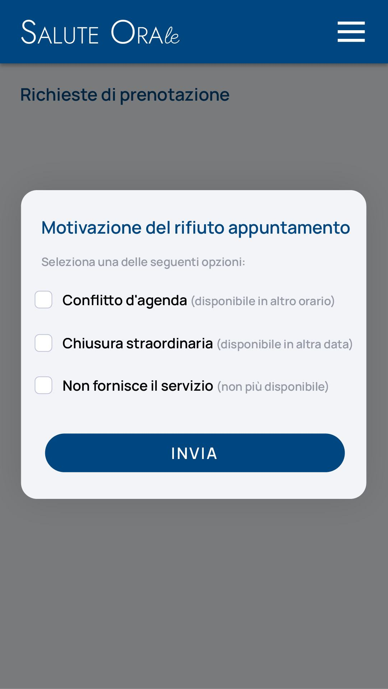

# Immagine 20

## Descrizione
Questa è l'immagine 20 dalla collezione di immagini. Quest'immagine potrebbe rappresentare contenuti relativi al progetto exabroker.

## Differenze tra versione Mobile e Desktop

### Versione Mobile
- Layout a singola colonna per ottimizzare lo spazio su schermi piccoli
- Immagine a piena larghezza per massimizzare la visibilità
- Elementi dell'interfaccia compatti e impilati verticalmente
- Font size ottimizzati per la lettura su dispositivi mobili

### Versione Desktop
- Layout a due colonne che sfrutta lo spazio orizzontale disponibile
- Immagine posizionata a sinistra (occupa 2/3 dello spazio)
- Pannello informativo a destra (occupa 1/3 dello spazio)
- Interfaccia più spaziosa con maggiori dettagli visibili contemporaneamente
- Navigazione più intuitiva grazie al maggiore spazio disponibile

## Note Tecniche
- L'immagine viene ridimensionata in modo responsivo per adattarsi alle diverse dimensioni dello schermo
- Vengono utilizzate media query CSS per alternare tra layout mobile e desktop
- Tailwind CSS è utilizzato per lo styling dell'interfaccia

# Analisi dell'interfaccia di rifiuto prenotazione

## Descrizione dell'immagine originale
L'immagine mostra la sezione per la motivazione del rifiuto di un appuntamento con:
- Titolo "Motivazione del rifiuto appuntamento"
- Tre opzioni di checkbox con:
  1. Conflitto d'agenda (con nota tra parentesi)
  2. Chiusura straordinaria (con nota tra parentesi)
  3. Non fornisce il servizio (con nota tra parentesi)

## Adattamento desktop
Nella versione HTML ho implementato:
1. **Gerarchia visiva migliorata**:
   - Colore rosso per elementi correlati al rifiuto
   - Spaziatura aumentata tra le opzioni
   - Sottotitoli in grigio per le note esplicative

2. **Elementi interattivi**:
   - Checkbox allineati verticalmente
   - Pulsante di azione primario in fondo
   - Effetti hover sul pulsante

3. **Struttura responsive**:
   - Larghezza massima del contenuto
   - Adattamento automatico alle dimensioni dello schermo
   - Layout a griglia flessibile

## Consigli e miglioramenti

### UI/UX
1. **Meccanismo di selezione**:
   - Convertire i checkbox in radio button (selezione singola)
   - Aggiungere un'opzione "Altro" con campo testo

2. **Conferma azione**:
   - Implementare un modal di conferma
   - Aggiungere un feedback visivo post-invio

3. **Dettagli aggiuntivi**:
   - Campo per note opzionali
   - Selezione data alternativa (per le prime due opzioni)
   - Icone illustrative accanto alle opzioni

### Tecnico
1. **Validazione**:
   - Obbligo di selezione almeno un'opzione
   - Controllo sulla coerenza tra opzione selezionata e campi aggiuntivi

2. **Accessibilità**:
   - Aggiungere label associate agli input
   - Implementare focus state visibili
   - Utilizzare ARIA roles appropriati

3. **Performance**:
   - Lazy loading per elementi non critici
   - Ottimizzazione SVG inline
   - Minificazione CSS/JS

### Prossimi sviluppi
1. Integrare con:
   - Calendario per selezionare nuove date
   - Sistema di notifiche automatiche
   - Cronologia dei rifiuti

2. Aggiungere:
   - Template per messaggi predefiniti
   - Opzione di invio via email al paziente
   - Tracking delle motivazioni più frequenti