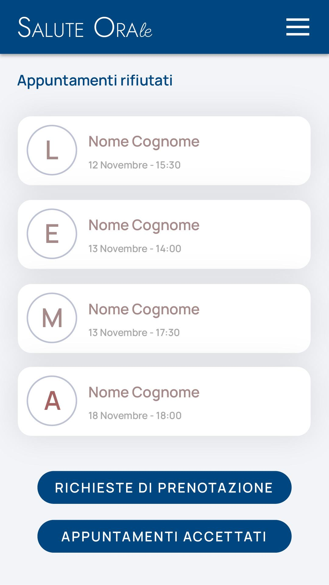

# Immagine 21

## Descrizione
Questa è l'immagine 21 dalla collezione di immagini. Quest'immagine potrebbe rappresentare contenuti relativi al progetto exabroker.

## Differenze tra versione Mobile e Desktop

### Versione Mobile
- Layout a singola colonna per ottimizzare lo spazio su schermi piccoli
- Immagine a piena larghezza per massimizzare la visibilità
- Elementi dell'interfaccia compatti e impilati verticalmente
- Font size ottimizzati per la lettura su dispositivi mobili

### Versione Desktop
- Layout a due colonne che sfrutta lo spazio orizzontale disponibile
- Immagine posizionata a sinistra (occupa 2/3 dello spazio)
- Pannello informativo a destra (occupa 1/3 dello spazio)
- Interfaccia più spaziosa con maggiori dettagli visibili contemporaneamente
- Navigazione più intuitiva grazie al maggiore spazio disponibile

## Note Tecniche
- L'immagine viene ridimensionata in modo responsivo per adattarsi alle diverse dimensioni dello schermo
- Vengono utilizzate media query CSS per alternare tra layout mobile e desktop
- Tailwind CSS è utilizzato per lo styling dell'interfaccia

# Analisi dell'Interfaccia "Appuntamenti Rifiutati"

## Descrizione dell'Immagine Mobile

L'immagine mostra un'interfaccia mobile dell'applicazione "Salute ORAle" sulla pagina "Appuntamenti rifiutati". L'interfaccia presenta:

1. **Header**: Una barra di navigazione blu scuro con il logo "SALUTE ORAle" a sinistra e un'icona hamburger menu a destra per le opzioni di navigazione.

2. **Contenuto Principale**:
   - Titolo "Appuntamenti rifiutati" in blu scuro
   - Una lista di quattro appuntamenti rifiutati, ciascuno visualizzato come una card bianca con bordi arrotondati e una leggera ombra
   - Ogni card contiene:
     - Un cerchio grigio con un'iniziale (L, E, M, A)
     - La dicitura "Nome Cognome" (placeholder per il nome reale del paziente)
     - Data e ora dell'appuntamento (es. "12 Novembre - 15:30")

3. **Pulsanti di Azione**:
   - Due pulsanti blu scuro a fondo pagina:
     - "RICHIESTE DI PRENOTAZIONE"
     - "APPUNTAMENTI ACCETTATI"

4. **Sfondo**: Grigio chiaro che offre un buon contrasto con le card bianche

## Versione Desktop (Estensione Concettuale)

Per la versione desktop, si potrebbe implementare:

1. **Header**: La barra di navigazione può includere più elementi visibili anziché nasconderli dietro un menu hamburger.
   
2. **Layout**: Organizzazione a due colonne:
   - Colonna sinistra: Menù di navigazione con opzioni come "Dashboard", "Appuntamenti", "Pazienti", "Calendario", ecc.
   - Colonna destra: Il contenuto attuale con la lista degli appuntamenti rifiutati
   
3. **Appuntamenti**: 
   - Visualizzazione a tabella anziché cards per maggiore efficienza spaziale
   - Possibilità di filtrare e ordinare gli appuntamenti per data, nome paziente, ecc.
   - Azioni rapide per ogni appuntamento (contattare paziente, riprogrammare, ecc.)

4. **Sezione Statistiche**: Area superiore con metriche come totale appuntamenti rifiutati, tasso di cancellazione, distribuzione per fascia oraria, ecc.

## Riflessioni e Consigli

### Punti di Forza

1. **Semplicità**: L'interfaccia è pulita e concentrata su una singola funzionalità, facilitando l'uso per operatori sanitari che potrebbero avere poco tempo.

2. **Gerarchia Visiva**: La struttura è chiara con titolo, lista e azioni ben distinte.

3. **Contrasto**: Il blu scuro su sfondo chiaro offre una buona leggibilità.

### Opportunità di Miglioramento

1. **Informazioni Contestuali**: Aggiungere il motivo del rifiuto dell'appuntamento sarebbe utile per l'analisi.

2. **Azioni Individuali**: Ogni card potrebbe avere pulsanti di azione specifici (ricontatta, riprogramma) per accelerare il workflow.

3. **Feedback Visivo**: Differenziare visivamente gli appuntamenti per urgenza o tipologia di trattamento usando codici colore.

4. **Personalizzazione**: Permettere la visualizzazione di immagini profilo o avatar anziché solo iniziali.

5. **Elementi Interattivi**:
   - Aggiungere animazioni sottili per migliorare l'esperienza utente
   - Implementare gesti touch per azioni rapide (swipe per archiviare o riprogrammare)

6. **Responsività**: Per la versione desktop, considerare una visualizzazione a colonne multiple per sfruttare meglio lo spazio orizzontale.

7. **Performance**:
   - Implementare il caricamento lazy per liste lunghe
   - Utilizzare SVG animati leggeri per lo sfondo
   - Minimizzare il DOM per una rappresentazione efficiente

### Considerazioni Tecniche

1. **Animazioni SVG**: Le animazioni dello sfondo sono state implementate con SVG leggeri e transizioni CSS per mantenere la fluidità.

2. **Accessibilità**: È importante aggiungere attributi ARIA appropriati e garantire un buon contrasto di colore per supportare utenti con disabilità visive.

3. **Ottimizzazioni Mobile**:
   - Touch targets di dimensioni adeguate (almeno 44x44px)
   - Gestione dello spazio verticale per evitare scrolling eccessivo
   - Considerare l'implementazione di pull-to-refresh per aggiornare la lista

4. **Gestione Dati**:
   - Implementare caching lato client per ridurre le chiamate API
   - Sincronizzazione in background per aggiornamenti in tempo reale

5. **Internazionalizzazione**:
   - Layout flessibile per accomodare testi di lunghezza variabile in diverse lingue
   - Supporto per formattazione di data/ora locale

Queste ottimizzazioni renderebbero l'interfaccia non solo esteticamente piacevole ma anche altamente funzionale e performante, migliorando l'esperienza complessiva per gli operatori sanitari che gestiscono gli appuntamenti.
