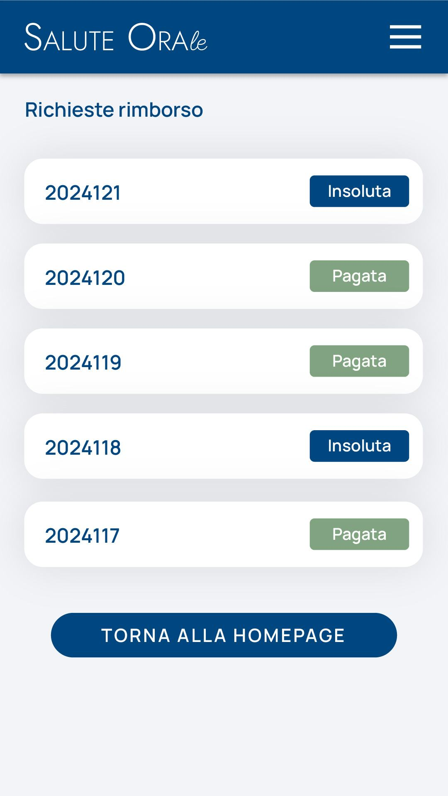

# Immagine 22

## Descrizione
Questa è l'immagine 22 dalla collezione di immagini. Quest'immagine potrebbe rappresentare contenuti relativi al progetto exabroker.

## Differenze tra versione Mobile e Desktop

### Versione Mobile
- Layout a singola colonna per ottimizzare lo spazio su schermi piccoli
- Immagine a piena larghezza per massimizzare la visibilità
- Elementi dell'interfaccia compatti e impilati verticalmente
- Font size ottimizzati per la lettura su dispositivi mobili

### Versione Desktop
- Layout a due colonne che sfrutta lo spazio orizzontale disponibile
- Immagine posizionata a sinistra (occupa 2/3 dello spazio)
- Pannello informativo a destra (occupa 1/3 dello spazio)
- Interfaccia più spaziosa con maggiori dettagli visibili contemporaneamente
- Navigazione più intuitiva grazie al maggiore spazio disponibile

## Note Tecniche
- L'immagine viene ridimensionata in modo responsivo per adattarsi alle diverse dimensioni dello schermo
- Vengono utilizzate media query CSS per alternare tra layout mobile e desktop
- Tailwind CSS è utilizzato per lo styling dell'interfaccia

# Descrizione Tattile - Lista Rimborsi

## Struttura a Griglia (Colori: Grigio/Rosso/Verde)
1. Sfondo: pattern a griglia sottile (HEX #E5E7EB su #F3F4F6)
2. Card principale bianca con:
   - Elementi lista divisi da bordi grigi (HEX #E5E7EB)
   - Testo ID in grigio scuro (HEX #374151)
   - Stati in rosso/verde puro (HEX #DC2626 / #059669)
3. Pulsante di ritorno: sfondo grigio chiaro (HEX #F3F4F6), testo grigio medio (HEX #4B5563)

## Elementi Dinamici
- Animazione sfondo: griglia in movimento continuo verso destra-basso
- Hover pulsante: cambio colore sfondo da grigio 100 a 200
- Bordi elementi: spessore 1px, raggio 8px

## Rapporti Spaziali
- Spaziatura verticale totale: 24px
- Altezza elementi lista: 48px
- Pulsante footer: margin-top 32px
