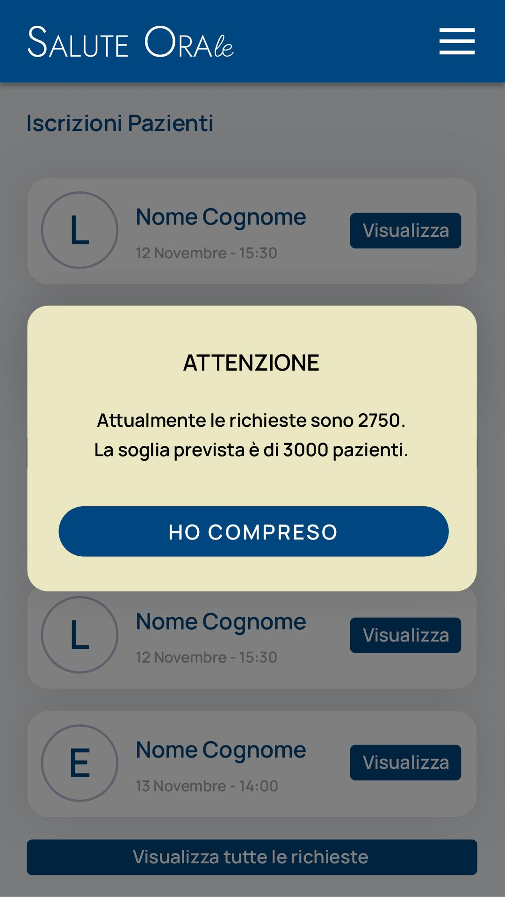

# Immagine 24

## Descrizione
Questa è l'immagine 24 dalla collezione di immagini. Quest'immagine potrebbe rappresentare contenuti relativi al progetto exabroker.

## Differenze tra versione Mobile e Desktop

### Versione Mobile
- Layout a singola colonna per ottimizzare lo spazio su schermi piccoli
- Immagine a piena larghezza per massimizzare la visibilità
- Elementi dell'interfaccia compatti e impilati verticalmente
- Font size ottimizzati per la lettura su dispositivi mobili

### Versione Desktop
- Layout a due colonne che sfrutta lo spazio orizzontale disponibile
- Immagine posizionata a sinistra (occupa 2/3 dello spazio)
- Pannello informativo a destra (occupa 1/3 dello spazio)
- Interfaccia più spaziosa con maggiori dettagli visibili contemporaneamente
- Navigazione più intuitiva grazie al maggiore spazio disponibile

## Note Tecniche
- L'immagine viene ridimensionata in modo responsivo per adattarsi alle diverse dimensioni dello schermo
- Vengono utilizzate media query CSS per alternare tra layout mobile e desktop
- Tailwind CSS è utilizzato per lo styling dell'interfaccia

# Analisi Iscrizioni Pazienti

## Componenti Complessi
- Lista pazienti con badge identificativo
- Alert soglia con CTA
- Paginazione automatica

## Roadmap Sviluppo
1. **Filtri Avanzati**:
   - Ricerca full-text
   - Filtro per data/status
2. **Gestione Capacità**:
   - Alert proattivi al 90% soglia
   - Prioritarizzazione automatica
3. **Ottimizzazioni**:
   - Virtual scrolling per grandi dataset
   - Cache delle richieste
