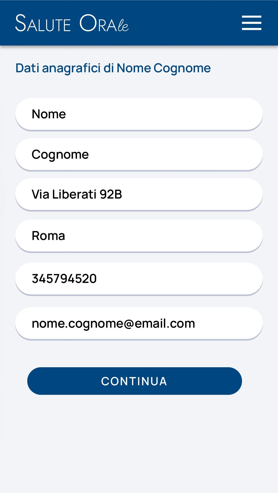

# Immagine 25

## Descrizione
Questa è l'immagine 25 dalla collezione di immagini. Quest'immagine potrebbe rappresentare contenuti relativi al progetto exabroker.

## Differenze tra versione Mobile e Desktop

### Versione Mobile
- Layout a singola colonna per ottimizzare lo spazio su schermi piccoli
- Immagine a piena larghezza per massimizzare la visibilità
- Elementi dell'interfaccia compatti e impilati verticalmente
- Font size ottimizzati per la lettura su dispositivi mobili

### Versione Desktop
- Layout a due colonne che sfrutta lo spazio orizzontale disponibile
- Immagine posizionata a sinistra (occupa 2/3 dello spazio)
- Pannello informativo a destra (occupa 1/3 dello spazio)
- Interfaccia più spaziosa con maggiori dettagli visibili contemporaneamente
- Navigazione più intuitiva grazie al maggiore spazio disponibile

## Note Tecniche
- L'immagine viene ridimensionata in modo responsivo per adattarsi alle diverse dimensioni dello schermo
- Vengono utilizzate media query CSS per alternare tra layout mobile e desktop
- Tailwind CSS è utilizzato per lo styling dell'interfaccia

# Analisi Dati Anagrafici

## Componenti Principali
- Form a singola colonna con 6 campi
- Pulsante di conferma "CONTINUA"
- Intestazione gerarchica

## Miglioramenti Proposti
1. **Validazione dati**:
   - Formato telefono/email automatico
   - Autocompletamento indirizzo con API
2. **UI/UX**:
   - Progress indicator
   - Icone esplicative accanto ai campi
3. **Sicurezza**:
   - Conferma OTP via email
   - Crittografia dati sensibili