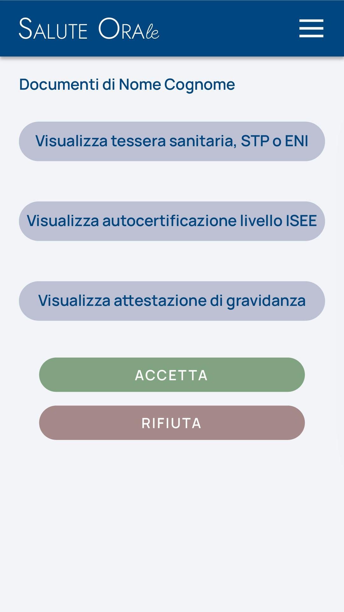

# Immagine 26

## Descrizione
Questa è l'immagine 26 dalla collezione di immagini. Quest'immagine potrebbe rappresentare contenuti relativi al progetto exabroker.

## Differenze tra versione Mobile e Desktop

### Versione Mobile
- Layout a singola colonna per ottimizzare lo spazio su schermi piccoli
- Immagine a piena larghezza per massimizzare la visibilità
- Elementi dell'interfaccia compatti e impilati verticalmente
- Font size ottimizzati per la lettura su dispositivi mobili

### Versione Desktop
- Layout a due colonne che sfrutta lo spazio orizzontale disponibile
- Immagine posizionata a sinistra (occupa 2/3 dello spazio)
- Pannello informativo a destra (occupa 1/3 dello spazio)
- Interfaccia più spaziosa con maggiori dettagli visibili contemporaneamente
- Navigazione più intuitiva grazie al maggiore spazio disponibile

## Note Tecniche
- L'immagine viene ridimensionata in modo responsivo per adattarsi alle diverse dimensioni dello schermo
- Vengono utilizzate media query CSS per alternare tra layout mobile e desktop
- Tailwind CSS è utilizzato per lo styling dell'interfaccia

# Descrizione Tattile - Documenti Paziente

## Cromatica a Strati
1. Card principale: gradiente bianco (HEX #FFFFFF → #F8FAFC)
2. Pulsanti documenti:
   - Tessera sanitaria: sfondo indaco 50 (HEX #EEF2FF), testo indaco 700 (HEX #4338CA)
   - ISEE: sfondo viola 50 (HEX #F5F3FF), testo viola 700 (HEX #6D28D9)
   - Gravidanza: sfondo rosa 50 (HEX #FDF2F8), testo rosa 700 (HEX #BE185D)
3. Pulsanti azione: verde (HEX #059669) e rosso (HEX #DC2626)

## Effetti Visivi
- Ombre: soft elevation con angolo 145°
- Hover card: sollevamento 2px + aumento ombreggiatura
- Transizioni: 300ms per tutte le proprietà

## Gerarchia Tipografica
- Titolo: 24px peso 600
- Testo pulsanti: 16px peso 400
- Pulsanti azione: 18px peso 500
