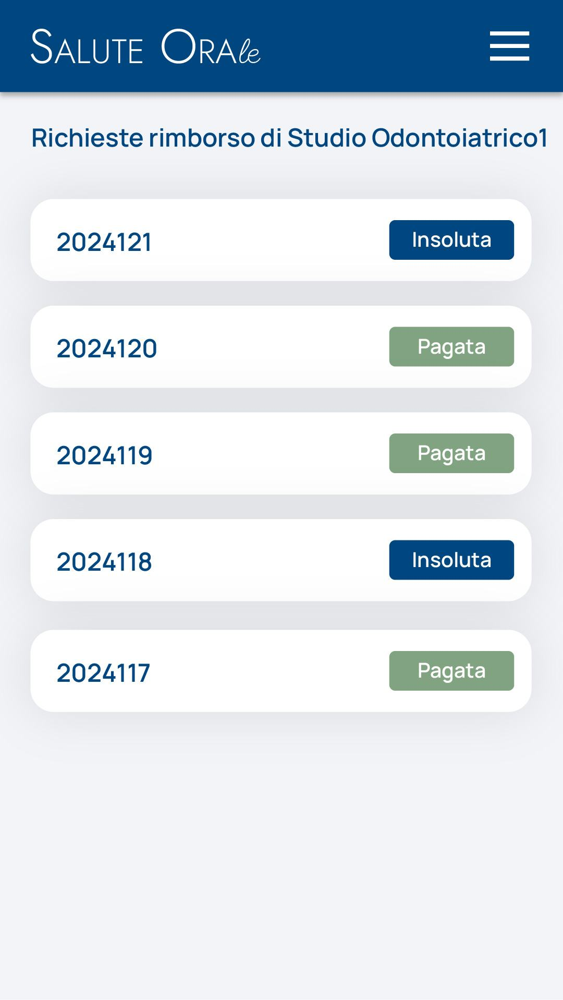

# Immagine 29

## Descrizione
Questa è l'immagine 29 dalla collezione di immagini. Quest'immagine potrebbe rappresentare contenuti relativi al progetto exabroker.

## Differenze tra versione Mobile e Desktop

### Versione Mobile
- Layout a singola colonna per ottimizzare lo spazio su schermi piccoli
- Immagine a piena larghezza per massimizzare la visibilità
- Elementi dell'interfaccia compatti e impilati verticalmente
- Font size ottimizzati per la lettura su dispositivi mobili

### Versione Desktop
- Layout a due colonne che sfrutta lo spazio orizzontale disponibile
- Immagine posizionata a sinistra (occupa 2/3 dello spazio)
- Pannello informativo a destra (occupa 1/3 dello spazio)
- Interfaccia più spaziosa con maggiori dettagli visibili contemporaneamente
- Navigazione più intuitiva grazie al maggiore spazio disponibile

## Note Tecniche
- L'immagine viene ridimensionata in modo responsivo per adattarsi alle diverse dimensioni dello schermo
- Vengono utilizzate media query CSS per alternare tra layout mobile e desktop
- Tailwind CSS è utilizzato per lo styling dell'interfaccia

# Descrizione Tattile - Cronologia Rimborsi

## Struttura Tabellare (Colori: Rosso/Verde)
1. Lista verticale con:
   - ID grigio scuro (HEX #374151) a sinistra
   - Stato in pillole colorate:
     * Rosso: sfondo #FEE2E2, testo #DC2626 (Insoluta)
     * Verde: sfondo #D1FAE5, testo #059669 (Pagata)
2. Hover sulle righe: sfondo grigio chiaro (HEX #F9FAFB)

## Dinamiche Interattive
- Badge di stato: leggero sollevamento di 1px all'hover
- Transizioni: smussatura delle animazioni con cubic-bezier

## Dettagli Grafici
- Spaziatura verticale tra elementi: 12px
- Raggio bordi pillole: 12px
- Font ID: monospace per enfasi tecnica
