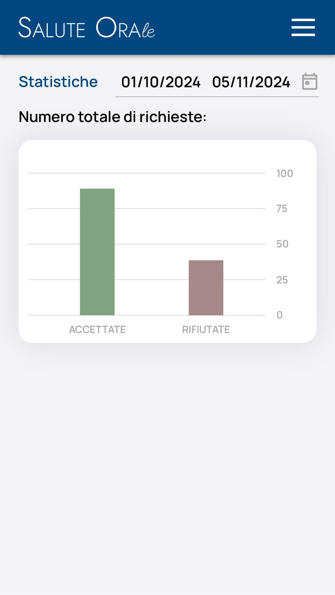

# Immagine 31

## Descrizione
Questa è l'immagine 31 dalla collezione di immagini. Quest'immagine potrebbe rappresentare contenuti relativi al progetto exabroker.

## Differenze tra versione Mobile e Desktop

### Versione Mobile
- Layout a singola colonna per ottimizzare lo spazio su schermi piccoli
- Immagine a piena larghezza per massimizzare la visibilità
- Elementi dell'interfaccia compatti e impilati verticalmente
- Font size ottimizzati per la lettura su dispositivi mobili

### Versione Desktop
- Layout a due colonne che sfrutta lo spazio orizzontale disponibile
- Immagine posizionata a sinistra (occupa 2/3 dello spazio)
- Pannello informativo a destra (occupa 1/3 dello spazio)
- Interfaccia più spaziosa con maggiori dettagli visibili contemporaneamente
- Navigazione più intuitiva grazie al maggiore spazio disponibile

## Note Tecniche
- L'immagine viene ridimensionata in modo responsivo per adattarsi alle diverse dimensioni dello schermo
- Vengono utilizzate media query CSS per alternare tra layout mobile e desktop
- Tailwind CSS è utilizzato per lo styling dell'interfaccia

# Descrizione Tattile - Statistiche

## Struttura Grafica (Colori: Verde/Rosso)
1. Barra orizzontale verde (HEX #059669) con gradiente da sinistra (HEX #10B981)
2. Numeri grandi:
   - Verde: 1,842 (HEX #10B981)
   - Rosso: 326 (HEX #DC2626)
3. Etichette secondarie in grigio medio (HEX #6B7280)

## Movimenti
- Barra di progressione: animazione di espansione da 0% a 85% in 1.5 secondi
- Numeri: effetto "count-up" (non implementato nell'HTML fornito)

## Rapporti Spaziali
- Spaziatura verticale tra elementi: 32px
- Barra spessa 8px con bordi arrotondati
- Testo principale: 48px, secondario 16px
