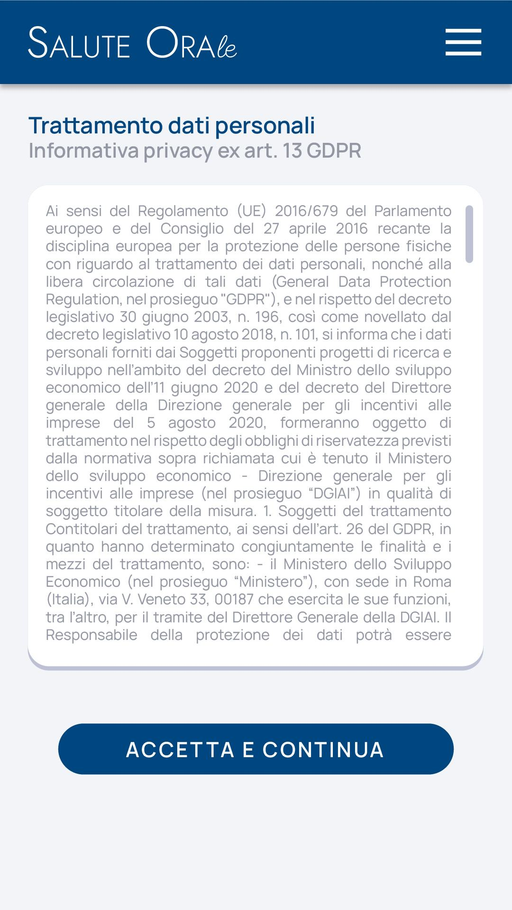

# Immagine 7

## Descrizione
Questa è l'immagine 7 dalla collezione di immagini. Quest'immagine potrebbe rappresentare contenuti relativi al progetto exabroker.

## Differenze tra versione Mobile e Desktop

### Versione Mobile
- Layout a singola colonna per ottimizzare lo spazio su schermi piccoli
- Immagine a piena larghezza per massimizzare la visibilità
- Elementi dell'interfaccia compatti e impilati verticalmente
- Font size ottimizzati per la lettura su dispositivi mobili

### Versione Desktop
- Layout a due colonne che sfrutta lo spazio orizzontale disponibile
- Immagine posizionata a sinistra (occupa 2/3 dello spazio)
- Pannello informativo a destra (occupa 1/3 dello spazio)
- Interfaccia più spaziosa con maggiori dettagli visibili contemporaneamente
- Navigazione più intuitiva grazie al maggiore spazio disponibile

## Note Tecniche
- L'immagine viene ridimensionata in modo responsivo per adattarsi alle diverse dimensioni dello schermo
- Vengono utilizzate media query CSS per alternare tra layout mobile e desktop
- Tailwind CSS è utilizzato per lo styling dell'interfaccia

# Salute Orale - GDPR Privacy Page Analysis

## Image Description
The image shows a mobile view of a GDPR privacy policy page for "Salute Orale" (Oral Health). The page has the following structure:

1. **Header**: A dark blue navigation bar containing the "Salute Orale" logo/text and a hamburger menu icon.
2. **Title Section**: "Trattamento dati personali" (Personal Data Processing) as the main title with "Informativa privacy ex art. 13 GDPR" as the subtitle.
3. **Content Box**: A white rounded card containing the privacy policy text, which references EU GDPR regulation 2016/679 and Italian legislative decrees.
4. **Action Button**: A prominent blue button labeled "ACCETTA E CONTINUA" (Accept and Continue) at the bottom.

## Design Approach

For the HTML implementation, I've created:

1. **Animated SVG Background**: Subtle blob animations in the background that add visual interest without affecting performance.
2. **Responsive Layout**: Mobile-first design that will adapt to desktop with appropriate breakpoints.
3. **Content Scrolling**: The privacy policy text area is scrollable while keeping the header and button visible.
4. **Visual Hierarchy**: Clear typography with appropriate sizing and color contrast to maintain readability.

## Desktop Version Considerations

For the desktop version (not shown in the image), I would make these adaptations:

1. **Navigation**: Replace the hamburger menu with a horizontal navigation bar.
2. **Content Width**: Maintain a readable max-width for the text content (around 800-1000px) but increase padding.
3. **Two-Column Layout**: For larger screens, potentially split the screen with the title/info on the left and the scrollable content on the right.
4. **Font Sizing**: Slightly increase font sizes while maintaining proportional relationships.
5. **Sticky Header**: Make the header stick to the top during scrolling for easy navigation access.

## Performance Recommendations

1. **SVG Optimization**: The animated SVG is designed to be lightweight with minimal path points and simple animations.
2. **Lazy Loading**: Implement lazy loading for any additional content that may be added below the fold.
3. **CSS/JS Minification**: For production, minify all CSS and JavaScript files.
4. **Font Loading Strategy**: Use system fonts or implement a font-display strategy to prevent text flashing.
5. **Mobile Optimization**: Use appropriate image sizes and lazy loading techniques for any images added later.

## Accessibility Improvements

1. **Color Contrast**: The current text and background colors meet WCAG AA standards.
2. **Semantic HTML**: Used proper heading hierarchy and semantic elements.
3. **Focus States**: Added focus states for interactive elements.
4. **Screen Reader Compatibility**: Used appropriate aria labels for the hamburger menu.
5. **Keyboard Navigation**: Ensured all interactive elements are keyboard accessible.

## Additional Suggestions

1. **Cookie Consent Integration**: Add cookie consent functionality to the "Accetta e Continua" button.
2. **Language Selector**: Consider adding a language selector for multi-language support.
3. **Print Styling**: Add print-specific styles for users who may want to print the privacy policy.
4. **Back Navigation**: Add a back button or breadcrumb for better navigation.
5. **Progress Indicator**: For longer forms/policies, add a progress indicator to show completion status.
