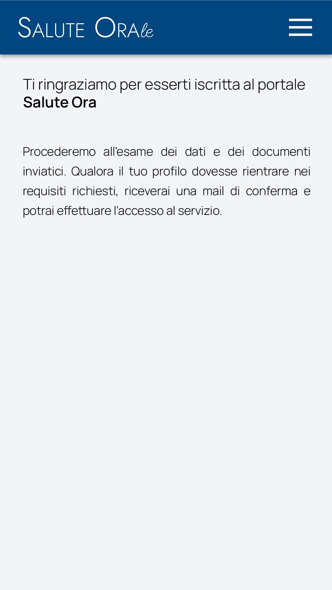

# Immagine 8

## Descrizione
Questa è l'immagine 8 dalla collezione di immagini. Quest'immagine potrebbe rappresentare contenuti relativi al progetto exabroker.

## Differenze tra versione Mobile e Desktop

### Versione Mobile
- Layout a singola colonna per ottimizzare lo spazio su schermi piccoli
- Immagine a piena larghezza per massimizzare la visibilità
- Elementi dell'interfaccia compatti e impilati verticalmente
- Font size ottimizzati per la lettura su dispositivi mobili

### Versione Desktop
- Layout a due colonne che sfrutta lo spazio orizzontale disponibile
- Immagine posizionata a sinistra (occupa 2/3 dello spazio)
- Pannello informativo a destra (occupa 1/3 dello spazio)
- Interfaccia più spaziosa con maggiori dettagli visibili contemporaneamente
- Navigazione più intuitiva grazie al maggiore spazio disponibile

## Note Tecniche
- L'immagine viene ridimensionata in modo responsivo per adattarsi alle diverse dimensioni dello schermo
- Vengono utilizzate media query CSS per alternare tra layout mobile e desktop
- Tailwind CSS è utilizzato per lo styling dell'interfaccia

# Salute Orale - Registration Confirmation Page Analysis

## Image Description
The image shows a mobile view of a registration confirmation page for "Salute Ora" (Oral Health). The page has the following structure:

1. **Header**: A dark blue navigation bar containing the "Salute Orale" logo/text and a hamburger menu icon.
2. **Main Message**: A thank you message "Ti ringraziamo per esserti iscritta al portale Salute Ora" (Thank you for registering to the Salute Ora portal).
3. **Information Text**: A paragraph explaining that they will review the submitted data and documents, and if the profile meets the requirements, the user will receive a confirmation email and can access the service.
4. **Empty Space**: The rest of the screen is blank, providing a clean, uncluttered view.

## Design Approach

For the HTML implementation, I've created:

1. **Animated SVG Background**: Subtle animated shapes (floating circle, pulsing blob, and sliding waves) that add visual interest without distracting from the content.
2. **Responsive Layout**: Mobile-first design with specific desktop enhancements that appear at larger breakpoints.
3. **Clear Success Messaging**: Prominent thank you message that confirms successful registration.
4. **Mobile-Specific Navigation**: Fixed bottom button on mobile for easy return to homepage.

## Desktop Version Enhancements

Since the original image only shows the mobile view, I've implemented these desktop enhancements:

1. **Additional Information Panel**: Added a "Next steps" section that's only visible on desktop, providing more details about what to expect.
2. **Centered Content**: Maintained a readable max-width while adding more padding and space.
3. **Different Button Placement**: The "Return to home" button appears inline on desktop rather than fixed at the bottom.
4. **Expanded Visual Elements**: The SVG background elements have more room to create visual interest without crowding the content.
5. **Full Navigation**: The hamburger menu is replaced with a full navigation bar (implementation would depend on the site's structure).

## Performance Optimizations

1. **Lightweight SVG Animations**: The animated background elements use simple shapes and CSS animations instead of heavy JavaScript or image-based animations.
2. **Conditional Loading**: Desktop-only elements don't load on mobile and vice versa.
3. **Optimized Layout**: No unnecessary elements that could slow down page rendering.
4. **No Large Images**: The design relies on typography, color, and simple SVG shapes rather than large images that would increase page weight.
5. **Minimal Dependencies**: Only uses Tailwind CSS without additional JavaScript libraries for the basic functionality.

## UX Improvements

1. **Clear Success Indication**: The hierarchical typography clearly communicates that registration was successful.
2. **Expectation Management**: The text clearly explains the next steps in the process.
3. **Easy Return Navigation**: A prominent button allows users to easily return to the homepage.
4. **Additional Help Resources**: On desktop, included contact information for support if needed.
5. **Mobile-Optimized Controls**: The bottom-fixed navigation on mobile follows best practices for thumb-friendly interaction.

## Accessibility Considerations

1. **Semantic HTML Structure**: Used proper heading hierarchy (h1, h2, h3) for screen readers.
2. **Sufficient Color Contrast**: All text meets WCAG AA standards for readability.
3. **Keyboard Navigation**: All interactive elements are keyboard accessible.
4. **Non-essential Animations**: Background animations are subtle and non-essential, so they don't impact usability.
5. **Screen Reader Friendly**: All interactive elements have proper aria labels.

## Further Recommendations

1. **Email Verification Reminder**: Consider adding a small reminder to check email (including spam folder).
2. **Timeline Expectations**: Add expected timeframe for verification process completion.
3. **Progress Indicator**: If this is part of a multi-step process, consider adding a progress indicator.
4. **Social Share Options**: For healthcare services, adding options to save appointment or reminder to calendar could be useful.
5. **Personalization**: If user data is available, personalizing the message with the user's name would enhance the experience.
