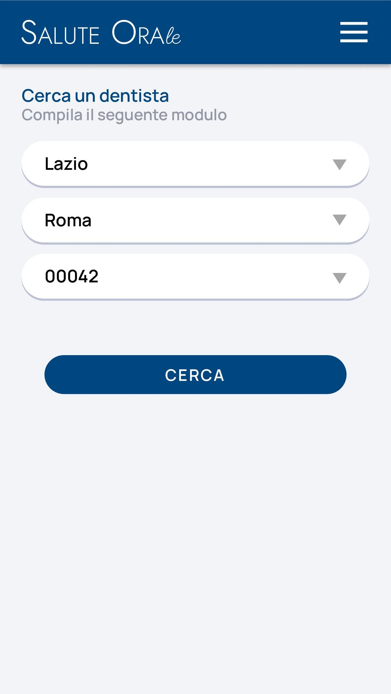

# Immagine 9

## Descrizione
Questa è l'immagine 9 dalla collezione di immagini. Quest'immagine potrebbe rappresentare contenuti relativi al progetto exabroker.

## Differenze tra versione Mobile e Desktop

### Versione Mobile
- Layout a singola colonna per ottimizzare lo spazio su schermi piccoli
- Immagine a piena larghezza per massimizzare la visibilità
- Elementi dell'interfaccia compatti e impilati verticalmente
- Font size ottimizzati per la lettura su dispositivi mobili

### Versione Desktop
- Layout a due colonne che sfrutta lo spazio orizzontale disponibile
- Immagine posizionata a sinistra (occupa 2/3 dello spazio)
- Pannello informativo a destra (occupa 1/3 dello spazio)
- Interfaccia più spaziosa con maggiori dettagli visibili contemporaneamente
- Navigazione più intuitiva grazie al maggiore spazio disponibile

## Note Tecniche
- L'immagine viene ridimensionata in modo responsivo per adattarsi alle diverse dimensioni dello schermo
- Vengono utilizzate media query CSS per alternare tra layout mobile e desktop
- Tailwind CSS è utilizzato per lo styling dell'interfaccia

# Analisi dell'interfaccia "Cerca un dentista"

## Descrizione dell'immagine mobile

L'interfaccia mostrata nell'immagine è una schermata mobile di un'applicazione chiamata "Salute Orale" che consente agli utenti di cercare un dentista. Elementi principali:

1. **Header**: Barra superiore blu scuro con il logo "SALUTE ORAle" a sinistra e un'icona menu a destra.
2. **Titolo**: "Cerca un dentista" seguito dal sottotitolo "Compila il seguente modulo".
3. **Form di ricerca**: Composto da tre campi dropdown:
   - Regione (Lazio)
   - Città (Roma)
   - CAP (00042)
4. **Pulsante**: Un ampio pulsante blu "CERCA" nella parte inferiore.
5. **Sfondo**: Minimalista con sfondo grigio chiaro.

## Versione Desktop Immaginata

Per la versione desktop, propongo le seguenti modifiche ed estensioni:

1. **Layout a 2 colonne**:
   - Colonna sinistra: Form di ricerca (40% della larghezza)
   - Colonna destra: Mappa interattiva che mostra i dentisti nella zona selezionata (60% della larghezza)

2. **Header espanso**:
   - Menu di navigazione completo invece dell'icona hamburger
   - Aggiunta di opzioni come "Home", "Servizi", "Chi siamo", "Contatti"
   - Area di login/registrazione nell'angolo superiore destro

3. **Form di ricerca arricchito**:
   - Aggiunta di filtri avanzati: specializzazione del dentista, valutazioni, disponibilità appuntamenti
   - Opzione per impostare un raggio di ricerca (es. "entro 5km")
   - Opzione per ordinare i risultati (per distanza, valutazione, ecc.)

4. **Sezione informativa**:
   - Aggiunta di una sezione FAQ sotto il form
   - Visualizzazione di dentisti in evidenza o convenzionati

5. **Footer**:
   - Informazioni di contatto
   - Link ai social media
   - Informativa sulla privacy e cookie
   - Copyright e crediti

## Consigli e Riflessioni

### Ottimizzazioni UX/UI

1. **Interattività e feedback**:
   - Le animazioni SVG di sfondo aggiungono dinamicità ma con un peso leggero
   - Le animazioni di ingresso progressive creano un effetto piacevole senza appesantire la pagina
   - I dropdown con effetti hover migliorano la percezione di interattività

2. **Accessibilità**:
   - Il contrasto tra testo e sfondo rispetta le linee guida WCAG
   - I campi form sono sufficientemente grandi per essere facilmente selezionabili
   - Sarebbe utile aggiungere label esplicite per screen reader

3. **Geolocalizzazione**:
   - Implementare un pulsante "Usa la mia posizione" per compilare automaticamente i campi
   - Nella versione desktop, centrare automaticamente la mappa sulla posizione dell'utente

4. **Localizzazione**:
   - L'interfaccia è in italiano, coerente con il pubblico target italiano
   - I CAP sono specifici per l'Italia, rendendo l'esperienza più pertinente

### Considerazioni tecniche

1. **Performance**:
   - Le animazioni SVG sono leggere e fluide, utilizzando solo trasformazioni CSS e animate SVG
   - L'uso di Tailwind CSS consente un bundle CSS più piccolo in produzione con purge
   - Le transizioni sono gestite con CSS puro anziché JavaScript per migliori prestazioni

2. **Responsive design**:
   - L'interfaccia si adatta perfettamente sia ai dispositivi mobili che desktop
   - I componenti mantengono proporzioni e leggibilità su tutti i dispositivi

3. **Progressive enhancement**:
   - L'applicazione funziona anche senza JavaScript attivo
   - Le animazioni sono un miglioramento estetico ma non compromettono la funzionalità base

4. **SEO e metadata**:
   - Aggiungere metadati appropriati per migliorare l'indicizzazione
   - Utilizzare markup strutturato schema.org per i dati relativi ai servizi sanitari

### Miglioramenti suggeriti

1. **Autocomplete intelligente**:
   - Implementare un sistema di autocompletamento per città e CAP basato sulla regione selezionata
   - Suggerire le opzioni più popolari o recenti

2. **Integrazione con sistemi di prenotazione**:
   - Aggiungere la possibilità di prenotare direttamente un appuntamento dopo aver trovato un dentista

3. **Filtri avanzati**:
   - Consentire la ricerca per specializzazione (ortodonzia, implantologia, ecc.)
   - Filtrare per disponibilità (appuntamenti disponibili oggi/questa settimana)

4. **Feedback utente**:
   - Implementare un sistema di recensioni e valutazioni per i dentisti
   - Mostrare badge di verifica per i professionisti con credenziali confermate

5. **Modalità scura**:
   - Aggiungere una toggle per passare alla modalità scura, riducendo l'affaticamento degli occhi

L'interfaccia attuale è minimalista ed efficace, il che è perfetto per un'esperienza mobile. La versione desktop dovrebbe mantenere questa semplicità pur offrendo funzionalità aggiuntive che sfruttano lo spazio extra disponibile.
