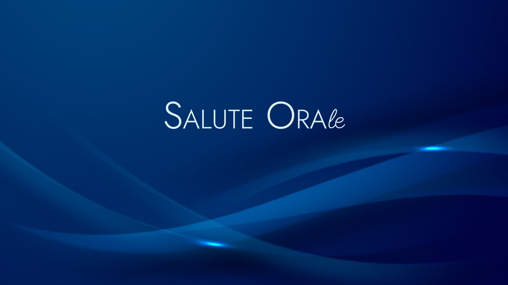
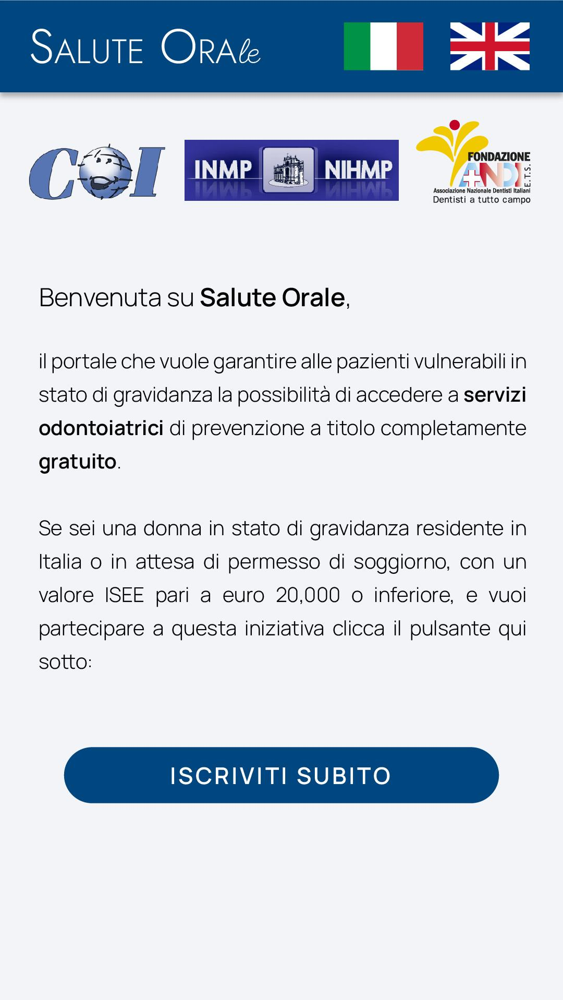
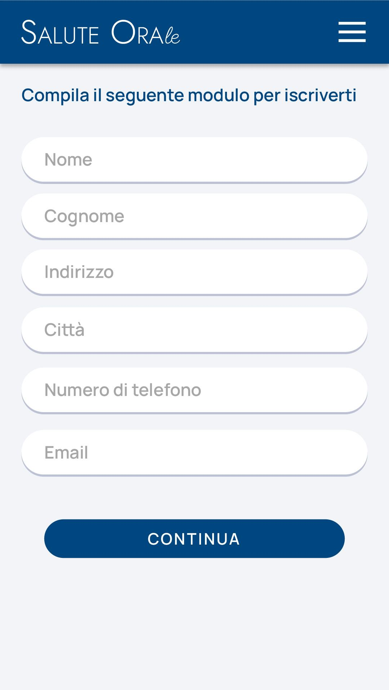
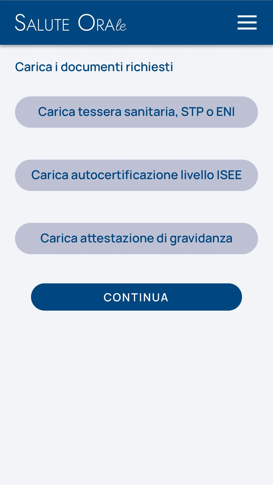
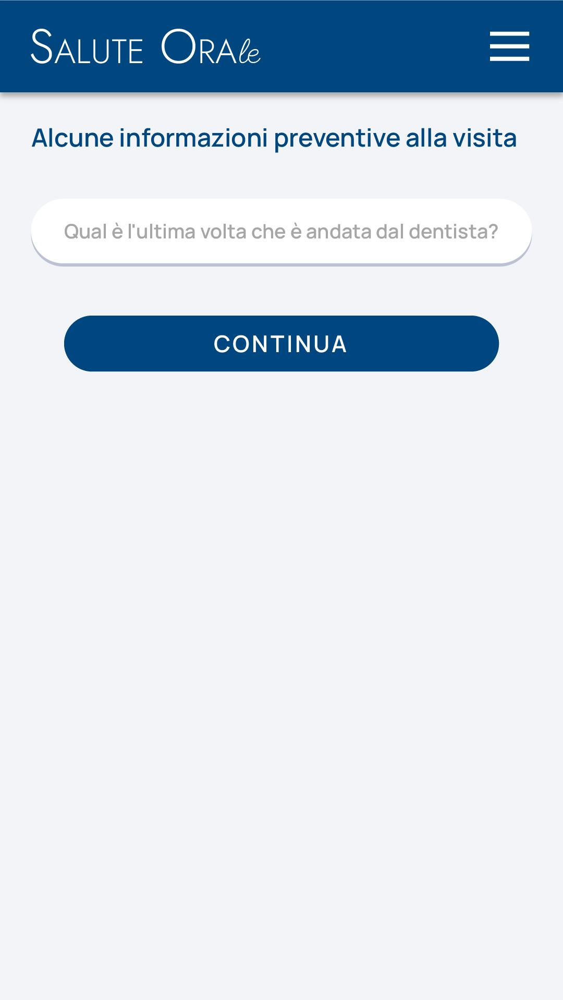

**INFORMATIVA SUL TRATTAMENTO DEI DATI PERSONALI**

**dedicata agli odontoiatri che aderiscono al progetto "Salute Ora"**

#  {#section .unnumbered}

# Premessa {#premessa .unnumbered}

L'informativa descrive le caratteristiche dei trattamenti svolti da
Fondazione ANDI E.T.S. sui suoi dati personali nell'ambito del Progetto
"Salute Ora" e le indica i diritti che la normativa le garantisce.

[Versione Markdown](images/0.md) | [Versione HTML](images/0.html) | [Versione Blade](images/0.blade.php)

Il logo di Salute ORAle presenta uno sfondo blu scuro (navy) con la scritta "SALUTE ORAle" in bianco. Il design è elegante e minimalista, con le lettere "S" e "O" più sottili e la porzione "le" in corsivo grigio chiaro, creando un contrasto visivo che trasmette professionalità e affidabilità.

# Presentazione del Portale

## Homepage

L'accesso alla pagina principale della webapp/portale contiene:
- Titolo e logo del progetto
- Loghi degli attori impegnati
- Informazioni sul progetto in essere al fine di informare le beneficiarie
- In chiusura di pagina, un pulsante molto evidente per manifestare l'intenzione di partecipare a questa iniziativa

## Flusso Paziente

### Iscrizione Paziente
Con il primo accesso, la paziente carica:
1. Dati anagrafici e contatti
2. Tessera sanitaria, STP o ENI
3. Autocertificazione livello ISEE
4. Documentazione attestante gravidanza
5. Questionario anamnestico
6. Accettazione normativa privacy

Dopo la registrazione, la paziente attende la conferma da parte del backoffice (personale di segreteria).

### Trova Dentista
Una volta approvata la documentazione:
- La paziente può inserire l'areale di interesse
- La piattaforma mostra la lista degli studi aderenti
- L'inserimento manuale dell'areale permette di effettuare la ricerca in zone diverse rispetto al domicilio

### Prenota Visita
- La paziente effettua una prenotazione (durata 1 ora)
- Gli orari disponibili sono impostati dal singolo studio odontoiatrico
- La paziente attende la risposta dell'odontoiatra (conferma o rifiuto)
- In caso di conferma, riceve un messaggio di riepilogo
- In caso di rifiuto, può richiedere un altro appuntamento

## Flusso Odontoiatra

### Iscrizione Odontoiatra
Durante il primo accesso:
1. Inserimento informazioni per verifica identità
2. Attesa revisione documenti
3. In caso di conferma, completamento registrazione con:
   - Dati generali
   - Indirizzo
   - Coordinate bancarie
   - Orari di disponibilità al servizio

### Gestione Appuntamenti
- Visualizzazione richieste di prenotazione dalla home page
- Possibilità di accettare o rifiutare le richieste
- Per gli appuntamenti accettati:
  - Costituzione memorandum
  - Compilazione referto di fine visita
  - Possibilità di annullare per cause di forza maggiore
- Per i rifiuti:
  - Obbligo di motivazione
  - Comunicazione alla paziente

### Richieste Rimborso
- Creazione automatica richiesta dopo compilazione referto
- Visualizzazione stato richieste
- Possibilità di emissione fattura dopo compensazione

## Flusso Back Office

### Funzioni Principali
1. Conferma utenze pazienti
2. Conferma utenze odontoiatri
3. Procedura fatturazione verso odontoiatri
4. Accesso ai dati raccolti dal servizio

### Gestione Iscrizioni
- Visualizzazione generalità e documentazione pazienti
- Decisione accettazione/rifiuto iscrizioni
- In caso di rifiuto, obbligo di motivazione

### Gestione Rimborsi
- Accesso all'archivio richieste di rimborso
- Filtri per:
  - Ragione sociale studio
  - Stato di completamento
  - Periodo di interesse
- Possibilità di procedere al pagamento
- Cambio stato in "PAGATA"

### Statistiche
- Accesso ai dati prodotti durante il progetto
- Possibilità di scaricare file CSV
- Organizzazione dati secondo logiche concordate

---

# INFORMATIVA PRIVACY DETTAGLIATA

## Dati personali
**Dati personali**

# Quali dati personali raccogliamo?

Fondazione ANDI ETS raccoglie i seguenti dati:

- dati identificativi e di contatto;

- dati relativi alla sua professione;

- dati fiscali e contabili;

- dati relativi alle visite svolte nell'ambito del progetto "Salute
  Ora".

[Versione Markdown](images/1.md) | [Versione HTML](images/1.html) | [Versione Blade](images/1.blade.php)

Il form di registrazione è ottimizzato sia per dispositivi mobili che desktop, con un layout responsive che si adatta alle diverse dimensioni dello schermo. Utilizza Tailwind CSS per lo styling e garantisce un'esperienza utente fluida e professionale.

# Per quali finalità utilizziamo i suoi dati personali?

Trattiamo i dati personali per le seguenti finalità:

- Valutare i requisiti per la partecipazione al progetto "Salute Ora"
  (la legittimazione del trattamento si fonda sull'esecuzione di
  obblighi normativi e precontrattuali);

- Consentirle di accedere in modo sicuro (tramite credenziali di
  autenticazione) alla piattaforma dedicata al Progetto "Salute Ora"
  messa a disposizione da Fondazione ANDI ETS (la legittimazione del
  trattamento si fonda sull'esecuzione di obblighi contrattuali);

- Procedere al pagamento del compenso per le visite che effettua
  nell'ambito del progetto (la legittimazione del trattamento si fonda
  sull'esecuzione di obblighi normativi e contrattuali)

[Versione Markdown](images/2.md) | [Versione HTML](images/2.html) | [Versione Blade](images/2.blade.php)

La dashboard odontoiatri presenta un'interfaccia mobile con tre sezioni principali: un'intestazione bianca con logo e selettore lingua, una sezione centrale blu navy con il messaggio di benvenuto e i passaggi del programma, e un piè di pagina con i loghi dei partner. Il design è minimalista e professionale, con un forte contrasto tra testo bianco su sfondo blu e testo blu su sfondo bianco.

# Con quali modalità Fondazione ANDI ETS tratta i suoi dati personali e per quanto tempo li conserva?

I suoi dati personali sono trattati sia in modalità cartacea che
elettronica (servers, database in cloud, software applicativi etc.).
Fondazione ANDI E.T.S. conserva i suoi dati in forma personale solo per
il tempo necessario al conseguimento delle finalità per le quali sono
stati raccolti e per i tempi fissati in base a criteri dettati da
normative di settore. Trascorso il termine, i dati conservati su
supporto cartaceo sono materialmente distrutti, i dati contenuti su
supporto digitale sono eliminati con procedura informatica, a meno che
non esistano obblighi di legge specifici che ne impongano la
conservazione ulteriore. I tempi di conservazione specifici possono
essere richiesti in ogni momento al Titolare.

[Versione Markdown](images/3.md) | [Versione HTML](images/3.html) | [Versione Blade](images/3.blade.php)

L'immagine mostra un'interfaccia dedicata alla gestione dei dati personali, con un design pulito e organizzato che facilita la visualizzazione e la gestione delle informazioni sensibili.

# A chi comunichiamo i suoi dati personali?

Possono accedere ai Suoi dati personali i dipendenti e collaboratori che
ne abbiano necessità per svolgere le attività previste dal Progetto a
cui sta partecipando. In particolare:

> \- il personale assegnato ai servizi amministrativi,
>
> \- il personale nominato Responsabile o incaricato del trattamento,
> nei limiti delle funzioni assegnate (tra cui la società ANDI Lab).

I dipendenti e collaboratori di Fondazione ANDI E.T.S. sono informati
sulla importanza della tutela della riservatezza dei dati personali,
sulla necessità di mantenere il massimo riserbo nel trattamento dei dati
personali, sugli obblighi di utilizzo delle misure di sicurezza fisiche
e informatiche disponibili, sulle responsabilità in tema di protezione
dei dati personali. Alcuni suoi dati personali potranno essere
comunicati a soggetti esterni per la realizzazione del progetto "Salute
Ora", in particolare INMP. Fornitori e consulenti esterni sono
vincolati, tramite apposite clausole contrattuali, al rispetto delle
specifiche istruzioni impartite da Fondazione ANDI E.T.S. nonché della
normativa vigente in materia di tutela della riservatezza dei dati
personali. Inoltre, i suoi dati personali potranno essere comunicati ad
Autorità, Enti ed Istituzioni qualora tale comunicazione avvenga in
esecuzione di un obbligo normativo.

[Versione Markdown](images/4.md) | [Versione HTML](images/4.html) | [Versione Blade](images/4.blade.php)

Il diagramma mostra il flusso dei dati personali all'interno del sistema, illustrando come le informazioni vengono gestite e protette durante tutto il processo di trattamento.

# Quali sono i suoi diritti come interessato al trattamento e come può esercitarli?

Il Regolamento europeo in materia di protezione dei dati personali
(2016/679) Le garantisce, come interessato al trattamento, specifici
diritti, in particolare: il diritto di accesso ai Suoi dati personali
(art. 15 ), il diritto di rettifica (art. 16), il diritto di
cancellazione (diritto all'oblio) (art. 17), il diritto di limitazione
di trattamento (art. 18), il diritto alla portabilità dei dati (art.
20), il diritto di opposizione (art. 21), il diritto di opporsi a una
decisione basata unicamente sul trattamento automatizzato (art. 22), il
diritto di revocare il consenso prestato, il diritto di proporre reclamo
all'Autorità Garante della protezione dei dati qualora ritenga che il
trattamento dei suoi dati sia contrario alla normativa in vigore.

[Versione Markdown](images/5.md) | [Versione HTML](images/5.html) | [Versione Blade](images/5.blade.php)

L'infografica illustra in modo chiaro e comprensibile i diritti garantiti dal GDPR, aiutando gli utenti a comprendere le loro prerogative in materia di protezione dei dati personali.

# Come può contattarci?

La presente informativa ha lo scopo di informarLa su quali siano i Suoi
dati personali raccolti da Fondazione ANDI E.T.S. e come siano trattati.
Se avesse bisogno di qualsiasi tipo di chiarimento, o qualora volesse
esercitare i diritti sopra esposti, può contattarci ai seguenti
indirizzi:

Fondazione ANDI E.T.S. con sede legale in Roma, Lungotevere Sanzio 9;
indirizzo di posta elettronica:
[[dpo@fondazioneandi.org]{.underline}](mailto:dpo@fondazioneandi.org)

Il Titolare del Trattamento ha designato, ai sensi dell'art. 37 del
GDPR, il Responsabile per la Protezione dei Dati, i cui dati di contatto
sono: <dpo@fondazioneandi.org>

---

# APPENDICE: SCREENSHOT DEL PORTALE

## Logo Salute ORAle

[Versione Markdown](images/0.md) | [Versione HTML](images/0.html) | [Versione Blade](images/0.blade.php)

Il logo di Salute ORAle presenta uno sfondo blu scuro (navy) con la scritta "SALUTE ORAle" in bianco. Il design è elegante e minimalista, con le lettere "S" e "O" più sottili e la porzione "le" in corsivo grigio chiaro, creando un contrasto visivo che trasmette professionalità e affidabilità.

## Form di registrazione odontoiatri

[Versione Markdown](images/1.md) | [Versione HTML](images/1.html) | [Versione Blade](images/1.blade.php)

Il form di registrazione è ottimizzato sia per dispositivi mobili che desktop, con un layout responsive che si adatta alle diverse dimensioni dello schermo. Utilizza Tailwind CSS per lo styling e garantisce un'esperienza utente fluida e professionale.

## Dashboard odontoiatri

[Versione Markdown](images/2.md) | [Versione HTML](images/2.html) | [Versione Blade](images/2.blade.php)

La dashboard odontoiatri presenta un'interfaccia mobile con tre sezioni principali: un'intestazione bianca con logo e selettore lingua, una sezione centrale blu navy con il messaggio di benvenuto e i passaggi del programma, e un piè di pagina con i loghi dei partner. Il design è minimalista e professionale, con un forte contrasto tra testo bianco su sfondo blu e testo blu su sfondo bianco.

## Gestione dati personali

[Versione Markdown](images/3.md) | [Versione HTML](images/3.html) | [Versione Blade](images/3.blade.php)

L'immagine mostra un'interfaccia dedicata alla gestione dei dati personali, con un design pulito e organizzato che facilita la visualizzazione e la gestione delle informazioni sensibili.

## Flusso dati

[Versione Markdown](images/4.md) | [Versione HTML](images/4.html) | [Versione Blade](images/4.blade.php)

Il diagramma mostra il flusso dei dati personali all'interno del sistema, illustrando come le informazioni vengono gestite e protette durante tutto il processo di trattamento.

## Diritti GDPR

[Versione Markdown](images/5.md) | [Versione HTML](images/5.html) | [Versione Blade](images/5.blade.php)

L'infografica illustra in modo chiaro e comprensibile i diritti garantiti dal GDPR, aiutando gli utenti a comprendere le loro prerogative in materia di protezione dei dati personali.

## Contatti

[Versione Markdown](images/6.md) | [Versione HTML](images/6.html) | [Versione Blade](images/6.blade.php)

L'immagine mostra le informazioni di contatto in un formato chiaro e accessibile, con il logo dell'organizzazione e i dettagli per contattare il Responsabile della Protezione dei Dati.
