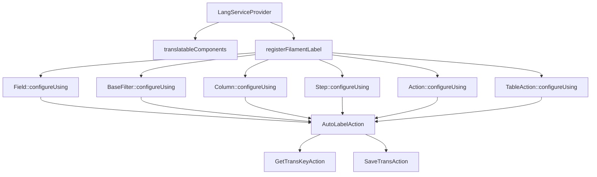

# LangServiceProvider: Analisi e Proposte di Miglioramento

## Analisi dell'Implementazione Attuale

Il `LangServiceProvider` è un componente fondamentale di <nome progetto> che gestisce automaticamente le traduzioni per i componenti Filament senza richiedere l'uso esplicito del metodo `->label()`. Questo approccio garantisce:

1. **Coerenza**: Tutte le etichette seguono lo stesso pattern di traduzione
2. **Manutenibilità**: Le traduzioni sono centralizzate nei file di lingua
3. **Automazione**: Le chiavi di traduzione mancanti vengono create automaticamente

### Architettura Attuale



### Flusso di Funzionamento

1. Il componente Filament viene creato
2. `LangServiceProvider` intercetta la creazione attraverso `configureUsing`
3. `AutoLabelAction` determina la classe che sta istanziando il componente
4. Genera una chiave di traduzione basata sulla classe e sul nome del componente
5. Cerca la traduzione nei file di lingua
6. Se la traduzione non esiste, la salva automaticamente
7. Applica la traduzione al componente

### Struttura Chiavi di Traduzione

- **Campi form**: `modulo::risorsa.fields.nome_campo.label`
- **Azioni**: `modulo::risorsa.actions.nome_azione.label`
- **Passi wizard**: `modulo::risorsa.steps.nome_passo.label`
- **Altri attributi**: `.placeholder`, `.helperText`, `.description`

## Proposte di Miglioramento

### 1. Estensione Supporto Componenti (Priorità: Alta)

Attualmente il sistema supporta `Field`, `BaseFilter`, `Column`, `Step`, `Action` e `TableAction`. Propongo di estendere il supporto a:

```php
// Modules/Lang/app/Providers/LangServiceProvider.php

protected function translatableComponents(): void
{
    $components = [
        Field::class, 
        BaseFilter::class, 
        Placeholder::class, 
        Column::class, 
        Entry::class,
        // Nuovi componenti da supportare
        Section::class,                // Sezioni form
        Tabs\Tab::class,               // Tab nei form
        Fieldset::class,               // Fieldset nei form
        ViewField::class,              // ViewField per componenti custom
        Navigation\NavigationItem::class, // Item di navigazione
        Infolists\Components\TextEntry::class, // Componenti Infolist
    ];
    // Resto del codice invariato
}
```

### 2. Ottimizzazione Cache Traduzioni (Priorità: Media)

Migliorare le performance attraverso un sistema di cache delle chiavi di traduzione per evitare ricerche ripetute:

```php
// Modules/Lang/app/Actions/Filament/AutoLabelAction.php

use Illuminate\Support\Facades\Cache;

class AutoLabelAction
{
    // Resto del codice invariato
    
    protected function getTranslation(string $key, string $default): string
    {
        // Chiave cache con namespacing appropriato
        $cacheKey = 'lang_service_provider:' . $key;
        
        // Cache per 24 ore, oppure fino al prossimo deploy
        return Cache::remember($cacheKey, now()->addHours(24), function () use ($key, $default) {
            $translation = trans($key);
            
            // Se la traduzione non esiste, la salviamo e restituiamo il default
            if ($key == $translation) {
                app(SaveTransAction::class)->execute($key, $default);
                return $default;
            }
            
            return $translation;
        });
    }
    
    public function execute($component, string $type = 'label')
    {
        // Codice esistente per generare label_key
        
        $label = $this->getTranslation($label_key, $val);
        
        // Resto del codice invariato
    }
}
```

### 3. Supporto per Enum come Opzioni nei Form (Priorità: Alta)

Estendere il supporto per tradurre automaticamente le opzioni degli enum:

```php
// Modules/Lang/app/Providers/LangServiceProvider.php

public function registerFilamentLabel(): void
{
    // Codice esistente
    
    // Aggiungiamo supporto per Select che usa enum
    Field::configureUsing(function (Field $component) {
        // Codice esistente
        
        // Se è un Select con opzioni da enum, traduciamo le opzioni
        if ($component instanceof Forms\Components\Select && method_exists($component, 'getOptions')) {
            $options = $component->getOptions();
            if (is_string($options) && enum_exists($options)) {
                $this->translateEnumOptions($component, $options);
            }
        }
        
        return $component;
    });
}

protected function translateEnumOptions(Forms\Components\Select $component, string $enumClass): void
{
    // Otteniamo la chiave di traduzione base
    $backtrace = debug_backtrace(DEBUG_BACKTRACE_IGNORE_ARGS, 10);
    $modClass = $this->findModuleClass($backtrace);
    $transKey = app(GetTransKeyAction::class)->execute($modClass);
    
    // Nome del campo
    $fieldName = $component->getName();
    
    // Prendiamo gli enum cases
    $cases = $enumClass::cases();
    
    // Prepariamo le opzioni tradotte
    $translatedOptions = [];
    foreach ($cases as $case) {
        $optionKey = $transKey . '.fields.' . $fieldName . '.options.' . Str::snake($case->name);
        $translatedOptions[$case->value] = trans($optionKey);
        
        // Se la traduzione non esiste, la salviamo
        if ($optionKey === $translatedOptions[$case->value]) {
            app(SaveTransAction::class)->execute($optionKey, $case->name);
            $translatedOptions[$case->value] = $case->name;
        }
    }
    
    // Applichiamo le opzioni tradotte
    $component->options($translatedOptions);
}

protected function findModuleClass(array $backtrace)
{
    // Simile alla logica in AutoLabelAction
}
```

### 4. Supporto per Traduzioni Wizard Multistep (Priorità: Media)

Migliorare la gestione delle traduzioni per wizard multistep che hanno strutture gerarchiche:

```php
// Modules/Lang/app/Actions/Filament/AutoLabelAction.php

public function execute($component, string $type = 'label')
{
    // Codice esistente
    
    if ($component instanceof Step) {
        Assert::string($val = $component->getLabel());
        
        // Se il passo è dentro un form wizard, otteniamo anche il nome del form
        $wizardName = $this->getWizardName($component);
        if ($wizardName) {
            $label_tkey = $trans_key . '.wizards.' . $wizardName . '.steps.' . $val;
        } else {
            $label_tkey = $trans_key . '.steps.' . $val;
        }
    }
    
    // Resto del codice invariato
}

protected function getWizardName(Step $step): ?string
{
    // Implementazione per risalire al nome del wizard parent
    // Questo è complicato e richiederebbe accesso all'oggetto parent
    // Possibile soluzione: modificare Filament per tenere traccia del parent
}
```

### 5. Miglioramento Logging Debug (Priorità: Bassa)

Aggiungere un sistema di logging dettagliato per le traduzioni, utile durante lo sviluppo:

```php
// Modules/Lang/app/Providers/LangServiceProvider.php

public function boot(): void
{
    parent::boot();
    
    // Aggiungiamo config per abilitare/disabilitare il debug
    $this->mergeConfigFrom(__DIR__.'/../config/lang.php', 'lang');
    
    // Resto del codice invariato
}
```

```php
// Modules/Lang/config/lang.php

return [
    'debug' => env('LANG_DEBUG', false),
    'log_missing_translations' => env('LANG_LOG_MISSING', true),
];
```

```php
// Modules/Lang/app/Actions/Filament/AutoLabelAction.php

use Illuminate\Support\Facades\Log;

public function execute($component, string $type = 'label')
{
    // Codice esistente
    
    $label = trans($label_key);
    if (is_string($label) && $label_key == $label) {
        app(SaveTransAction::class)->execute($label_key, $val);
        
        // Logging delle traduzioni mancanti
        if (config('lang.log_missing_translations', true)) {
            Log::debug("Missing translation: {$label_key} => {$val}");
        }
    }
    
    // Se debug è abilitato, aggiungere informazioni sulla chiave usata
    if (config('lang.debug', false) && is_string($label) && $label_key != $label) {
        if (method_exists($component, 'helperText')) {
            $currentHelperText = $component->getHelperText();
            $debugInfo = "[Translation key: {$label_key}]";
            $component->helperText($currentHelperText ? $currentHelperText . " " . $debugInfo : $debugInfo);
        }
    }
    
    // Resto del codice invariato
}
```

### 6. Integrazione con Tool di Gestione Traduzioni (Priorità: Media)

Estendere il `SaveTransAction` per integrarlo con strumenti di gestione traduzioni come Translation Manager:

```php
// Modules/Lang/app/Actions/SaveTransAction.php

use Modules\TranslationManager\Services\TranslationManagerService;

class SaveTransAction
{
    public function execute(string $key, string $value): void
    {
        // Implementazione esistente
        
        // Se abbiamo un translation manager, registriamo la chiave anche lì
        if (app()->bound('translation-manager')) {
            /** @var TranslationManagerService $manager */
            $manager = app('translation-manager');
            $manager->missingKey(app()->getLocale(), $key, $value);
        }
    }
}
```

### 7. Supporto per Convenzioni di Denominazione Coerenti (Priorità: Alta)

Migliorare la generazione di chiavi di traduzione per garantire coerenza:

```php
// Modules/Lang/app/Actions/GetTransKeyAction.php

class GetTransKeyAction
{
    public function execute(string $class): string
    {
        // Implementazione esistente
        
        // Miglioriamo la logica di generazione chiavi
        
        // Estraiamo il modulo dal namespace
        preg_match('/^Modules\\\\([^\\\\]+)\\\\/', $class, $matches);
        if (!isset($matches[1])) {
            return 'lang::missing_module';
        }
        
        $module = Str::snake($matches[1]);
        
        // Determiniamo il tipo di risorsa dal percorso della classe
        $resourceType = $this->determineResourceType($class);
        
        // Determiniamo il nome della risorsa
        $resourceName = $this->determineResourceName($class);
        
        return "{$module}::{$resourceType}.{$resourceName}";
    }
    
    protected function determineResourceType(string $class): string
    {
        if (Str::contains($class, 'Filament\\Resources\\')) {
            return 'resources';
        }
        
        if (Str::contains($class, 'Filament\\Pages\\')) {
            return 'pages';
        }
        
        if (Str::contains($class, 'Filament\\Widgets\\')) {
            return 'widgets';
        }
        
        return 'common';
    }
    
    protected function determineResourceName(string $class): string
    {
        // Estrazione del nome della risorsa dal nome della classe
        // es. UserResource -> user
        // es. CreateUserAction -> user
        
        $className = class_basename($class);
        
        // Rimuoviamo suffissi comuni
        $suffixes = ['Resource', 'Action', 'Page', 'Widget', 'Livewire', 'Component'];
        foreach ($suffixes as $suffix) {
            $className = Str::beforeLast($className, $suffix);
        }
        
        return Str::snake($className);
    }
}
```

## Implementazione Proposta

Per implementare questi miglioramenti, suggerisco la seguente timeline:

1. **Fase 1: Miglioramenti non invasivi**
   - Estensione supporto componenti
   - Ottimizzazione cache traduzioni
   - Miglioramento logging debug
   
2. **Fase 2: Miglioramenti funzionali**
   - Supporto per Enum come opzioni
   - Supporto per traduzioni wizard multistep
   - Integrazione con tool di gestione traduzioni
   
3. **Fase 3: Miglioramenti architetturali**
   - Supporto per convenzioni di denominazione coerenti
   - Refactoring per migliorare l'organizzazione del codice

## Esempio di Implementazione per Enum

Un esempio completo di come funzionerebbe il supporto per gli enum:

```php
// Modules/Dental/app/Enums/DayOfWeek.php
enum DayOfWeek: int
{
    case MONDAY = 1;
    case TUESDAY = 2;
    case WEDNESDAY = 3;
    case THURSDAY = 4;
    case FRIDAY = 5;
    case SATURDAY = 6;
    case SUNDAY = 0;
}

// Modules/Dental/app/Filament/Resources/AvailabilityResource.php
class AvailabilityResource extends XotBaseResource
{
    public static function getFormSchema(): array
    {
        return [
            'day_of_week' => Forms\Components\Select::make('day_of_week')
                ->options(DayOfWeek::class)
                ->required(),
        ];
    }
}

// Modules/Dental/lang/it/availability.php
return [
    'fields' => [
        'day_of_week' => [
            'label' => 'Giorno della settimana',
            'options' => [
                'monday' => 'Lunedì',
                'tuesday' => 'Martedì',
                'wednesday' => 'Mercoledì',
                'thursday' => 'Giovedì',
                'friday' => 'Venerdì',
                'saturday' => 'Sabato',
                'sunday' => 'Domenica',
            ],
        ],
    ],
];
```

Questo permette di mantenere gli enum come sorgente di verità per i valori, ma di avere le traduzioni gestite automaticamente tramite i file di lingua.

## Conclusioni

Le proposte di miglioramento mirano a rafforzare il sistema attuale, mantenendo la sua architettura di base ma estendendone le funzionalità. I principali benefici sarebbero:

1. **Maggiore copertura** dei componenti Filament
2. **Migliori performance** grazie alla cache
3. **Supporto nativo per enum** con traduzioni automatiche
4. **Convenzioni di denominazione più coerenti**
5. **Migliore debugging** durante lo sviluppo

Il sistema LangServiceProvider è già molto potente e ben progettato. Queste proposte incrementali permetteranno di sfruttarne appieno il potenziale senza richiedere un refactoring completo.
