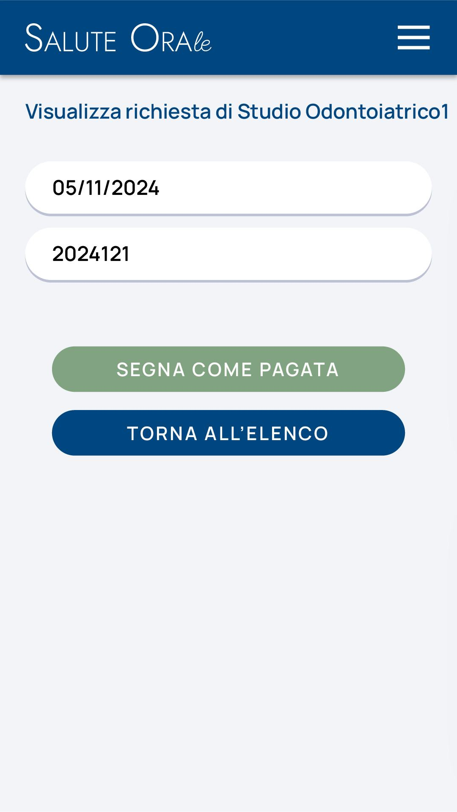

# Presentazione del portale

*[Dettagli immagine](images/0.md)*

## Homepage

*[Dettagli immagine](images/2.md)*

L'accesso alla pagina principale della webapp/portale contiene titolo e logo del progetto, loghi degli attori impegnati, informazioni sul progetto in essere al fine di informare le beneficiarie.

## Homepage - Call to Action

*[Dettagli immagine](images/1.md)*

In chiusura di pagina, un pulsante molto evidente manifesta l'intenzione di partecipare a questa iniziativa; comincia da qui il flusso paziente.

# Paziente

*[Dettagli immagine](images/3.md)*

## Iscrizione paziente

*[Dettagli immagine](images/4.md)*

Con il suo primo accesso, la paziente carica i dati e la documentazione che, a seguito approvazione, la abilitano ad accedere al progetto.

Dati anagrafici e contatti

## Iscrizione paziente - Documentazione

*[Dettagli immagine](images/5.md)*

Con il suo primo accesso, la paziente carica i dati e la documentazione che, a seguito approvazione, la abilitano ad accedere al progetto.

Tessera sanitaria, STP o ENI; autocertificazione livello ISEE; documentazione attestante gravidanza

## Iscrizione paziente - Questionario

*[Dettagli immagine](images/6.md)*

Con il suo primo accesso, la paziente carica i dati e la documentazione che, a seguito approvazione, la abilitano ad accedere al progetto.

Questionario anamnestico

## Iscrizione paziente - Privacy

*[Dettagli immagine](images/7.md)*

Con il suo primo accesso, la paziente carica i dati e la documentazione che, a seguito approvazione, la abilitano ad accedere al progetto.

Accettazione normativa privacy

## Iscrizione paziente - Completamento

*[Dettagli immagine](images/8.md)*

A questo punto, la paziente ha concluso la propria registrazione.

Resta quindi in attesa di conferma da parte del backoffice (personale di segreteria), a seguito della quale può accedere al servizio.

## Trova Dentista

*[Dettagli immagine](images/9.md)*

Approvata la documentazione, l'utenza della paziente è confermata.

La paziente può procedere quindi a inserire l'areale di suo interesse al fine di rintracciare gli studi odontoiatrici aderenti all'iniziativa.

## Trova Dentista - Risultati

*[Dettagli immagine](images/10.md)*

Una volta identificato l'areale, la piattaforma mostra la lista degli studi aderenti.

L'inserimento manuale dell'areale permette di effettuare la ricerca in zone diverse rispetto al domicilio, aprendo a più opzioni.

## Prenota visita

*[Dettagli immagine](images/11.md)*

La paziente effettua una prenotazione. Ciascun appuntamento ha durata di 1 ora.

Gli orari a disposizione sono impostati dal singolo studio odontoiatrico: la paziente ha modo di scegliere tra questi.

## Prenota visita - Conferma

*[Dettagli immagine](images/12.md)*

La paziente attende quindi la risposta dell'odontoiatra, che può confermare o rifiutare, motivando il rifiuto, l'appuntamento.

Nel caso di conferma, la paziente riceve un messaggio di riepilogo; in caso di rifiuto, riaccederà alla funzione Trova Dentista per richiedere un altro appuntamento.

# Odontoiatra

*[Dettagli immagine](images/13.md)*

## Iscrizione odontoiatra

*[Dettagli immagine](images/14.md)*

Durante il suo primo accesso alla piattaforma, l'odontoiatra inserisce le informazioni necessarie alla verifica della propria identità.

## Iscrizione odontoiatra - Verifica

*[Dettagli immagine](images/15.md)*

L'odontoiatra attende la revisione dei documenti inseriti.

In caso di conferma, riceve una mail che gli permette di continuare con la sua registrazione; in caso di rifiuto, una motivazione che giustifichi il mancato completamento della sua iscrizione.

## Iscrizione odontoiatra - Dati

*[Dettagli immagine](images/16.md)*

L'odontoiatra completa la propria registrazione con i dati necessari per le funzioni che andrà a svolgere in piattaforma: dati generali, indirizzo e coordinate bancarie

## Iscrizione odontoiatra - Disponibilità

*[Dettagli immagine](images/17.md)*

L'odontoiatra completa la propria registrazione con i dati necessari per le funzioni che andrà a svolgere in piattaforma: orari di disponibilità al servizio

## Richieste di prenotazione

*[Dettagli immagine](images/18.md)*

Terminata la definizione della propria utenza, l'odontoiatra visualizza tutte le richieste di appuntamento dalla propria home page.

Potrà accettare o rifiutare le richieste grazie ai pulsanti evidenziati.

## Appuntamenti accettati

*[Dettagli immagine](images/19.md)*

Gli appuntamenti, una volta accettati, vengono visualizzati all'interno di una schermata dedicata.

All'interno di questa sarà possibile interagire con essi, al fine di:

## Appuntamenti accettati - Azioni

*[Dettagli immagine](images/20.md)*

Costituire un memorandum per l'appuntamento
Compilare un breve referto di fine visita
Annullare, per cause di forza maggiore, l'appuntamento fissato

## Rifiuto di un appuntamento

*[Dettagli immagine](images/22.md)*

Quando una richiesta di approvazione viene rifiutata, l'odontoiatra deve motivare il rifiuto qualificandolo.

Questa verrà recapitata alla paziente, al fine di assisterla nell'organizzare al meglio la sua successiva prenotazione.

## Appuntamenti rifiutati

*[Dettagli immagine](images/21.md)*

Anche le prenotazioni rifiutate e gli appuntamenti annullati vengono caricati in una pagina dedicata, con la funzione di storico.

Gli appuntamenti annullati non saranno più interagibili.

## Richieste rimborso

*[Dettagli immagine](images/28.md)*

Dopo aver compilato il referto di fine visita, il sistema crea automaticamente una richiesta di rimborso e la invia al back office.

Da questo pannello, l'odontoiatra può visualizzare lo stato delle proprie richieste e procedere indipendentemente, a compensazione avvenuta, ad emettere fattura.

# Back Office

## Schermata di accesso

*[Dettagli immagine](images/23.md)*

Il personale di segreteria accede al servizio per svolgere quattro funzioni principali:

- confermare le utenze delle pazienti
- confermare le utenze degli odontoiatri 
- procedere alla fatturazione verso gli odontoiatri
- accedere ai dati raccolti dal servizio 

## Avvisi di sistema

*[Dettagli immagine](images/24.md)*

In fase di registrazione delle pazienti, il back office riceverà degli avvisi preventivi al superamento di date soglie di affluenza, al fine di non eccedere i termini di servizio.

Questi dati saranno comunque sempre consultabili, nella loro interezza, tramite pannello apposito.

## Richiesta di iscrizione

*[Dettagli immagine](images/25.md)*

Da back office, il personale di segreteria visualizza le generalità inserite dalle pazienti...

## Richiesta di iscrizione - Documentazione

*[Dettagli immagine](images/26.md)*

...e la documentazione allegata da queste.

A seguito di questo esame, decide se accettare o rifiutare la richiesta di iscrizione al servizio.

## Iscrizione non accettata

*[Dettagli immagine](images/27.md)*

In caso una iscrizione venga rifiutata, la segreteria deve motivare il rifiuto, al fine di guidare la paziente ad una corretta compilazione dei propri dati o esplicitando le ragioni di una esclusione dal servizio.

## Richieste di rimborso - Archivio

*[Dettagli immagine](images/30.md)*

Dal menu di selezione, la segreteria può accedere all'archivio delle richieste di rimborso inviate a sistema alla compilazione del referto.

Le richieste sono rintracciabili per ragione sociale dello studio e/o stato di completamento, oppure entro un periodo di interesse.

## Richieste di rimborso - Filtro

*[Dettagli immagine](images/29.md)*

Filtrando in questo caso per ragione sociale, la segreteria può visualizzare tutte le richieste emesse da un singolo studio odontoiatrico e lo stato a loro assegnato.

La segreteria può accedere al dettaglio della richiesta selezionandola.

## Visualizza richiesta di rimborso

*[Dettagli immagine](images/32.md)*

Entrando nel dettaglio della richiesta, la segreteria può procedere al pagamento di questa nei modi che verranno attivati, indipendenti dalla piattaforma.

A questo punto, potrà cambiare lo stato in "PAGATA". Anche l'odontoiatra visualizzerà questo cambiamento di stato.

## Statistiche

*[Dettagli immagine](images/31.md)*

Infine, il back office avrà accesso ai dati prodotti lungo la durata del progetto, e potrà scaricare dei file CSV che li riassumono.

Le numeriche registrate saranno organizzate secondo logiche (quesiti) da concordare.
