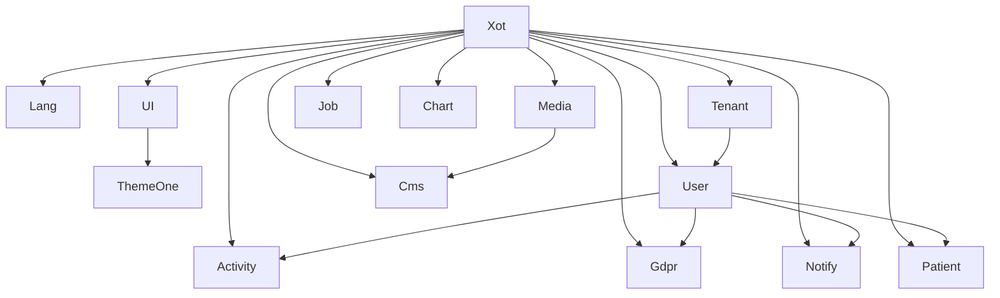

# Architettura e Moduli

## Architettura Generale

Il progetto il progetto è implementato come applicazione Laravel modulare, utilizzando la struttura fornita da `nwidart/laravel-modules` e l'ecosistema di moduli Laraxot.

### Schema Architetturale

```
/var/www/html/<nome progetto>/
├── laravel/                 # Applicazione Laravel
│   ├── app/                 # Codice applicativo core
│   ├── bootstrap/           # File di bootstrap
│   ├── config/              # Configurazioni
│   ├── database/            # Migrazioni, seeders e factories
│   ├── Modules/             # Moduli Laraxot installati
│   │   ├── Xot/             # Modulo core base
│   │   ├── Lang/            # Gestione multilingua
│   │   ├── Tenant/          # Multi-tenancy
│   │   ├── User/            # Gestione utenti
│   │   ├── UI/              # Interfaccia utente
│   │   ├── ThemeOne/        # Tema Filament
│   │   ├── Media/           # Gestione media
│   │   ├── Activity/        # Logging attività
│   │   ├── Gdpr/            # Conformità GDPR
│   │   ├── Notify/          # Sistema notifiche
│   │   ├── Cms/             # Gestione contenuti
│   │   ├── Job/             # Gestione job
│   │   ├── Chart/           # Visualizzazione dati
│   │   └── Patient/         # Modulo specifico paziente
│   ├── public/              # File pubblici
│   ├── resources/           # Risorse frontend (views, assets)
│   └── routes/              # Definizione route
└── docs/                    # Documentazione
```

## Moduli Implementati

### Moduli Core

| Modulo | Scopo | Dipendenze | Stato |
|--------|-------|------------|-------|
| **Xot** | Utilità core, base per tutti gli altri moduli | Nessuna | ✅ Installato |
| **Lang** | Gestione multilingua | Xot | ✅ Installato |
| **Tenant** | Multi-tenancy per separazione dati | Xot | ✅ Installato |
| **User** | Gestione utenti e autenticazione | Xot, Tenant | ✅ Installato |

### Moduli Frontend

| Modulo | Scopo | Dipendenze | Stato |
|--------|-------|------------|-------|
| **UI** | Interfaccia utente base | Xot | ✅ Installato |
| **ThemeOne** | Tema per Filament 4 | UI | ✅ Installato |

### Moduli Funzionali

| Modulo | Scopo | Dipendenze | Stato |
|--------|-------|------------|-------|
| **Media** | Gestione file e media | Xot | ✅ Installato |
| **Activity** | Logging attività sistema | Xot, User | ✅ Installato |
| **Gdpr** | Conformità normativa privacy | Xot, User | ✅ Installato |
| **Notify** | Sistema notifiche | Xot, User | ✅ Installato |
| **Cms** | Gestione contenuti | Xot, Media | ✅ Installato |
| **Job** | Gestione processi asincroni | Xot | ✅ Installato |
| **Chart** | Visualizzazione dati | Xot | ✅ Installato |
| **Patient** | Gestione pazienti | Xot, User | ✅ Installato |

## Dipendenze e Relazioni tra Moduli



## Funzionalità per Modulo

### Modulo Xot
- Framework di base per tutti i moduli
- Gestione delle configurazioni
- Utility comuni
- Trait e interfacce condivise

### Modulo Lang
- Supporto multilingua (IT/EN)
- Traduzione interfacce
- Gestione localizzazione

### Modulo Tenant
- Isolamento dati per tenant
- Gestione sottodominii
- Configurazioni per tenant

### Modulo User
- Autenticazione e autorizzazione
- Gestione profili utente
- Ruoli e permessi
- Registrazione e recupero password

### Modulo UI
- Componenti UI riutilizzabili
- Layout base
- Helpers per costruzione interfacce

### Modulo ThemeOne
- Tema Filament personalizzato
- Stili e componenti

### Modulo Media
- Upload e gestione file
- Archiviazione sicura
- Generazione thumbnail
- Gestione permessi su file

### Modulo Activity
- Logging azioni utente
- Monitoraggio sistema
- Audit trail per conformità

### Modulo Gdpr
- Gestione consensi
- Esportazione dati personali
- Cancellazione dati
- Registro trattamenti

### Modulo Notify
- Notifiche in-app
- Email
- SMS (opzionale)

### Modulo Cms
- Gestione pagine
- Contenuti informativi
- FAQ

### Modulo Job
- Code di lavoro
- Scheduling
- Monitoraggio job

### Modulo Chart
- Visualizzazione dati
- Report
- Dashboard analytics

### Modulo Patient
- Gestione anagrafica pazienti
- Schede cliniche
- Appuntamenti

## Implementazione delle Attività da Completare

Per completare l'implementazione dei moduli, è necessario:

1. **Configurare il Service Provider di ciascun modulo**:
   ```php
   // config/app.php
   'providers' => [
       // ...
       Modules\Xot\Providers\XotServiceProvider::class,
       Modules\Lang\Providers\LangServiceProvider::class,
       // Altri service provider dei moduli
   ],
   ```

2. **Pubblicare configurazioni**:
   ```bash
   php artisan vendor:publish --provider="Modules\Xot\Providers\XotServiceProvider" --tag="config"
   # Ripetere per ogni modulo
   ```

3. **Eseguire migrazioni**:
   ```bash
   php artisan migrate
   ```

4. **Creare seeders per dati iniziali**:
   ```bash
   php artisan module:make-seed ModuleNameDatabaseSeeder ModuleName
   ```

5. **Attivare i moduli**:
   ```bash
   php artisan module:enable ModuleName
   ```

## Problemi noti e soluzioni

### Autoloading
Risolvere conflitti di namespace modificando le classi duplicate o assicurando che i namespace siano coerenti.

### Incompatibilità versioni
Verificare la compatibilità tra moduli Laraxot e Laravel 12.0, eventualmente aggiornando le dipendenze.

### Conflitti di classe
Rimuovere o rinominare classi duplicate tra moduli, privilegiando moduli specializzati (es. classe GDPR dal modulo GDPR anziché UI).
