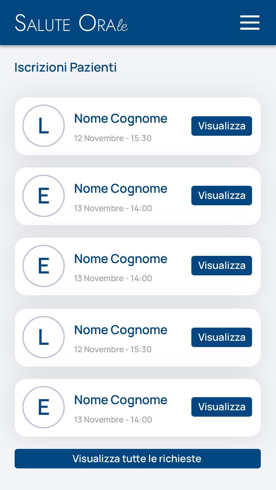
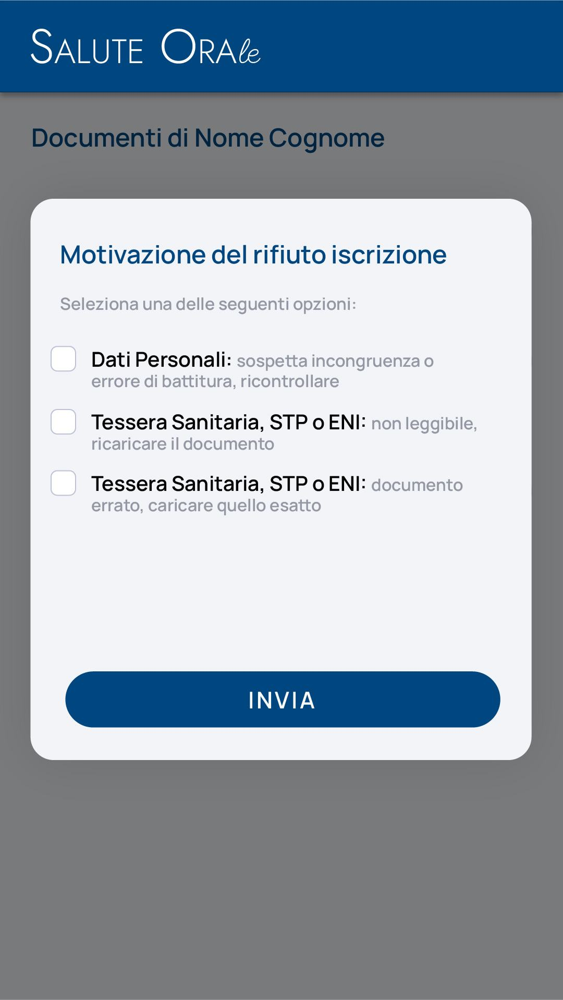

# Back Office <nome progetto>

## Panoramica

Il Back Office rappresenta il cuore amministrativo del portale <nome progetto>, dove il personale autorizzato gestisce tutti i processi di verifica, approvazione e supervisione del sistema. È strutturato per garantire efficienza operativa e controllo qualitativo dei servizi offerti.



## Funzionalità Implementate

### Verifica Pazienti


Il Back Office esamina e verifica la documentazione caricata dalle pazienti durante la fase di registrazione, in particolare:

```php
// Implementato in: Modules/Patient/app/Livewire/BackOffice/PatientVerificationPanel.php
public function approvePatient($patientId)
{
    $patient = Patient::findOrFail($patientId);
    
    try {
        app(ApprovePatientAction::class)->execute($patient);
        
        // Notifica via email alla paziente
        Mail::to($patient->user->email)->send(new PatientApprovedMail($patient));
        
        $this->notification()->success(
            'Paziente Approvata', 
            'La paziente è stata approvata con successo e notificata via email'
        );
        
    } catch (\Exception $e) {
        $this->notification()->error(
            'Errore',
            'Si è verificato un errore durante l\'approvazione: ' . $e->getMessage()
        );
    }
}
```

- **Stato implementazione:** 95%
- **File coinvolti:** 
  - `Modules/Patient/app/Livewire/BackOffice/PatientVerificationPanel.php`
  - `Modules/Patient/app/Actions/ApprovePatientAction.php`
  - `Modules/Patient/app/Mail/PatientApprovedMail.php`

### Verifica ISEE

Il sistema verifica l'autocertificazione ISEE caricata dalla paziente per confermare l'idoneità economica al servizio:

```php
// Implementato in: Modules/Patient/app/Actions/VerifyIseeDocumentAction.php
public function execute(Document $document): bool
{
    // Verificare il documento ISEE
    $isValidIsee = $this->documentValidator->validateIseeDocument($document);
    
    if ($isValidIsee) {
        $document->verification_status = 'approved';
        $document->verified_at = now();
        $document->save();
        
        // Log della verifica
        activity()
            ->performedOn($document)
            ->withProperties(['status' => 'approved'])
            ->log('Documento ISEE verificato e approvato');
            
        return true;
    }
    
    return false;
}
```

- **Stato implementazione:** 90%
- **File coinvolti:** 
  - `Modules/Patient/app/Actions/VerifyIseeDocumentAction.php`
  - `Modules/Patient/app/Services/DocumentValidatorService.php`

### Verifica Gravidanza

Verifica della documentazione attestante lo stato di gravidanza, requisito fondamentale per l'accesso al servizio:

```php
// Implementato in: Modules/Patient/app/Actions/VerifyPregnancyDocumentAction.php
public function execute(Document $document): bool
{
    // Verificare il documento di gravidanza
    $isValidPregnancy = $this->documentValidator->validatePregnancyDocument($document);
    
    if ($isValidPregnancy) {
        $document->verification_status = 'approved';
        $document->verified_at = now();
        $document->save();
        
        // Aggiornare lo stato della paziente
        $document->patient->update([
            'pregnancy_verified' => true,
            'pregnancy_verified_at' => now(),
        ]);
        
        return true;
    }
    
    return false;
}
```

- **Stato implementazione:** 90%
- **File coinvolti:** 
  - `Modules/Patient/app/Actions/VerifyPregnancyDocumentAction.php`
  - `Modules/Patient/app/Models/Document.php`

### Approvazione Pazienti


Processo di approvazione finale che abilita la paziente ad utilizzare il servizio:

```php
// Implementato in: Modules/Patient/app/Actions/ApprovePatientRegistrationAction.php
public function execute(Patient $patient): Patient
{
    // Verificare che tutti i documenti necessari siano stati approvati
    $documentsVerified = $patient->documents()
        ->whereIn('type', ['isee', 'pregnancy'])
        ->where('verification_status', 'approved')
        ->count() === 2;
    
    if (!$documentsVerified) {
        throw new \Exception('Non tutti i documenti sono stati verificati e approvati');
    }
    
    $patient->status = 'approved';
    $patient->approved_at = now();
    $patient->save();
    
    // Attivare l'account utente associato
    $patient->user->update(['status' => 'active']);
    
    // Notificare la paziente
    event(new PatientApproved($patient));
    
    return $patient;
}
```

- **Stato implementazione:** 95%
- **File coinvolti:** 
  - `Modules/Patient/app/Actions/ApprovePatientRegistrationAction.php`
  - `Modules/Patient/app/Events/PatientApproved.php`
  - `Modules/Patient/app/Notifications/PatientApprovedNotification.php`

### Verifica Odontoiatri


Il Back Office verifica i documenti professionali degli odontoiatri, garantendo l'idoneità dei professionisti:

```php
// Implementato in: Modules/Dentist/app/Livewire/BackOffice/DentistVerificationPanel.php
public function verifyDentist($dentistId)
{
    $dentist = Dentist::findOrFail($dentistId);
    
    // Verificare iscrizione all'albo
    $professionalIdValid = $this->dentistValidator->validateProfessionalId(
        $dentist->professional_id,
        $dentist->professional_registration_date
    );
    
    if (!$professionalIdValid) {
        $this->notification()->error(
            'Verifica Fallita',
            'Il numero di iscrizione all\'albo non è valido o non corrisponde ai dati forniti'
        );
        return;
    }
    
    // Processo di approvazione
    app(ApproveDentistAction::class)->execute($dentist);
    
    $this->notification()->success(
        'Odontoiatra Verificato',
        'I documenti dell\'odontoiatra sono stati verificati con successo'
    );
}
```

- **Stato implementazione:** 90%
- **File coinvolti:** 
  - `Modules/Dentist/app/Livewire/BackOffice/DentistVerificationPanel.php`
  - `Modules/Dentist/app/Services/DentistValidatorService.php`
  - `Modules/Dentist/app/Actions/ApproveDentistAction.php`

### Verifica Documenti Professionali

Analisi e verifica dei documenti professionali dell'odontoiatra:

```php
// Implementato in: Modules/Dentist/app/Actions/VerifyProfessionalDocumentsAction.php
public function execute(Dentist $dentist): bool
{
    // Verificare tutti i documenti richiesti
    $requiredDocuments = ['license', 'id_card', 'professional_registration'];
    $allDocumentsValid = true;
    
    foreach ($requiredDocuments as $docType) {
        $document = $dentist->documents()->where('type', $docType)->first();
        
        if (!$document || !$this->documentValidator->validateDocument($document, $docType)) {
            $allDocumentsValid = false;
            break;
        }
    }
    
    if ($allDocumentsValid) {
        $dentist->documents_verified = true;
        $dentist->documents_verified_at = now();
        $dentist->save();
        
        return true;
    }
    
    return false;
}
```

- **Stato implementazione:** 95%
- **File coinvolti:** 
  - `Modules/Dentist/app/Actions/VerifyProfessionalDocumentsAction.php`
  - `Modules/Dentist/app/Services/DocumentValidatorService.php`

### Approvazione Odontoiatri



Processo di approvazione finale degli odontoiatri:

```php
// Implementato in: Modules/Dentist/app/Actions/ApproveDentistRegistrationAction.php
public function execute(Dentist $dentist): Dentist
{
    // Verificare che tutti i documenti necessari siano stati approvati
    if (!$dentist->documents_verified) {
        throw new \Exception('I documenti dell\'odontoiatra non sono stati completamente verificati');
    }
    
    $dentist->status = 'approved';
    $dentist->approved_at = now();
    $dentist->save();
    
    // Attivare l'account utente associato
    $dentist->user->update(['status' => 'active']);
    
    // Generare token per completamento registrazione
    $token = app(GenerateRegistrationCompletionTokenAction::class)->execute($dentist);
    
    // Inviare email con link per completare la registrazione
    Mail::to($dentist->email)->send(new DentistApprovedMail($dentist, $token));
    
    return $dentist;
}
```

- **Stato implementazione:** 90%
- **File coinvolti:** 
  - `Modules/Dentist/app/Actions/ApproveDentistRegistrationAction.php`
  - `Modules/Dentist/app/Actions/GenerateRegistrationCompletionTokenAction.php`
  - `Modules/Dentist/app/Mail/DentistApprovedMail.php`

### Dashboard Rimborsi

Gestione delle richieste di rimborso generate dagli odontoiatri dopo le visite:

```php
// Implementato in: Modules/Reimbursement/app/Livewire/BackOffice/ReimbursementDashboard.php
class ReimbursementDashboard extends Component
{
    public function mount()
    {
        $this->reimbursements = ReimbursementRequest::with(['dentist', 'patient', 'appointment'])
            ->orderBy('created_at', 'desc')
            ->paginate(15);
            
        $this->statistics = [
            'pending' => ReimbursementRequest::where('status', 'pending')->count(),
            'approved' => ReimbursementRequest::where('status', 'approved')->count(),
            'paid' => ReimbursementRequest::where('status', 'paid')->count(),
            'rejected' => ReimbursementRequest::where('status', 'rejected')->count(),
            'total_amount' => ReimbursementRequest::where('status', 'paid')->sum('amount'),
        ];
    }
    
    // Altre funzioni per gestire i rimborsi...
}
```

- **Stato implementazione:** 90%
- **File coinvolti:** 
  - `Modules/Reimbursement/app/Livewire/BackOffice/ReimbursementDashboard.php`
  - `Modules/Reimbursement/app/Models/ReimbursementRequest.php`

### Approvazione Rimborsi

Processo di approvazione delle richieste di rimborso:

```php
// Implementato in: Modules/Reimbursement/app/Actions/ApproveReimbursementRequestAction.php
public function execute(ReimbursementRequest $request, BackOfficeUser $approver): ReimbursementRequest
{
    // Verificare che la richiesta sia in stato pendente
    if ($request->status !== 'pending') {
        throw new \Exception('Solo le richieste in stato pendente possono essere approvate');
    }
    
    // Verificare che l'appuntamento associato sia effettivamente completato
    if ($request->appointment->status !== 'completed') {
        throw new \Exception('Il rimborso può essere approvato solo per appuntamenti completati');
    }
    
    $request->status = 'approved';
    $request->approved_at = now();
    $request->approved_by = $approver->id;
    $request->save();
    
    // Notificare l'odontoiatra
    Mail::to($request->dentist->email)->send(new ReimbursementApprovedMail($request));
    
    // Log dell'attività
    activity()
        ->performedOn($request)
        ->causedBy($approver)
        ->withProperties(['amount' => $request->amount])
        ->log('Richiesta di rimborso approvata');
    
    return $request;
}
```

- **Stato implementazione:** 85%
- **File coinvolti:** 
  - `Modules/Reimbursement/app/Actions/ApproveReimbursementRequestAction.php`
  - `Modules/Reimbursement/app/Mail/ReimbursementApprovedMail.php`

### Gestione Pagamenti

Gestione dei pagamenti per le richieste di rimborso approvate:

```php
// Implementato in: Modules/Reimbursement/app/Actions/ProcessPaymentAction.php
public function execute(ReimbursementRequest $request, array $paymentData): Payment
{
    // Verificare che la richiesta sia stata approvata
    if ($request->status !== 'approved') {
        throw new \Exception('Solo le richieste approvate possono essere pagate');
    }
    
    // Creare il record di pagamento
    $payment = Payment::create([
        'reimbursement_request_id' => $request->id,
        'dentist_id' => $request->dentist_id,
        'amount' => $request->amount,
        'payment_method' => $paymentData['method'],
        'transaction_id' => $paymentData['transaction_id'] ?? null,
        'payment_date' => now(),
        'status' => 'completed',
        'notes' => $paymentData['notes'] ?? null,
    ]);
    
    // Aggiornare lo stato della richiesta di rimborso
    $request->update([
        'status' => 'paid',
        'paid_at' => now(),
    ]);
    
    // Notificare l'odontoiatra
    Mail::to($request->dentist->email)->send(new PaymentProcessedMail($payment));
    
    return $payment;
}
```

- **Stato implementazione:** 75%
- **File coinvolti:** 
  - `Modules/Reimbursement/app/Actions/ProcessPaymentAction.php`
  - `Modules/Reimbursement/app/Models/Payment.php`
  - `Modules/Reimbursement/app/Mail/PaymentProcessedMail.php`

### Verifica Fatture

Processo di verifica delle fatture emesse dagli odontoiatri:

```php
// Implementato in: Modules/Reimbursement/app/Actions/VerifyInvoiceAction.php
public function execute(Invoice $invoice): bool
{
    // Verificare che la fattura corrisponda al pagamento
    $payment = $invoice->payment;
    
    if (!$payment) {
        throw new \Exception('Fattura non associata ad alcun pagamento');
    }
    
    // Verificare i dati fiscali
    $isValid = $this->invoiceValidator->validate($invoice, $payment);
    
    if ($isValid) {
        $invoice->verification_status = 'approved';
        $invoice->verified_at = now();
        $invoice->save();
        
        // Aggiornare lo stato del pagamento
        $payment->update(['invoice_verified' => true]);
        
        return true;
    }
    
    return false;
}
```

- **Stato implementazione:** 70%
- **File coinvolti:** 
  - `Modules/Reimbursement/app/Actions/VerifyInvoiceAction.php`
  - `Modules/Reimbursement/app/Services/InvoiceValidatorService.php`
  - `Modules/Reimbursement/app/Models/Invoice.php`

### Statistiche Pazienti

Dashboard con statistiche dettagliate sulle pazienti:

```php
// Implementato in: Modules/Patient/app/Livewire/BackOffice/PatientStatisticsPanel.php
public function mount()
{
    $this->statistics = [
        'total' => Patient::count(),
        'pending' => Patient::where('status', 'pending')->count(),
        'approved' => Patient::where('status', 'approved')->count(),
        'rejected' => Patient::where('status', 'rejected')->count(),
        'appointments' => Appointment::whereHas('patient')->count(),
        'completed_appointments' => Appointment::whereHas('patient')->where('status', 'completed')->count(),
        'avg_time_to_verification' => $this->calculateAverageVerificationTime(),
        'geographic_distribution' => $this->getGeographicDistribution(),
    ];
}
```

- **Stato implementazione:** 85%
- **File coinvolti:** 
  - `Modules/Patient/app/Livewire/BackOffice/PatientStatisticsPanel.php`
  - `Modules/Patient/app/Models/Patient.php`

### Statistiche Odontoiatri

Dashboard con statistiche dettagliate sugli odontoiatri:

```php
// Implementato in: Modules/Dentist/app/Livewire/BackOffice/DentistStatisticsPanel.php
public function mount()
{
    $this->statistics = [
        'total' => Dentist::count(),
        'pending' => Dentist::where('status', 'pending')->count(),
        'approved' => Dentist::where('status', 'approved')->count(),
        'rejected' => Dentist::where('status', 'rejected')->count(),
        'appointments' => Appointment::whereHas('dentist')->count(),
        'completed_appointments' => Appointment::whereHas('dentist')->where('status', 'completed')->count(),
        'avg_appointments_per_dentist' => $this->calculateAverageAppointments(),
        'geographic_distribution' => $this->getGeographicDistribution(),
    ];
}
```

- **Stato implementazione:** 85%
- **File coinvolti:** 
  - `Modules/Dentist/app/Livewire/BackOffice/DentistStatisticsPanel.php`
  - `Modules/Dentist/app/Models/Dentist.php`

### Report Rimborsi

Sistema di reportistica dettagliata sui rimborsi:

```php
// Implementato in: Modules/Reimbursement/app/Livewire/BackOffice/ReimbursementReportPanel.php
public function generateReport()
{
    $this->validate([
        'start_date' => 'required|date',
        'end_date' => 'required|date|after_or_equal:start_date',
        'report_type' => 'required|in:summary,detailed,financial',
    ]);
    
    $query = ReimbursementRequest::whereBetween('created_at', [$this->start_date, $this->end_date]);
    
    if ($this->dentist_id) {
        $query->where('dentist_id', $this->dentist_id);
    }
    
    $this->data = match($this->report_type) {
        'summary' => $this->generateSummaryReport($query),
        'detailed' => $this->generateDetailedReport($query),
        'financial' => $this->generateFinancialReport($query),
    };
    
    // Opzionalmente exportare in Excel
    if ($this->export_excel) {
        return Excel::download(
            new ReimbursementExport($this->data), 
            "rimborsi_{$this->start_date}_{$this->end_date}.xlsx"
        );
    }
}
```

- **Stato implementazione:** 80%
- **File coinvolti:** 
  - `Modules/Reimbursement/app/Livewire/BackOffice/ReimbursementReportPanel.php`
  - `Modules/Reimbursement/app/Exports/ReimbursementExport.php`

### Dashboard Integrata

Dashboard centralizzata con visione d'insieme di tutti i processi:

```php
// Implementato in: Modules/BackOffice/app/Livewire/Dashboard/IntegratedDashboard.php
public function mount()
{
    $this->patientStats = app(PatientStatisticsService::class)->getKeyMetrics();
    $this->dentistStats = app(DentistStatisticsService::class)->getKeyMetrics();
    $this->appointmentStats = app(AppointmentStatisticsService::class)->getKeyMetrics();
    $this->reimbursementStats = app(ReimbursementStatisticsService::class)->getKeyMetrics();
    
    $this->alerts = Alert::where('is_active', true)
        ->orderBy('priority', 'desc')
        ->take(5)
        ->get();
        
    $this->recentActivity = Activity::orderBy('created_at', 'desc')
        ->take(10)
        ->get();
}
```

- **Stato implementazione:** 70%
- **File coinvolti:** 
  - `Modules/BackOffice/app/Livewire/Dashboard/IntegratedDashboard.php`
  - `Modules/BackOffice/app/Services/StatisticsServices.php`

## Priorità di Sviluppo

### Completamento (Q3 2025)

1. **Automazione verifica documenti (40%)**
   - Implementazione OCR per estrazione dati automatica
   - Sistema di verifica automatica delle informazioni estratte
   - Validazione automatica contro database esterni

2. **Sistema di allerta avanzato (55%)**
   - Notifiche automatiche per scadenze documentali
   - Allerte per pattern sospetti o anomalie
   - Dashboard di monitoraggio rischi

3. **Integrazione con sistemi esterni (30%)**
   - Connessione con database ordini professionali
   - Interfaccia con sistemi ISEE nazionali
   - Verifica automatica documenti identità

### Miglioramenti UX/UI (Q4 2025)

1. **Dashboard personalizzabili (25%)**
   - Widget configurabili per ruolo operatore
   - Salvataggio configurazioni personalizzate
   - Visualizzazioni alternative dei dati

2. **Reportistica avanzata (40%)**
   - Esportazione multi-formato (PDF, Excel, CSV)
   - Report programmati automatici
   - Visualizzazioni grafiche avanzate

## Integrazione con Altri Moduli

Il Back Office si integra con:

1. **Modulo Paziente**:
   - Verifica registrazioni
   - Approvazione documenti
   - Gestione statistiche

2. **Modulo Odontoiatra**:
   - Verifica professionisti
   - Approvazione iscrizione
   - Monitoraggio qualità servizio

3. **Modulo Rimborsi**:
   - Approvazione richieste
   - Gestione pagamenti
   - Verifica fatturazione

---

*Ultimo aggiornamento: 14 Maggio 2025*
