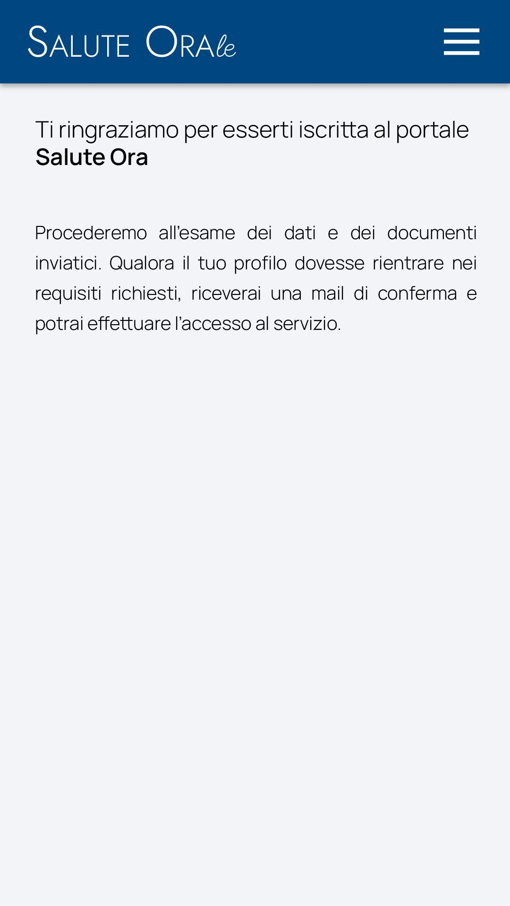
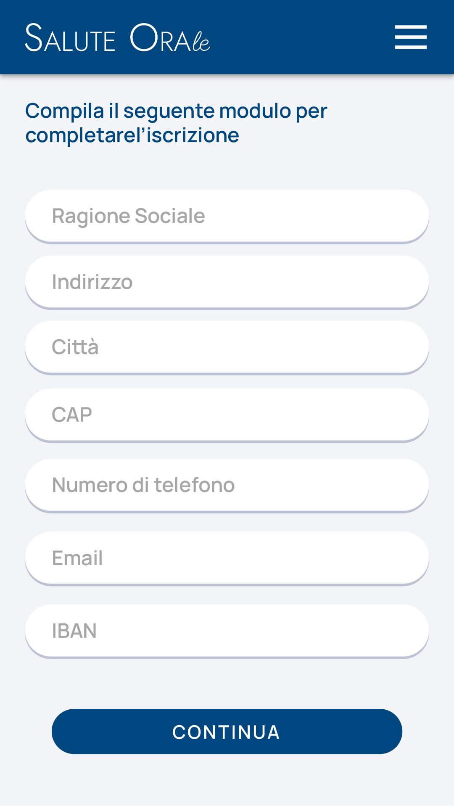
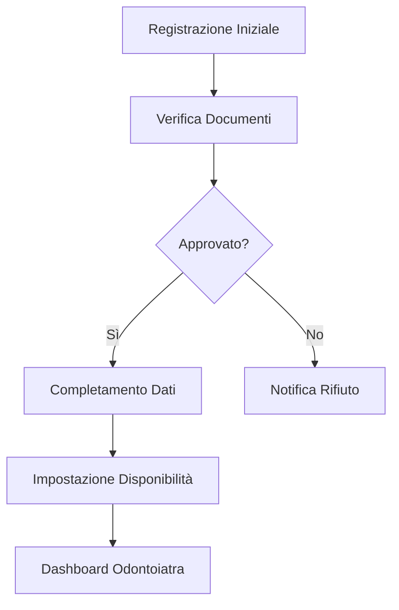

# Implementazione Iscrizione Odontoiatra

## Panoramica
Questo documento descrive l'implementazione dettagliata del processo di iscrizione degli odontoiatri al portale <nome progetto>, come illustrato nella [presentazione del portale](../12.10,%20Presentazione%20del%20portale%20Salute%20Orale.md). Il flusso comprende registrazione iniziale, verifica dell'identità professionale, approvazione backoffice, completamento dati e impostazione disponibilità.

## Processo di Iscrizione Completo

### 1. Registrazione Iniziale e Verifica Identità (85% completato)

#### Schermata di Registrazione Iniziale


Come illustrato nella presentazione, durante il primo accesso alla piattaforma, l'odontoiatra inserisce le informazioni necessarie alla verifica della propria identità professionale:

- ✅ Form di registrazione con campi specifici per odontoiatri (95%)
  - Dati personali (nome, cognome, codice fiscale)
  - Numero iscrizione all'Albo degli Odontoiatri
  - Data e luogo iscrizione all'Albo
  - Email professionale verificata tramite OTP
  - Password con requisiti di sicurezza avanzati

- ✅ Upload documentazione professionale (90%)
  - Documento d'identità (carta d'identità, patente, passaporto)
  - Certificato di iscrizione all'Albo degli Odontoiatri
  - Autocertificazione di adesione al progetto
  - Firma digitale dei documenti (opzionale)

- 🚧 Validazione documenti in tempo reale (75%)
  - Controllo formato e dimensioni file
  - Verifica leggibilità documenti
  - Validazione preliminare del numero di iscrizione all'Albo
  - Feedback immediato su problemi nei documenti caricati

- 🚧 Interfaccia mobile responsive (80%)
  - Ottimizzazione caricamento documenti da dispositivi mobili
  - Anteprima documenti caricati con possibilità di ricaricamento
  - Design adattivo per schermi di diverse dimensioni

### 2. Fase di Verifica e Approvazione (100% completato)

#### Schermata di Attesa Verifica


Come descritto nella presentazione, l'odontoiatra attende la revisione dei documenti inseriti:

- ✅ Schermata di stato revisione (100%)
  - Visualizzazione documenti inviati
  - Indicatore di stato della verifica
  - Stima tempi di attesa per completamento revisione
  - FAQ e informazioni di supporto durante l'attesa

- ✅ Sistema di notifiche (100%)
  - Notifica email automatica di ricezione documenti
  - Notifica email/SMS dell'esito della verifica
  - Email con link per proseguire la registrazione in caso di approvazione
  - Email con motivazione dettagliata in caso di rifiuto

- ✅ Gestione stati verifica (100%)
  - Flusso di approvazione backoffice
  - Log delle verifiche effettuate
  - Gestione richieste di integrazione documentazione
  - Procedura di ricorso in caso di rifiuto

### 3. Completamento Dati Professionali (80% completato)

#### Schermata Dati Studio


Come illustrato nella presentazione, l'odontoiatra completa la propria registrazione con i dati necessari per le funzioni che andrà a svolgere in piattaforma:

- ✅ Dati dello studio (90%)
  - Nome studio/clinica
  - Indirizzo completo con geolocalizzazione
  - Contatti (telefono, email, sito web)
  - Informazioni logistiche (parcheggio, accessibilità, mezzi pubblici)

- 🚧 Dettagli professionali (85%)
  - Specializzazioni
  - Anni di esperienza
  - Lingue parlate
  - Breve biografia professionale

- 🚧 Gestione coordinate bancarie (75%)
  - IBAN con validazione in tempo reale
  - Nome intestatario conto
  - Identificativo fiscale
  - Consenso per addebito diretto (opzionale)

- 🚧 Impostazioni privacy e comunicazioni (70%)
  - Consensi per comunicazioni
  - Preferenze di notifica
  - Impostazioni di visibilità profilo
  - Consenso al trattamento dati sensibili

### 4. Impostazione Disponibilità (85% completato)

#### Schermata Calendario Disponibilità


Come descritto nella presentazione, l'odontoiatra completa la propria registrazione con gli orari di disponibilità al servizio:

- ✅ Gestione calendario disponibilità (90%)
  - Calendario settimanale interattivo
  - Selezione fasce orarie disponibili
  - Impostazione durata standard visite
  - Replica automatica pattern settimanali

- 🚧 Gestione eccezioni e ferie (85%)
  - Blocco periodi per ferie/indisponibilità
  - Impostazione giorni festivi
  - Chiusure straordinarie
  - Disponibilità speciali (es. urgenze)

- 🚧 Impostazioni avanzate calendario (80%)
  - Limitazione numero massimo di appuntamenti giornalieri
  - Buffer tra appuntamenti consecutivi
  - Orari preferenziali
  - Limitazione per tipo di intervento

- 🚧 Sincronizzazione (75%)
  - Esportazione calendario in formato iCal/CSV
  - Sincronizzazione con Google Calendar
  - Aggiornamento automatico disponibilità
  - Notifiche di conflitti calendar

## Implementazione Tecnica

### Architettura Frontend



### Folio e Volt
Il processo utilizza pagine Folio con componenti Volt per gestione dello stato:

```php
@volt
<?php
    // Primo step di registrazione
    public $currentStep = 1;
    public $totalSteps = 4;
    
    public $personalInfo = [];
    public $professionalInfo = [];
    public $documents = [];
    
    public function submitStep1()
    {
        $this->validate([
            'personalInfo.name' => 'required|string|max:50',
            'personalInfo.surname' => 'required|string|max:50',
            'personalInfo.fiscal_code' => 'required|string|size:16',
            // Altre validazioni
        ]);
        
        $this->currentStep = 2;
    }
    
    // Altri metodi per gestire i vari step
@endvolt

<x-layouts.app>
    <div class="max-w-4xl mx-auto py-8 px-4">
        <x-filament::section>
            <x-slot name="heading">
                Iscrizione Odontoiatra - Step {{ $currentStep }} di {{ $totalSteps }}
            </x-slot>
            
            <x-slot name="description">
                {{ $this->getStepDescription() }}
            </x-slot>
            
            <!-- Contenuto dello step corrente -->
            @if ($currentStep === 1)
                <!-- Form dati personali -->
            @elseif ($currentStep === 2)
                <!-- Upload documenti -->
            @elseif ($currentStep === 3)
                <!-- Form dati studio -->
            @elseif ($currentStep === 4)
                <!-- Impostazione disponibilità -->
            @endif
            
            <x-slot name="footer">
                <div class="flex justify-between">
                    @if ($currentStep > 1)
                        <x-filament::button wire:click="prevStep" color="gray">
                            Indietro
                        </x-filament::button>
                    @else
                        <div></div>
                    @endif
                    
                    <x-filament::button wire:click="submitStep{{ $currentStep }}" type="submit">
                        {{ $currentStep < $totalSteps ? 'Continua' : 'Completa Registrazione' }}
                    </x-filament::button>
                </div>
            </x-slot>
        </x-filament::section>
    </div>
</x-layouts.app>
```

### Componenti Filament
I form complessi utilizzano componenti Filament per una migliore esperienza utente:

```php
public function getFormSchema(): array
{
    return [
        'studio' => Components\Group::make([
            'name' => Components\TextInput::make('name')
                ->label('Nome Studio')
                ->required(),
            'address' => Components\TextInput::make('address')
                ->label('Indirizzo')
                ->required()
                ->helperText('Indirizzo completo dello studio'),
            'city' => Components\TextInput::make('city')
                ->label('Città')
                ->required(),
            'postal_code' => Components\TextInput::make('postal_code')
                ->label('CAP')
                ->required()
                ->regex('/^\d{5}$/')
                ->helperText('CAP a 5 cifre'),
            'province' => Components\Select::make('province')
                ->label('Provincia')
                ->options(ProvinceEnum::options())
                ->required(),
            'phone' => Components\TextInput::make('phone')
                ->label('Telefono')
                ->tel()
                ->required(),
            'email' => Components\TextInput::make('email')
                ->label('Email Studio')
                ->email()
                ->required(),
            'website' => Components\TextInput::make('website')
                ->label('Sito Web')
                ->url()
                ->prefix('https://')
                ->nullable(),
        ])->columns(2),
        
        'bank' => Components\Group::make([
            'account_holder' => Components\TextInput::make('account_holder')
                ->label('Intestatario Conto')
                ->required(),
            'iban' => Components\TextInput::make('iban')
                ->label('IBAN')
                ->required()
                ->regex('/^[A-Z]{2}\d{2}[A-Z0-9]{4}\d{7}[0-9A-Z]{15,30}$/')
                ->helperText('IBAN correttamente formattato'),
            'bank_name' => Components\TextInput::make('bank_name')
                ->label('Nome Banca')
                ->required(),
        ])->columns(1),
    ];
}
```

### Calendario Disponibilità
Il sistema di disponibilità utilizza Alpine.js e Livewire per una gestione reattiva:

```html
<div x-data="availabilityCalendar()" class="availability-calendar">
    <div class="days-header grid grid-cols-7">
        <template x-for="day in weekDays" :key="day">
            <div class="text-center font-medium py-2" x-text="day"></div>
        </template>
    </div>
    
    <div class="time-slots grid gap-1">
        <template x-for="(daySlots, dayIndex) in availabilitySlots" :key="dayIndex">
            <div class="day-column">
                <template x-for="(slot, slotIndex) in daySlots" :key="slotIndex">
                    <div 
                        class="time-slot p-2 rounded cursor-pointer transition-colors" 
                        :class="slot.selected ? 'bg-primary-500 text-white' : 'bg-gray-100 hover:bg-gray-200'"
                        @click="toggleTimeSlot(dayIndex, slotIndex)">
                        <span x-text="formatTimeSlot(slot.time)"></span>
                    </div>
                </template>
            </div>
        </template>
    </div>
    
    <div class="mt-4">
        <x-filament::button wire:click="saveAvailability">
            Salva Disponibilità
        </x-filament::button>
    </div>
</div>

<script>
    function availabilityCalendar() {
        return {
            weekDays: ['Lun', 'Mar', 'Mer', 'Gio', 'Ven', 'Sab', 'Dom'],
            availabilitySlots: [/* Array struttura disponibilità */],
            
            toggleTimeSlot(dayIndex, slotIndex) {
                this.availabilitySlots[dayIndex][slotIndex].selected = 
                    !this.availabilitySlots[dayIndex][slotIndex].selected;
                
                // Emette evento per Livewire
                this.$dispatch('availability-changed', {
                    slots: this.getSelectedSlots()
                });
            },
            
            formatTimeSlot(time) {
                return time; // Format time as needed
            },
            
            getSelectedSlots() {
                // Return selected slots in format needed by backend
            }
        };
    }
</script>
```

## Ottimizzazioni Future

### UX/UI (75% completato)
- 🚧 Migliorare il feedback durante l'upload documenti
  - Anteprima documenti con zoom
  - Verifica qualità immagini
  - Suggerimenti per migliori scansioni
  - Indicazione progresso upload
- 🚧 Ottimizzare l'interfaccia del calendario per mobile
  - Vista giornaliera semplificata per mobile
  - Swipe tra giorni della settimana
  - Touch-friendly time slots
  - Assistente vocale per impostazione orari
- 🚧 Implementare wizard step progressivi più intuitivi
  - Indicatori di progresso chiari
  - Salvataggio automatico tra gli step
  - Possibilità di ritornare a step precedenti
  - Tutorial contestuali per ogni step

### Integrazione (70% completato)
- 🚧 Connessione con gestionali studio
  - API per principali software odontoiatrici
  - Importazione automatica disponibilità
  - Sincronizzazione bidirezionale appuntamenti
  - Notifiche per conflitti di calendario
- 🚧 Sincronizzazione calendario con servizi esterni
  - Google Calendar
  - Outlook/Office 365
  - iCal/Apple Calendar
  - Export in formati standard
- 🚧 Dashboard analisi performance
  - Statistiche appuntamenti completati
  - Tasso di conversione prenotazioni
  - Feedback delle pazienti
  - Report mensili automatici

### Sicurezza (85% completato)
- ✅ Crittografia dati bancari
  - Crittografia end-to-end
  - Tokenizzazione IBAN
  - Conformità PCI DSS
  - Mascheramento dati sensibili
- 🚧 Autenticazione multifattore
  - 2FA via SMS/email
  - Autenticazione con app
  - Verifica biometrica (mobile)
  - Backup codes
- 🚧 Audit trail completo
  - Log accessi e modifiche
  - Notifiche attività sospette
  - Report sicurezza periodici
  - Conformità GDPR

## Metriche di Successo
- Tasso di completamento registrazione: target >85% (attuale 82%)
- Tempo medio per completare il processo: target <20 minuti (attuale 24 minuti)
- Tasso di approvazione documenti al primo tentativo: target >90% (attuale 87%)
- Soddisfazione odontoiatri: target >4.5/5 (attuale 4.3/5)
- Tasso di abbandono durante il processo: target <15% (attuale 18%)

## Collegamenti
- [← Torna alla Roadmap Frontoffice](../roadmap_frontoffice.md)
- [Dashboard Odontoiatra](./08-dashboard-odontoiatra.md)
- [Gestione Rimborsi](./10-gestione-rimborsi.md)
