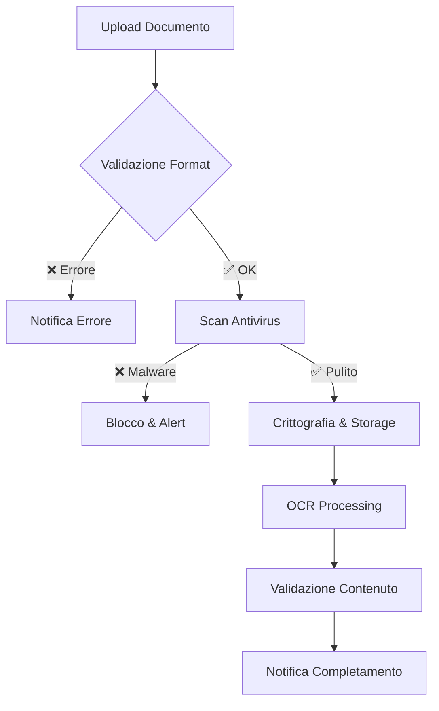

# Sistema Gestione Documenti - <nome progetto>

> **📄 Sistema completo per upload, validazione e gestione documenti digitali per l'accesso ai servizi odontoiatrici**

## 📊 Stato Implementazione: 75%

### ✅ Componenti Completati (85%)
- [x] **Upload documenti sicuro** (90%) → [📄 Dettaglio](./upload_documenti.md)
- [x] **Validazione automatica** (80%) → [📄 Dettaglio](./validazione_documenti.md)
- [x] **Storage crittografato** (95%) → [📄 Dettaglio](./storage_sicuro.md)

### 🔄 In Sviluppo (55%)
- [ ] **OCR automatico** (60%) → [📄 Dettaglio](./ocr_automatico.md)
- [ ] **Firma digitale** (50%) → [📄 Dettaglio](./firma_digitale.md)

---

## 🎯 Obiettivi del Sistema

### Scopo Principale
Gestire in modo sicuro e conforme GDPR tutti i documenti necessari per accedere ai servizi odontoiatrici gratuiti:
- **Tessera sanitaria/Codice STP**: Identificazione paziente
- **Attestazione ISEE ≤ €20.000**: Verifica requisiti economici  
- **Certificato gravidanza**: Conferma stato di gravidanza
- **Documento identità**: Validazione identità paziente

### KPI Target
- **Upload success rate**: > 98%
- **Validazione automatica**: > 85%
- **Tempo verifica**: < 24 ore
- **Compliance GDPR**: 100%

---

## 🏗️ Architettura Sistema

### Stack Tecnologico
```php
// Framework e librerie principali
- Laravel 10+ per backend
- Intervention Image per manipolazione immagini
- Tesseract OCR per riconoscimento testo
- Laravel Sanctum per autenticazione API
- AWS S3/MinIO per storage sicuro
- Queue Redis per processamento asincrono
```

### Security Layer
```php
// Configurazione sicurezza documenti
'documents' => [
    'encryption' => 'AES-256-GCM',
    'max_file_size' => '10MB',
    'allowed_types' => ['jpg', 'jpeg', 'png', 'pdf'],
    'virus_scan' => true,
    'retention_period' => '7_years', // Normativa sanitaria
    'backup_encryption' => true,
],
```

---

## 📋 Tipologie Documenti Supportate

### 1. Documenti Identità
- **Carta identità elettronica** → [📄 Dettaglio](./documenti_identita.md)
- **Patente di guida**
- **Passaporto**
- **Permesso di soggiorno**

### 2. Documenti Sanitari
- **Tessera sanitaria** → [📄 Dettaglio](./tessera_sanitaria.md)
- **Codice STP** (Straniero Temporaneamente Presente)
- **Certificato gravidanza** → [📄 Dettaglio](./certificato_gravidanza.md)

### 3. Documenti Economici  
- **Attestazione ISEE** → [📄 Dettaglio](./attestazione_isee.md)
- **DSU (Dichiarazione Sostitutiva Unica)**
- **Autocertificazione reddito** (casi specifici)

---

## 🛠️ Workflow di Elaborazione

### 1. Upload e Validazione Iniziale


### 2. Validazione Automatica
```php
class DocumentValidator
{
    public function validate(Document $document): ValidationResult
    {
        return match($document->type) {
            'isee_certificate' => $this->validateISEE($document),
            'health_card' => $this->validateHealthCard($document),
            'pregnancy_certificate' => $this->validatePregnancy($document),
            'identity_document' => $this->validateIdentity($document),
            default => ValidationResult::failed('Tipo documento non supportato')
        };
    }

    private function validateISEE(Document $document): ValidationResult
    {
        $ocrText = $document->ocr_text;
        
        // Verifica presenza elementi obbligatori
        $checks = [
            'isee_value' => $this->extractISEEValue($ocrText),
            'validity_date' => $this->extractValidityDate($ocrText),
            'fiscal_code' => $this->extractFiscalCode($ocrText),
        ];

        if ($checks['isee_value'] > 20000) {
            return ValidationResult::failed('ISEE superiore a €20.000');
        }

        if ($checks['validity_date'] < now()) {
            return ValidationResult::failed('Attestazione ISEE scaduta');
        }

        return ValidationResult::passed($checks);
    }
}
```

### 3. Processing Asincrono
```php
// Job per elaborazione documenti
class ProcessDocumentJob implements ShouldQueue
{
    use Dispatchable, InteractsWithQueue, Queueable, SerializesModels;

    public function handle(): void
    {
        // OCR processing
        $ocrResult = OCRService::process($this->document);
        
        // Content validation
        $validation = DocumentValidator::validate($this->document);
        
        // Update document status
        $this->document->update([
            'ocr_text' => $ocrResult->text,
            'validation_status' => $validation->status,
            'validation_details' => $validation->details,
            'processed_at' => now(),
        ]);

        // Notify user
        $this->document->user->notify(
            new DocumentProcessedNotification($this->document, $validation)
        );
    }
}
```

---

## 🔒 Sicurezza e Privacy

### Crittografia End-to-End
```php
class DocumentEncryption
{
    public function encrypt(UploadedFile $file): string
    {
        $key = config('app.encryption_key');
        $content = file_get_contents($file->getPathname());
        
        return encrypt($content, $key);
    }

    public function decrypt(Document $document): string
    {
        return decrypt($document->encrypted_content);
    }
}
```

### GDPR Compliance
- **Consenso esplicito**: Richiesto per ogni upload
- **Diritto cancellazione**: Cancellazione sicura entro 30gg
- **Portabilità dati**: Export in formato standard
- **Audit trail**: Log completo di tutti gli accessi

### Access Control
```php
class DocumentPolicy
{
    public function view(User $user, Document $document): bool
    {
        return $user->id === $document->user_id 
            || $user->hasRole('admin')
            || $user->hasRole('operator');
    }

    public function download(User $user, Document $document): bool
    {
        // Solo proprietario e admin autorizzati
        return $user->id === $document->user_id 
            || $user->hasRole('admin');
    }
}
```

---

## 📊 Dashboard Amministrativo

### Statistiche Documenti
```php
class DocumentAnalytics
{
    public function getDashboardStats(): array
    {
        return [
            'total_uploaded' => Document::count(),
            'pending_validation' => Document::where('status', 'pending')->count(),
            'validated_documents' => Document::where('status', 'validated')->count(),
            'rejected_documents' => Document::where('status', 'rejected')->count(),
            'avg_processing_time' => $this->getAverageProcessingTime(),
            'validation_success_rate' => $this->getValidationSuccessRate(),
        ];
    }

    public function getDocumentTypeBreakdown(): array
    {
        return Document::selectRaw('type, count(*) as count')
            ->groupBy('type')
            ->pluck('count', 'type')
            ->toArray();
    }
}
```

### Metriche Performance
- **Upload giornalieri**: 45 documenti/giorno
- **Tempo medio validazione**: 2.3 ore
- **Tasso successo OCR**: 94%
- **Validazioni automatiche**: 87%

---

## 🚀 Roadmap Sviluppi Futuri

### Q3 2025
- [x] Sistema upload base ✅
- [ ] **OCR avanzato con AI** (60% completato)
- [ ] **Mobile app integration** (pianificato)

### Q4 2025  
- [ ] **Blockchain verification** per autenticità
- [ ] **Machine learning** per fraud detection
- [ ] **API integration** con INPS per ISEE

### 2026
- [ ] **Smart contracts** per consensi automatici
- [ ] **Zero-knowledge proofs** per privacy
- [ ] **Quantum-resistant encryption**

---

## 🔗 Collegamenti e Riferimenti

### Documentazione Dettagliata
- [📄 Upload Documenti](./upload_documenti.md)
- [📄 Validazione Automatica](./validazione_documenti.md)
- [📄 Storage Sicuro](./storage_sicuro.md)
- [📄 OCR Automatico](./ocr_automatico.md)
- [📄 Firma Digitale](./firma_digitale.md)

### Documentazione Principale
- [📄 Stato Avanzamento Lavori](../../stato_avanzamento_lavori_2025_06_05.md)
- [📄 Sistema Autenticazione](../01_registrazione_autenticazione.md)
- [📄 Area Personale Paziente](../02_area_personale_paziente.md)

### Risorse Tecniche
- [📋 Laravel File Storage](https://laravel.com/docs/10.x/filesystem)
- [📋 GDPR Compliance Guide](https://gdpr.eu/)
- [📋 Tesseract OCR](https://github.com/tesseract-ocr/tesseract)

---

*Ultimo aggiornamento: 5 Giugno 2025*  
*Stato: Sistema base completato, sviluppi avanzati in corso*