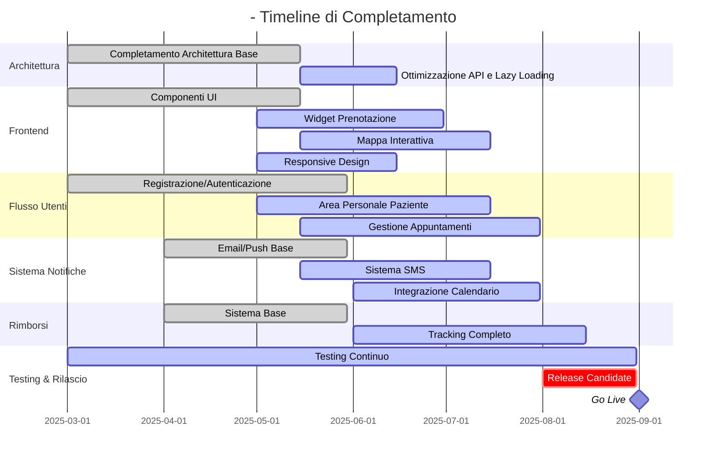

# Stato Aggiornamenti Lavori <nome progetto>

> Ultimo aggiornamento: 05 Giugno 2025

## Panoramica Generale

Questo documento fornisce un quadro aggiornato dello stato di avanzamento del progetto <nome progetto>, incluse le attività completate, quelle in corso e quelle pianificate per le prossime iterazioni. La pianificazione dettagliata si basa sull'analisi del codice attuale, dei requisiti documentati e delle risorse disponibili.

## Stato Complessivo del Progetto

| Area | Completamento | Previsione Completamento | Criticità |
|------|--------------|--------------------------|-----------|
| Architettura Base | 95% | Giugno 2025 | Bassa |
| Frontend - Moduli Utente | 80% | Luglio 2025 | Media |
| Backend - API | 85% | Giugno 2025 | Bassa |
| Flusso Prenotazioni | 75% | Luglio 2025 | Alta |
| Sistema Notifiche | 70% | Luglio 2025 | Media |
| Sistema Rimborsi | 65% | Agosto 2025 | Alta |
| Mobile Responsiveness | 85% | Giugno 2025 | Bassa |
| Testing e QA | 70% | Continua | Media |
| Documentazione | 75% | Continua | Bassa |

## Timeline Aggiornata

## Priorità Immediate (Giugno 2025)

1. **Completamento flusso prenotazione paziente** - Rif: [patient-book.md](roadmap_frontoffice/patient-book.md)
   - Sviluppo front-end mobile-first
   - Integrazione calendario e disponibilità
   - Validazione ISEE e documenti

2. **Mappa interattiva dentisti** - Rif: [mappa-dentisti.md](roadmap_frontoffice/mappa-dentisti.md)
   - Filtri per distanza e disponibilità
   - Schede dettaglio dentisti
   - Integrazione con Google Maps

3. **Ottimizzazioni prestazionali** - Rif: [ottimizzazioni.md](roadmap_frontoffice/ottimizzazioni.md)
   - Lazy loading componenti
   - Caching API
   - Minificazione risorse statiche

## Attività con Scadenza Luglio 2025

1. **Sistema notifiche avanzato** - Rif: [sistema-notifiche.md](roadmap_frontoffice/sistema-notifiche.md)
   - Integrazione SMS
   - Notifiche push browser
   - Template personalizzabili

2. **Area personale paziente** - Rif: [area-paziente.md](roadmap_frontoffice/area-paziente.md)
   - Dashboard storico appuntamenti
   - Documentazione clinica
   - Upload referti

3. **Dashboard odontoiatra** - Rif: [dashboard-odontoiatra.md](roadmap_frontoffice/dashboard-odontoiatra.md)
   - Calendario interattivo
   - Gestione slot disponibilità
   - Visualizzazione dati paziente

## Attività con Scadenza Agosto 2025

1. **Sistema rimborsi completo** - Rif: [sistema-rimborsi.md](roadmap_frontoffice/sistema-rimborsi.md)
   - Tracking completo stato rimborsi
   - Integrazione documenti fiscali
   - Notifiche automatiche pagamenti

2. **API partner** - Rif: [api-partner.md](roadmap_frontoffice/api-partner.md)
   - Documentazione OpenAPI
   - Authentication OAuth2
   - Rate limiting e sicurezza

3. **Testing e QA finale** - Rif: [testing-qa.md](roadmap_frontoffice/testing-qa.md)
   - Test di carico
   - User acceptance testing
   - Security audit

## Risorse e Allocazione

| Team | Membri | Focus Attuale | Prossimo Focus |
|------|--------|---------------|----------------|
| Frontend | 4 | Widgets prenotazione, Mappa interattiva | Sistema notifiche, Dashboard |
| Backend | 3 | API ottimizzazione, Calendario | Sistema rimborsi, API partner |
| DevOps | 2 | CI/CD, Performance | Monitoring, Sicurezza |
| Design | 2 | UI Mobile, Interfaccia prenotazione | Dashboard odontoiatra, Notifiche |
| QA | 2 | Testing componenti, Regression | Load testing, Security testing |

## Tracking e KPI

Per ciascuna area funzionale, sono definiti KPI specifici nel documento [tracking-kpi.md](roadmap_frontoffice/tracking-kpi.md), che verranno monitorati settimanalmente per valutare il progresso e identificare eventuali colli di bottiglia.

## Collegamenti

- [Roadmap Frontoffice](roadmap_frontoffice.md)
- [Documentazione tecnica](standards/technical-documentation.md)
- [Report settimanali](reports/weekly/index.md)
