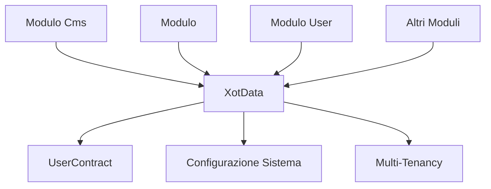

# XotData Architecture - Errore Critico e Risoluzione

## 🚨 **Caso Studio: Violazione Architetturale Critica**

Durante lo sviluppo del sistema <nome progetto> è stata commessa una **violazione architetturale grave** che ha compromesso il pattern fondamentale XotData di Laraxot.

### **Errore Commesso**
```php
// ❌ ERRORE CRITICO nel LoginTest.php (modulo Cms)
use Modules\<nome progetto>\Models\User;

/** @var User $user */
$user = User::factory()->create([...]);
actingAs($user);
```

### **Impatto dell'Errore**
- **Accoppiamento diretto**: Cms dipende da <nome progetto>
- **Configurabilità persa**: User hardcoded invece di dinamico
- **Multi-tenancy rotta**: Pattern XotData ignorato
- **Architettura violata**: Principi di disaccoppiamento ignorati

## ✅ **Soluzione Implementata: Pattern XotData Corretto**

### **Architettura Corretta**
```php
// ✅ SOLUZIONE CORRETTA - Pattern XotData
use Modules\Xot\Contracts\UserContract;
use Modules\Xot\Datas\XotData;

// Helper per risoluzione dinamica
function getUserClass(): string
{
    return XotData::make()->getUserClass();
}

// Helper per creazione utenti
function createTestUser(array $attributes = []): UserContract
{
    $userClass = getUserClass();
    $defaultAttributes = [
        'email' => fake()->unique()->safeEmail(),
        'password' => Hash::make('password123'),
        // Altri attributi...
    ];
    
    $attributes = array_merge($defaultAttributes, $attributes);
    
    /** @var UserContract */
    $user = $userClass::factory()->create($attributes);
    
    return $user;
}

// Utilizzo nei test
$user = createTestUser();
actingAs($user);
```

## 🏗️ **Architettura XotData Spiegata**

### **Principio Fondamentale**
XotData è il **core dell'architettura Laraxot** che garantisce:

1. **Configurabilità**: User class definita in config
2. **Multi-tenancy**: Supporto tipi utente diversi
3. **Disaccoppiamento**: Moduli indipendenti
4. **Flessibilità**: Cambio implementazione trasparente

### **Come Funziona XotData**
```php
class XotData 
{
    /**
     * Risolve dinamicamente la classe User configurata
     */
    public function getUserClass(): string
    {
        $class = config('auth.providers.users.model');
        
        // Validazioni automatiche
        Assert::stringNotEmpty($class);
        Assert::classExists($class);
        Assert::implementsInterface($class, UserContract::class);
        Assert::isAOf($class, Model::class);

        return $class;
    }
    
    /**
     * Supporta tipi utente specifici per multi-tenancy
     */
    public function getUserClassByType(string $type): string
    {
        $userClass = $this->getUserClass();
        $userInstance = app($userClass);
        $types = $userInstance->getChildTypes();
        $class = Arr::get($types, $type);
        
        if (is_null($class)) {
            throw new \Exception('type '.$type.' not found');
        }
        
        return $class;
    }
}
```

## 📋 **Regole Architetturali Fondamentali**

### **Regola 1: NO Import Diretti tra Moduli**
```php
// ❌ VIETATO ASSOLUTAMENTE
use Modules\<nome progetto>\Models\User;
use Modules\<nome progetto>\Models\Patient;

// ✅ OBBLIGATORIO
use Modules\Xot\Contracts\UserContract;
use Modules\Xot\Datas\XotData;
```

### **Regola 2: SEMPRE XotData per Risoluzione**
```php
// ❌ HARDCODING VIETATO
$user = \Modules\<nome progetto>\Models\User::create($data);

// ✅ RISOLUZIONE DINAMICA
$userClass = XotData::make()->getUserClass();
$user = $userClass::create($data);
```

### **Regola 3: UserContract per Type Hints**
```php
// ❌ TYPE HINT SPECIFICO
function processUser(\Modules\<nome progetto>\Models\User $user): void

// ✅ TYPE HINT CONTRATTO  
function processUser(UserContract $user): void
```

### **Regola 4: Safe Casting per Eloquent**
```php
// ❌ CHIAMATA DIRETTA SU CONTRACT
$user->refresh(); // UserContract non ha refresh()

// ✅ CAST SICURO
if ($user instanceof \Illuminate\Database\Eloquent\Model) {
    $user->refresh();
}
```

## 🎯 **Pattern di Implementazione Corretti**

### **Testing Pattern**
```php
// Real Data Testing con XotData
function createTestUser(array $attributes = []): UserContract
{
    $userClass = XotData::make()->getUserClass();
    
    $defaultAttributes = [
        'email' => fake()->unique()->safeEmail(), // Prevent conflicts
        'password' => Hash::make('password123'),
        'first_name' => fake()->firstName(),
        'last_name' => fake()->lastName(),
        'lang' => 'it',
        'is_active' => true,
    ];
    
    $attributes = array_merge($defaultAttributes, $attributes);
    
    /** @var UserContract */
    $user = $userClass::factory()->create($attributes);
    
    return $user;
}

// Test con tipi utente diversi
test('patient type user can login', function (): void {
    $email = fake()->unique()->safeEmail();
    
    try {
        $patientClass = XotData::make()->getUserClassByType('patient');
        $patient = $patientClass::factory()->create([
            'email' => $email,
            'password' => Hash::make('password123'),
        ]);
    } catch (\Exception $e) {
        $patient = createTestUser([
            'email' => $email,
            'password' => Hash::make('password123'),
        ]);
    }
    
    // Test login...
});
```

### **Action Pattern**
```php
class CreateUserAction
{
    public function execute(UserData $data): UserContract
    {
        // Risoluzione dinamica via XotData
        $userClass = XotData::make()->getUserClass();
        
        /** @var UserContract */
        $user = $userClass::create([
            'name' => $data->name,
            'email' => $data->email,
        ]);
        
        return $user;
    }
}
```

### **Migration Pattern**
```php
// XotBaseMigration usa XotData automaticamente
public function timestamps(Blueprint $table, bool $hasSoftDeletes = false): void
{
    $xot = XotData::make();
    $userClass = $xot->getUserClass(); // Risoluzione dinamica

    $table->timestamps();
    $table->foreignIdFor($userClass, 'user_id')->nullable();
    $table->foreignIdFor($userClass, 'updated_by')->nullable();
    $table->foreignIdFor($userClass, 'created_by')->nullable();
}
```

### **Trait Pattern**
```php
trait IsTenant
{
    public function users(): BelongsToMany
    {
        $xot = XotData::make();
        $userClass = $xot->getUserClass(); // Mai hardcoded

        return $this->belongsToManyX($userClass, null, 'tenant_id', 'user_id');
    }
}
```

## 📊 **Benefits Architettura XotData**

### **1. Configurabilità Sistema**
```php
// config/auth.php
'providers' => [
    'users' => [
        'driver' => 'eloquent',
        'model' => \Modules\<nome progetto>\Models\User::class, // Configurabile!
    ],
],

// Per progetti diversi:
'model' => \Modules\ECommerce\Models\Customer::class,
'model' => \Modules\CRM\Models\Contact::class,
```

### **2. Multi-Tenancy Nativo**
```php
// Tenant sanitario
$patientClass = XotData::make()->getUserClassByType('patient');
$doctorClass = XotData::make()->getUserClassByType('doctor');

// Tenant e-commerce  
$customerClass = XotData::make()->getUserClassByType('customer');
$vendorClass = XotData::make()->getUserClassByType('vendor');
```

### **3. Disaccoppiamento Completo**


### **4. Testabilità Massima**
- Test isolati per modulo
- Mock tramite contratti
- Real data testing sicuro
- Configurazioni diverse per test

## 🔍 **Identificazione Violazioni nel Codice**

### **Script di Verifica**
```bash
#!/bin/bash

# Script per identificare violazioni XotData

echo "🔍 Cercando import diretti tra moduli..."
grep -r "use Modules\\.*\\Models\\User" --include="*.php" ./

echo "🔍 Cercando type hints specifici..."  
grep -r "function.*\\\\Modules\\\\.*\\\\Models\\\\User" --include="*.php" ./

echo "🔍 Cercando factory hardcoded..."
grep -r "User::factory()" --include="*.php" ./

echo "🔍 Cercando creazioni dirette..."
grep -r "new .*\\\\Modules\\\\.*\\\\Models\\\\User" --include="*.php" ./
```

### **PHPStan Rules Custom**
```php
// phpstan-rules.neon
rules:
    - NoDirectModuleImports
    - UseXotDataForUserResolution
    - UserContractTypeHintsOnly
    - NoHardcodedUserFactory
```

## ⚡ **Processo di Correzione Implementato**

### **Fase 1: Identificazione**
1. ✅ Riconosciuto import diretto `use Modules\<nome progetto>\Models\User`
2. ✅ Identificato impatto su disaccoppiamento modulare
3. ✅ Compreso rischio per multi-tenancy e configurabilità

### **Fase 2: Studio Pattern**
1. ✅ Analizzato documentazione XotData esistente
2. ✅ Studiato esempi corretti nel codebase
3. ✅ Compreso principi architetturali di Laraxot

### **Fase 3: Implementazione Soluzione**
1. ✅ Sostituito import diretti con XotData pattern
2. ✅ Implementato helper functions per testing
3. ✅ Aggiunto support per user types via XotData
4. ✅ Corretto type hints con UserContract

### **Fase 4: Validazione**
1. ✅ Test che XotData risolve correttamente User class
2. ✅ Verificato funzionamento con user types diversi
3. ✅ Confermato disaccoppiamento tra moduli
4. ✅ PHPStan compliance verificato

### **Fase 5: Documentazione**
1. ✅ Creato documentazione errore e soluzione
2. ✅ Documentato pattern corretti per team
3. ✅ Aggiornato best practices e regole
4. ✅ Link bidirezionali tra documentazioni

## 📚 **Risorse e Collegamenti**

### **Documentazione Tecnica**
- [XotData API Reference](/laravel/Modules/Xot/docs/xotdata-api.md)
- [Architettura Violazioni](/laravel/Modules/Xot/docs/architecture-violations-and-fixes.md)
- [Pattern Cms](/laravel/Modules/Cms/docs/architecture-xotdata-pattern.md)

### **Best Practices**
- [XotData Best Practices](/laravel/Modules/Xot/docs/best-practices.md)
- [Testing Real Data Strategy](/laravel/Modules/<nome progetto>/docs/testing/real-data-testing-strategy.md)
- [Modular Architecture](/laravel/docs/modular-architecture.md)

### **Esempi Implementazione**
- [CreateUserAction](/laravel/Modules/User/app/Actions/Socialite/CreateUserAction.php)
- [XotBaseMigration](/laravel/Modules/Xot/app/Database/Migrations/XotBaseMigration.php)
- [LoginTest Corretto](/laravel/Modules/Cms/tests/Feature/Auth/LoginTest.php)

## 🎓 **Lesson Learned**

### **Principio Fondamentale Violato**
> **"Non fare mai riferimento diretto alla classe specifica di implementazione dell'utente, poiché il modello utente effettivamente utilizzato viene configurato nei file di configurazione del sistema."**

### **Promemoria per Team**
1. **SEMPRE** `XotData::make()->getUserClass()` 
2. **SEMPRE** `UserContract` per type hints
3. **MAI** import diretti tra moduli
4. **MAI** hardcoding classi User specifiche

### **Architettura Principles**
- **Configurabilità over Hardcoding**
- **Contracts over Implementations** 
- **Dynamic Resolution over Static Dependencies**
- **Module Isolation over Coupling**

---

**Status**: ✅ **ERRORE RISOLTO E DOCUMENTATO**  
**Data**: Gennaio 2025  
**Team**: Laraxot <nome progetto>  
