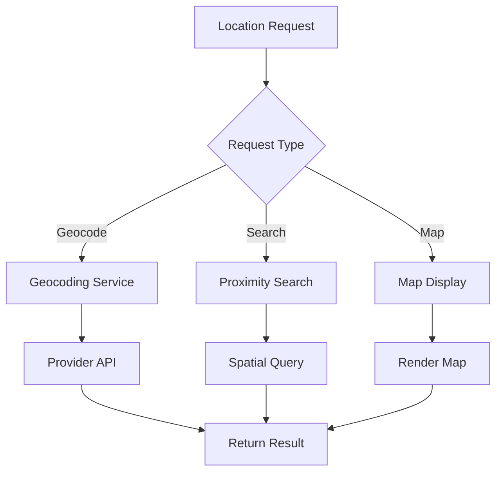

# Product Requirements Document (PRD) - Geo Module

**Module**: Geo
**Version**: 1.0
**Status**: Draft
**Author**: Product Team

---

## Document Control

| Version | Date | Author | Changes |
|---------|------|--------|---------|
| 1.0 | 2026-03-12 | Product Team | Initial draft |

---

## 1. Executive Summary

### 1.1 Problem Statement
> Location-based services are essential for modern applications requiring geographic data, mapping, distance calculations, and location-aware features. Without a dedicated geo services module, implementing maps, geocoding, proximity search, and location-based filtering requires duplicating effort across modules and managing multiple external APIs. The platform needs a centralized geo services module to handle all location-based functionality consistently and efficiently.

### 1.2 Proposed Solution
> The Geo module provides comprehensive geographic services including geocoding (address ↔ coordinates), reverse geocoding, distance calculations, proximity search, map integration, location storage, and geographic queries. It supports multiple mapping providers (Google Maps, Mapbox, OpenStreetMap), implements efficient spatial indexing, and provides a clean API for other modules to leverage location features without managing geographic complexity.

### 1.3 Business Value Proposition
- **Primary Value**: Unified location services enabling geographic features across the platform
- **Secondary Value**: Cost optimization through shared API usage, consistent UX
- **Strategic Alignment**: Enable location-based features for predictions, users, and content

### 1.4 Success Metrics (High-Level)
| Metric | Current | Target | Timeline |
|--------|---------|--------|----------|
| Geocoding Accuracy | N/A | 95%+ | Q3 2026 |
| API Response Time | N/A | <200ms | Q2 2026 |
| Provider Coverage | N/A | 3+ providers | Q2 2026 |
| Module Integration | N/A | 5+ modules | Q3 2026 |

---

## 2. Goals & Objectives

### 2.1 Primary Goals (SMART)
1. **Specific**: Build unified geo API supporting geocoding, distance, and proximity search
2. **Measurable**: Achieve 95%+ geocoding accuracy, <200ms response time
3. **Achievable**: Leverage existing mapping providers and Laravel infrastructure
4. **Relevant**: Critical for location-based predictions and user features
5. **Time-bound**: Core geo services by Q2 2026, advanced features by Q3 2026

### 2.2 Secondary Goals
- Implement geographic analytics and heatmaps
- Build location-based recommendations
- Create geographic data visualization
- Develop offline map caching

### 2.3 Non-Goals
> What this module will NOT do (scope boundaries)
- Real-time GPS tracking (handled by mobile apps)
- Navigation/routing (use dedicated mapping services)
- Indoor mapping (specialized use case)

### 2.4 Key Results (OKRs)
| Objective | Key Result | Target | Status |
|-----------|------------|--------|--------|
| Geographic Excellence | Geocoding accuracy | 95%+ | Pending |
| Performance | API response time | <200ms | Pending |
| Provider Flexibility | Provider integrations | 3+ | Pending |
| Adoption | Module integrations | 5+ | Pending |

---

## 3. Target Users

### 3.1 User Personas

#### Persona 1: Application Developer
| Attribute | Details |
|-----------|---------|
| Role | Backend/Frontend Developer |
| Goals | Add location features without geographic complexity |
| Pain Points | Multiple mapping APIs, coordinate conversions, spatial queries |
| Technical Level | Advanced |
| Usage Frequency | Daily during development |

**User Story**:
> As an Application Developer, I want a simple geo API for geocoding and distance calculations, so that I can add location features without managing mapping providers.

#### Persona 2: End User
| Attribute | Details |
|-----------|---------|
| Role | Platform User |
| Goals | Find location-based content, see nearby items |
| Pain Points | Inaccurate locations, slow map loading, poor UX |
| Technical Level | Basic |
| Usage Frequency | Weekly |

**User Story**:
> As an End User, I want to find predictions and content near my location, so that I can engage with locally relevant information.

#### Persona 3: Data Analyst
| Attribute | Details |
|-----------|---------|
| Role | Business Analyst |
| Goals | Analyze geographic patterns and trends |
| Pain Points | Lack of geographic data, difficult visualization |
| Technical Level | Intermediate |
| Usage Frequency | Weekly |

**User Story**:
> As a Data Analyst, I want to visualize data on maps and analyze geographic patterns, so that I can uncover location-based insights.

### 3.2 Use Cases
| ID | Use Case | Actor | Trigger | Outcome |
|----|----------|-------|---------|---------|
| UC-001 | Geocode address | Developer | Address input | Coordinates returned |
| UC-002 | Reverse geocode | Developer | Coordinates | Address returned |
| UC-003 | Calculate distance | Developer | Two locations | Distance calculated |
| UC-004 | Find nearby items | User | Location search | Nearby results |
| UC-005 | Display map | User | Map view request | Map rendered |
| UC-006 | Store location | Developer | Location data | Location persisted |

### 3.3 Pain Points Addressed
| Pain Point | Severity | How Solved |
|------------|----------|------------|
| Multiple mapping APIs | High | Unified abstraction layer |
| Complex spatial queries | High | Simplified query API |
| Provider lock-in | Medium | Multi-provider support |
| Inconsistent UX | Medium | Standardized map components |

---

## 4. Functional Requirements

### 4.1 Requirements Matrix

| ID | Requirement | Description | Priority | Acceptance Criteria |
|----|-------------|-------------|----------|---------------------|
| FR-001 | Geocoding | Address to coordinates conversion | P0 | 95%+ accuracy |
| FR-002 | Reverse Geocoding | Coordinates to address | P0 | Accurate addresses |
| FR-003 | Distance Calculation | Calculate distance between points | P0 | Multiple units |
| FR-004 | Proximity Search | Find items within radius | P0 | Efficient queries |
| FR-005 | Map Integration | Embed maps in UI | P1 | Multiple providers |
| FR-006 | Location Storage | Store geographic data | P0 | Spatial indexing |
| FR-007 | Geographic Queries | Bounding box, polygon queries | P1 | Spatial operations |
| FR-008 | Provider Abstraction | Multi-provider support | P1 | Provider switching |
| FR-009 | Location Autocomplete | Address autocomplete | P2 | Fast suggestions |
| FR-010 | Map Markers | Display markers on maps | P1 | Custom markers |
| FR-011 | Clustering | Marker clustering | P2 | Performance optimization |
| FR-012 | Heatmaps | Geographic heatmaps | P3 | Data visualization |

### 4.2 Priority Definitions
- **P0 (Critical)**: Must have for launch - core geo services
- **P1 (High)**: Should have - maps, visualization
- **P2 (Medium)**: Nice to have - autocomplete, clustering
- **P3 (Low)**: Future consideration - advanced analytics

### 4.3 Feature Details

#### Feature 1: Geocoding Service
**Description**: Convert addresses to coordinates and vice versa with support for multiple providers and intelligent fallback.

**User Flow**:
```
1. User/developer submits address for geocoding
2. System validates address format
3. Request sent to primary provider
4. On failure, fallback to secondary provider
5. Result cached for future requests
6. Coordinates returned with confidence score
```

**Acceptance Criteria**:
- [ ] Support for Google Maps Geocoding API
- [ ] Support for Mapbox Geocoding API
- [ ] Support for OpenStreetMap Nominatim
- [ ] Automatic provider failover
- [ ] Result caching
- [ ] Confidence score in response

**Dependencies**: External mapping APIs, Redis caching

#### Feature 2: Proximity Search
**Description**: Find items within a specified radius of a location with efficient spatial indexing.

**Acceptance Criteria**:
- [ ] Radius-based search (km, miles)
- [ ] Efficient spatial indexing (geohash)
- [ ] Pagination for large result sets
- [ ] Sort by distance
- [ ] Filter by additional criteria
- [ ] Bounding box queries

**Dependencies**: Database with spatial support

#### Feature 3: Map Integration
**Description**: Embed interactive maps in application UI with markers, popups, and custom controls.

**Acceptance Criteria**:
- [ ] Google Maps integration
- [ ] Mapbox integration
- [ ] OpenStreetMap integration
- [ ] Marker management
- [ ] Info windows/popups
- [ ] Zoom and pan controls
- [ ] Mobile-responsive

**Dependencies**: External map providers, Frontend framework

---

## 5. Non-Functional Requirements

### 5.1 Performance Requirements
| Metric | Requirement | Measurement |
|--------|-------------|-------------|
| Geocoding Response | <200ms | API response time |
| Proximity Search | <500ms | Query execution |
| Map Load Time | <2s | Initial map render |
| Cache Hit Rate | 80%+ | Cached requests |
| Availability | 99.9% | Monthly uptime |

### 5.2 Security Requirements
- [x] API key management for providers
- [x] Rate limiting per API key
- [x] Request validation
- [x] Data encryption in transit
- [x] Privacy compliance (location data)

### 5.3 Scalability Requirements
- Support for 1M+ location records
- Efficient spatial indexing
- CDN for map tiles
- Request queuing for burst handling

### 5.4 Compliance Requirements
- [x] GDPR (location data is personal data)
- [x] Provider terms compliance
- [x] Privacy policy disclosure

---

## 6. User Experience

### 6.1 User Flows


### 6.2 Wireframes
> [Links to Figma/Sketch wireframes - to be created]

### 6.3 Design Principles
- Fast, responsive map loading
- Clear location visualization
- Accessible map controls
- Mobile-first design

### 6.4 Interaction Specifications
| Interaction | Behavior | Feedback |
|-------------|----------|----------|
| Search Location | Typeahead input | Suggestions dropdown |
| Click Map | Set location marker | Marker placement |
| Pan/Zoom | Navigate map | Smooth animation |
| Click Marker | View details | Info window popup |

---

## 7. Technical Considerations

### 7.1 Architecture Overview
```
┌─────────────────────────────────────────────────────────┐
│                    Geo Module                           │
│  ┌──────────────┐  ┌──────────────┐  ┌──────────────┐  │
│  │ Geocoding    │  │ Proximity    │  │ Map          │  │
│  │ Service      │  │ Search       │  │ Integration  │  │
│  └──────────────┘  └──────────────┘  └──────────────┘  │
│  ┌──────────────┐  ┌──────────────┐  ┌──────────────┐  │
│  │ Provider     │  │ Spatial      │  │ Location     │  │
│  │ Abstraction  │  │ Indexing     │  │ Storage      │  │
│  └──────────────┘  └──────────────┘  └──────────────┘  │
└─────────────────────────────────────────────────────────┘
              │              │              │
              ▼              ▼              ▼
    ┌─────────────┐ ┌─────────────┐ ┌─────────────┐
    │   Google    │ │   Mapbox    │ │    OSM      │
    │   Maps      │ │             │ │  Nominatim  │
    └─────────────┘ └─────────────┘ └─────────────┘
```

### 7.2 Dependencies
| Dependency | Type | Version | Criticality |
|------------|------|---------|-------------|
| Laravel | Framework | 12.x | Critical |
| Filament | UI Framework | 5.x | High |
| doctrine/dbal | Database | 3.x | Medium |
| redis | Cache | 7.x | High |

### 7.3 Integration Points
| System | Integration Type | Data Flow | Frequency |
|--------|------------------|-----------|-----------|
| Google Maps API | REST API | Bidirectional | Per request |
| Mapbox API | REST API | Bidirectional | Per request |
| Predict Module | Location Data | Inbound | Per market |
| User Module | User Locations | Inbound | Per user |

### 7.4 Technical Constraints
- PHP 8.3+ required
- Laravel 12+ required
- MySQL 8.0+ with spatial support
- External API rate limits

### 7.5 Database Schema
```sql
CREATE TABLE locations (
    id BIGINT UNSIGNED AUTO_INCREMENT PRIMARY KEY,
    name VARCHAR(255),
    address VARCHAR(500),
    city VARCHAR(100),
    state VARCHAR(100),
    country VARCHAR(100),
    postal_code VARCHAR(20),
    latitude DECIMAL(10, 8),
    longitude DECIMAL(11, 8),
    geohash VARCHAR(12),
    locationable_type VARCHAR(255),
    locationable_id BIGINT UNSIGNED,
    created_at TIMESTAMP DEFAULT CURRENT_TIMESTAMP,
    updated_at TIMESTAMP DEFAULT CURRENT_TIMESTAMP ON UPDATE CURRENT_TIMESTAMP,
    
    SPATIAL INDEX idx_coordinates (latitude, longitude),
    INDEX idx_geohash (geohash),
    INDEX idx_locationable (locationable_type, locationable_id)
);

CREATE TABLE geo_cache (
    id BIGINT UNSIGNED AUTO_INCREMENT PRIMARY KEY,
    query_hash VARCHAR(64) UNIQUE,
    query_type VARCHAR(50),
    query_data JSON,
    result_data JSON,
    provider VARCHAR(50),
    expires_at TIMESTAMP,
    created_at TIMESTAMP DEFAULT CURRENT_TIMESTAMP,
    
    INDEX idx_expires (expires_at)
);
```

---

## 8. Analytics & Metrics

### 8.1 Success Metrics (KPIs)
| KPI | Definition | Target | Measurement Method |
|-----|------------|--------|-------------------|
| Geocoding Accuracy | % accurate results | 95%+ | Manual review |
| API Response Time | Average response | <200ms | Monitoring |
| Cache Hit Rate | % cached requests | 80%+ | Cache stats |
| Provider Uptime | API availability | 99.9% | Health checks |

### 8.2 Tracking Requirements
- Geocoding request volume
- Provider usage and costs
- Cache effectiveness
- Error rates by provider

### 8.3 Reporting Dashboards
- Geo API usage overview
- Provider performance comparison
- Cache effectiveness metrics
- Error tracking

---

## 9. Timeline & Milestones

### 10.1 Key Dates
| Milestone | Date | Status |
|-----------|------|--------|
| Requirements Complete | 2026-03-12 | Complete |
| Design Complete | 2026-03-26 | Pending |
| Development Start | 2026-03-27 | Pending |
| Core Features (P0) | 2026-04-17 | Pending |
| Beta Launch | 2026-04-24 | Pending |
| GA Launch | 2026-05-08 | Pending |

### 10.2 Phase Breakdown
**Phase 1: Discovery** (Weeks 1-2)
- Provider evaluation
- Use case gathering
- Technical research

**Phase 2: Design** (Weeks 3-4)
- API design
- Provider abstraction design
- UI component design

**Phase 3: Development** (Weeks 5-10)
- Sprint 1-2: Geocoding, storage
- Sprint 3-4: Proximity search, maps
- Sprint 5: Polish, testing

**Phase 4: Testing** (Weeks 11-12)
- QA testing
- Performance testing
- Provider testing

**Phase 5: Launch** (Week 13)
- Beta launch
- GA launch

---

## 11. Open Questions

| ID | Question | Owner | Due Date | Status |
|----|----------|-------|----------|--------|
| Q-001 | Which provider should be default? | Tech Lead | 2026-03-20 | Open |
| Q-002 | Should we support offline maps? | Product | 2026-04-01 | Open |
| Q-003 | What is the geocoding budget? | Finance | 2026-03-20 | Open |

---

## 12. Appendix

### 12.1 Glossary
| Term | Definition |
|------|------------|
| Geocoding | Address to coordinates conversion |
| Reverse Geocoding | Coordinates to address conversion |
| Geohash | Hierarchical spatial index |
| Proximity Search | Search within radius |
| Bounding Box | Rectangular geographic area |

### 12.2 References
- [Google Maps API](https://developers.google.com/maps)
- [Mapbox API](https://docs.mapbox.com/)
- [OpenStreetMap](https://www.openstreetmap.org/)

### 12.3 Related PRDs
- [Predict Module PRD](../Predict/docs/PRD.md)
- [User Module PRD](../User/docs/PRD.md)
- [UI Module PRD](../UI/docs/PRD.md)

---

## Approval

| Role | Name | Signature | Date |
|------|------|-----------|------|
| Product Manager | | | |
| Engineering Lead | | | |
| Design Lead | | | |
| Stakeholder | | | |
