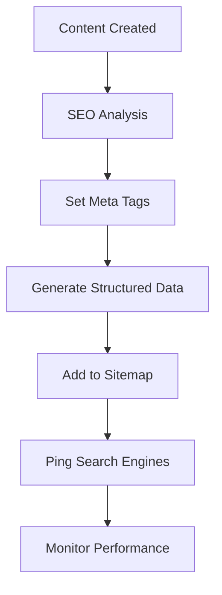

# Product Requirements Document (PRD) - Seo Module

**Module**: Seo
**Version**: 1.0
**Status**: Draft
**Author**: Product Team

---

## Document Control

| Version | Date | Author | Changes |
|---------|------|--------|---------|
| 1.0 | 2026-03-12 | Product Team | Initial draft |

---

## 1. Executive Summary

### 1.1 Problem Statement
> Search engine optimization is critical for organic traffic growth, but implementing SEO best practices across a modular platform requires centralized management of meta tags, sitemaps, structured data, redirects, and performance optimization. Without a dedicated SEO module, each module implements SEO inconsistently, missing opportunities for improved rankings and organic discovery. The platform needs a comprehensive SEO infrastructure to ensure all content is optimized for search engines.

### 1.2 Proposed Solution
> The Seo module provides comprehensive SEO infrastructure including meta tag management, automatic sitemap generation, structured data (Schema.org), canonical URLs, redirect management, SEO analysis and scoring, Open Graph and Twitter Cards, and integration with all content modules. It ensures consistent SEO implementation across the platform and provides tools for monitoring and improving search performance.

### 1.3 Business Value Proposition
- **Primary Value**: Improved organic search visibility and traffic
- **Secondary Value**: Consistent SEO implementation, reduced manual effort
- **Strategic Alignment**: Organic growth, content discoverability, platform visibility

### 1.4 Success Metrics (High-Level)
| Metric | Current | Target | Timeline |
|--------|---------|--------|----------|
| SEO Score Average | N/A | 85+/100 | Q3 2026 |
| Organic Traffic | N/A | +50% YoY | Q4 2026 |
| Indexed Pages | N/A | 100% | Q2 2026 |
| Core Web Vitals | N/A | 90+ score | Q3 2026 |

---

## 2. Goals & Objectives

### 2.1 Primary Goals (SMART)
1. **Specific**: Build comprehensive SEO infrastructure with meta tags, sitemaps, and structured data
2. **Measurable**: Achieve 85+ average SEO score, 100% page indexing
3. **Achievable**: Leverage Laravel SEO packages, existing content modules
4. **Relevant**: Critical for organic growth and content discoverability
5. **Time-bound**: Core SEO by Q2 2026, advanced features by Q3 2026

### 2.2 Secondary Goals
- Implement SEO A/B testing
- Build keyword tracking
- Create competitor analysis
- Develop content optimization recommendations

### 2.3 Non-Goals
> What this module will NOT do (scope boundaries)
- Paid search management (SEM/Google Ads)
- Content creation (handled by content modules)
- Link building outreach (marketing function)

### 2.4 Key Results (OKRs)
| Objective | Key Result | Target | Status |
|-----------|------------|--------|--------|
| SEO Excellence | Average SEO score | 85+/100 | Pending |
| Indexing Coverage | % pages indexed | 100% | Pending |
| Performance | Core Web Vitals | 90+ | Pending |
| Organic Growth | Traffic increase | +50% | Pending |

---

## 3. Target Users

### 3.1 User Personas

#### Persona 1: SEO Manager
| Attribute | Details |
|-----------|---------|
| Role | SEO Specialist |
| Goals | Improve search rankings, monitor performance |
| Pain Points | Inconsistent SEO, manual sitemap updates |
| Technical Level | Intermediate |
| Usage Frequency | Daily |

**User Story**:
> As an SEO Manager, I want to manage meta tags and sitemaps centrally, so that I can optimize content for search engines efficiently.

#### Persona 2: Content Creator
| Attribute | Details |
|-----------|---------|
| Role | Author/Editor |
| Goals | Create SEO-optimized content |
| Pain Points | Complex SEO requirements, unclear guidelines |
| Technical Level | Basic |
| Usage Frequency | Daily |

**User Story**:
> As a Content Creator, I want SEO guidance while creating content, so that I can optimize for search without being an expert.

#### Persona 3: Developer
| Attribute | Details |
|-----------|---------|
| Role | Application Developer |
| Goals | Implement SEO without complexity |
| Pain Points | Manual meta tag management, inconsistent implementation |
| Technical Level | Advanced |
| Usage Frequency | Daily during development |

**User Story**:
> As a Developer, I want simple SEO APIs with automatic implementation, so that I can add SEO features without managing details.

### 3.2 Use Cases
| ID | Use Case | Actor | Trigger | Outcome |
|----|----------|-------|---------|---------|
| UC-001 | Set meta tags | Content Creator | Content creation | Meta tags set |
| UC-002 | Generate sitemap | System | Content change | Sitemap updated |
| UC-003 | Add structured data | System | Page render | Schema.org data |
| UC-004 | Manage redirects | SEO Manager | URL change | Redirect created |
| UC-005 | Analyze SEO | SEO Manager | Content review | SEO score |
| UC-006 | Submit to search | System | Sitemap update | Search notified |

### 3.3 Pain Points Addressed
| Pain Point | Severity | How Solved |
|------------|----------|------------|
| Inconsistent SEO | High | Centralized SEO management |
| Manual sitemaps | High | Automatic generation |
| Missing structured data | Medium | Auto-generation |
| Poor meta management | Medium | Unified interface |

---

## 4. Functional Requirements

### 4.1 Requirements Matrix

| ID | Requirement | Description | Priority | Acceptance Criteria |
|----|-------------|-------------|----------|---------------------|
| FR-001 | Meta Tag Management | Title, description, keywords | P0 | Dynamic meta tags |
| FR-002 | Sitemap Generation | Automatic XML sitemap | P0 | Auto-update |
| FR-003 | Structured Data | Schema.org markup | P0 | JSON-LD output |
| FR-004 | Canonical URLs | Prevent duplicate content | P0 | Canonical tags |
| FR-005 | Open Graph | Social media meta tags | P1 | OG tags |
| FR-006 | Twitter Cards | Twitter meta tags | P1 | Twitter cards |
| FR-007 | Redirect Management | 301/302 redirects | P1 | Redirect manager |
| FR-008 | SEO Analysis | Content SEO scoring | P1 | SEO score |
| FR-009 | Robots.txt | Manage robots.txt | P2 | Dynamic robots |
| FR-010 | Breadcrumbs | Navigation breadcrumbs | P1 | Breadcrumb schema |
| FR-011 | Image SEO | Alt text, optimization | P2 | Image optimization |
| FR-012 | Performance | Core Web Vitals | P1 | Performance metrics |

### 4.2 Priority Definitions
- **P0 (Critical)**: Must have for launch - meta tags, sitemap, structured data
- **P1 (High)**: Should have - OG, Twitter, redirects, analysis
- **P2 (Medium)**: Nice to have - robots, image SEO
- **P3 (Low)**: Future consideration - advanced analytics

### 4.3 Feature Details

#### Feature 1: Meta Tag Management
**Description**: Centralized meta tag management for titles, descriptions, keywords, and social meta tags.

**User Flow**:
```
1. Content creator opens SEO settings
2. Enters SEO title (or uses auto)
3. Enters meta description
4. Previews search snippet
5. Saves meta tags
6. Tags rendered on page
```

**Acceptance Criteria**:
- [ ] Dynamic title tags
- [ ] Meta description management
- [ ] Keyword support (optional)
- [ ] Search snippet preview
- [ ] Character count guidance
- [ ] Auto-generation from content

**Dependencies**: Blog Module, Cms Module

#### Feature 2: Automatic Sitemap
**Description**: Generate and maintain XML sitemaps for all indexable content.

**Acceptance Criteria**:
- [ ] Automatic sitemap generation
- [ ] Sitemap index for large sites
- [ ] Lastmod, changefreq, priority
- [ ] Image sitemap support
- [ ] Video sitemap support
- [ ] Automatic ping to search engines

**Dependencies**: All Content Modules

#### Feature 3: Structured Data
**Description**: Automatic Schema.org structured data generation for rich search results.

**Acceptance Criteria**:
- [ ] Article schema
- [ ] Organization schema
- [ ] Breadcrumb schema
- [ ] FAQ schema
- [ ] Event schema (if applicable)
- [ ] JSON-LD output format

**Dependencies**: Content Modules

---

## 5. Non-Functional Requirements

### 5.1 Performance Requirements
| Metric | Requirement | Measurement |
|--------|-------------|-------------|
| Meta Tag Render | <10ms | Rendering time |
| Sitemap Load | <1s | Sitemap generation |
| SEO Analysis | <500ms | Analysis time |
| Cache Hit Rate | 95%+ | SEO cache |
| Availability | 99.9% | Monthly uptime |

### 5.2 Security Requirements
- [x] Authentication for admin functions
- [x] Authorization for SEO changes
- [x] Input validation
- [x] XSS protection in meta tags

### 5.3 Scalability Requirements
- Support for 10,000+ URLs in sitemap
- Efficient sitemap splitting
- Meta tag caching
- CDN for sitemaps

### 5.4 Compliance Requirements
- [x] Search engine guidelines
- [x] Accessibility (alt text)
- [x] Privacy (no PII in meta)

---

## 6. User Experience

### 6.1 User Flows


### 6.2 Wireframes
> [Links to Figma/Sketch wireframes - to be created]

### 6.3 Design Principles
- Simple SEO interface
- Clear guidance and scoring
- Real-time preview
- Accessible tools

### 6.4 Interaction Specifications
| Interaction | Behavior | Feedback |
|-------------|----------|----------|
| Edit Meta | Input fields | Character count |
| Preview Snippet | Click preview | Search preview |
| View Score | SEO analysis | Score display |
| Manage Redirect | Form submit | Confirmation |

---

## 7. Technical Considerations

### 7.1 Architecture Overview
```
┌─────────────────────────────────────────────────────────┐
│                    Seo Module                           │
│  ┌──────────────┐  ┌──────────────┐  ┌──────────────┐  │
│  │ Meta Tag     │  │ Sitemap      │  │ Structured   │  │
│  │ Manager      │  │ Generator    │  │ Data         │  │
│  └──────────────┘  └──────────────┘  └──────────────┘  │
│  ┌──────────────┐  ┌──────────────┐  ┌──────────────┐  │
│  │ Redirect     │  │ SEO          │  │ Open Graph/  │  │
│  │ Manager      │  │ Analysis     │  │ Twitter      │  │
│  └──────────────┘  └──────────────┘  └──────────────┘  │
└─────────────────────────────────────────────────────────┘
              │              │              │
              ▼              ▼              ▼
    ┌─────────────┐ ┌─────────────┐ ┌─────────────┐
    │    Blog/    │ │   Search    │ │   Cache     │
    │    Cms      │ │  Engines    │ │   (Redis)   │
    └─────────────┘ └─────────────┘ └─────────────┘
```

### 7.2 Dependencies
| Dependency | Type | Version | Criticality |
|------------|------|---------|-------------|
| Laravel | Framework | 12.x | Critical |
| Filament | UI Framework | 5.x | High |
| artesaos/seotools | Package | 1.x | High |
| spatie/laravel-sitemap | Package | 7.x | High |

### 7.3 Integration Points
| System | Integration Type | Data Flow | Frequency |
|--------|------------------|-----------|-----------|
| Blog Module | Article SEO | Inbound | Per article |
| Cms Module | Page SEO | Inbound | Per page |
| Predict Module | Market SEO | Inbound | Per market |
| Media Module | Image SEO | Inbound | Per image |

### 7.4 Technical Constraints
- PHP 8.3+ required
- Laravel 12+ required
- Filament v5 compatibility

### 7.5 Database Schema
```sql
CREATE TABLE seo_meta (
    id BIGINT UNSIGNED AUTO_INCREMENT PRIMARY KEY,
    metaable_type VARCHAR(255),
    metaable_id BIGINT UNSIGNED,
    title VARCHAR(255),
    description TEXT,
    keywords TEXT,
    canonical_url VARCHAR(500),
    og_title VARCHAR(255),
    og_description TEXT,
    og_image VARCHAR(500),
    twitter_card VARCHAR(50),
    created_at TIMESTAMP DEFAULT CURRENT_TIMESTAMP,
    updated_at TIMESTAMP DEFAULT CURRENT_TIMESTAMP ON UPDATE CURRENT_TIMESTAMP,
    
    INDEX idx_metaable (metaable_type, metaable_id)
);

CREATE TABLE redirects (
    id BIGINT UNSIGNED AUTO_INCREMENT PRIMARY KEY,
    from_url VARCHAR(500),
    to_url VARCHAR(500),
    status_code TINYINT DEFAULT 301,
    is_active BOOLEAN DEFAULT TRUE,
    created_at TIMESTAMP DEFAULT CURRENT_TIMESTAMP,
    updated_at TIMESTAMP DEFAULT CURRENT_TIMESTAMP ON UPDATE CURRENT_TIMESTAMP,
    
    INDEX idx_from (from_url)
);

CREATE TABLE seo_scores (
    id BIGINT UNSIGNED AUTO_INCREMENT PRIMARY KEY,
    url VARCHAR(500),
    score INT,
    issues JSON,
    recommendations JSON,
    created_at TIMESTAMP DEFAULT CURRENT_TIMESTAMP,
    
    INDEX idx_url (url)
);
```

---

## 8. Analytics & Metrics

### 8.1 Success Metrics (KPIs)
| KPI | Definition | Target | Measurement Method |
|-----|------------|--------|-------------------|
| SEO Score | Average SEO rating | 85+/100 | SEO analysis |
| Indexed Pages | % pages indexed | 100% | Search Console |
| Organic Traffic | Search traffic | +50% YoY | Analytics |
| Core Web Vitals | Performance score | 90+ | PageSpeed |

### 8.2 Tracking Requirements
- SEO scores over time
- Sitemap coverage
- Redirect usage
- Meta tag completeness

### 8.3 Reporting Dashboards
- SEO overview
- Score trends
- Issue tracking
- Index coverage

---

## 9. Timeline & Milestones

### 9.1 Key Dates
| Milestone | Date | Status |
|-----------|------|--------|
| Requirements Complete | 2026-03-12 | Complete |
| Design Complete | 2026-03-26 | Pending |
| Development Start | 2026-03-27 | Pending |
| Core Features (P0) | 2026-04-17 | Pending |
| Beta Launch | 2026-04-24 | Pending |
| GA Launch | 2026-05-08 | Pending |

---

## 10. Open Questions

| ID | Question | Owner | Due Date | Status |
|----|----------|-------|----------|--------|
| Q-001 | Which SEO package should we use? | Tech Lead | 2026-03-20 | Open |
| Q-002 | Should we integrate with Google Search Console? | Product | 2026-04-01 | Open |
| Q-003 | What is the minimum SEO score threshold? | Product | 2026-03-20 | Open |

---

## 11. Appendix

### 11.1 Glossary
| Term | Definition |
|------|------------|
| Meta Tags | HTML tags for search engines |
| Sitemap | XML file listing pages |
| Structured Data | Schema.org markup |
| Canonical URL | Preferred URL for content |
| Open Graph | Social media meta tags |
| Core Web Vitals | Performance metrics |

### 11.2 References
- [Google SEO Guidelines](https://developers.google.com/search)
- [Schema.org](https://schema.org/)
- [Spatie Sitemap](https://github.com/spatie/laravel-sitemap)

### 11.3 Related PRDs
- [Blog Module PRD](../Blog/docs/PRD.md)
- [Cms Module PRD](../Cms/docs/PRD.md)
- [Predict Module PRD](../Predict/docs/PRD.md)
- [Media Module PRD](../Media/docs/PRD.md)

---

## Approval

| Role | Name | Signature | Date |
|------|------|-----------|------|
| Product Manager | | | |
| Engineering Lead | | | |
| Design Lead | | | |
| Stakeholder | | | |
