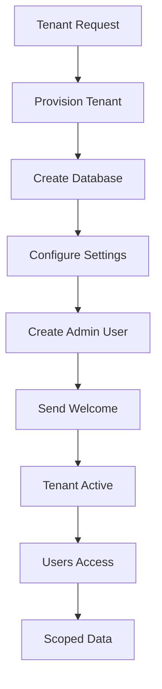

# Product Requirements Document (PRD) - Tenant Module

**Module**: Tenant
**Version**: 1.0
**Status**: Draft
**Author**: Product Team

---

## Document Control

| Version | Date | Author | Changes |
|---------|------|--------|---------|
| 1.0 | 2026-03-12 | Product Team | Initial draft |

---

## 1. Executive Summary

### 1.1 Problem Statement
> Multi-tenancy enables serving multiple organizations or user groups from a single application instance while maintaining data isolation and customization. Without a dedicated tenant management module, implementing multi-tenancy requires complex database separation, tenant-aware queries, and custom isolation logic across all modules. The platform needs a centralized tenant infrastructure to manage tenant provisioning, data isolation, customization, and billing efficiently.

### 1.2 Proposed Solution
> The Tenant module provides comprehensive multi-tenancy infrastructure including tenant provisioning and management, database isolation (single/multi-database), tenant-aware scoping, customization (themes, settings), tenant billing and quotas, and admin tools for tenant oversight. It supports various tenancy models (database-per-tenant, schema-per-tenant, row-level isolation) and integrates with all modules to ensure proper data separation.

### 1.3 Business Value Proposition
- **Primary Value**: Enable SaaS multi-tenancy for serving multiple organizations
- **Secondary Value**: Cost efficiency through shared infrastructure, tenant customization
- **Strategic Alignment**: SaaS business model, market expansion, scalability

### 1.4 Success Metrics (High-Level)
| Metric | Current | Target | Timeline |
|--------|---------|--------|----------|
| Tenant Provisioning Time | N/A | <5 minutes | Q3 2026 |
| Data Isolation Accuracy | N/A | 100% | Q2 2026 |
| Tenant Satisfaction | N/A | 4.5/5 | Q3 2026 |
| Platform Uptime | N/A | 99.9% | Q2 2026 |

---

## 2. Goals & Objectives

### 2.1 Primary Goals (SMART)
1. **Specific**: Build multi-tenancy infrastructure with data isolation and tenant management
2. **Measurable**: Achieve 100% data isolation accuracy, <5 minute provisioning
3. **Achievable**: Leverage Laravel tenancy packages, existing modules
4. **Relevant**: Critical for SaaS business model and scalability
5. **Time-bound**: Core tenancy by Q2 2026, advanced features by Q3 2026

### 2.2 Secondary Goals
- Implement tenant analytics and usage tracking
- Build tenant self-service portal
- Create automated billing integration
- Develop tenant health monitoring

### 2.3 Non-Goals
> What this module will NOT do (scope boundaries)
- Full ERP/CRM functionality (tenant-specific apps)
- Complex enterprise SSO (use identity providers)
- Custom development per tenant (professional services)

### 2.4 Key Results (OKRs)
| Objective | Key Result | Target | Status |
|-----------|------------|--------|--------|
| Tenancy Excellence | Active tenants | 10+ | Pending |
| Data Isolation | Isolation accuracy | 100% | Pending |
| Provisioning Speed | Setup time | <5 min | Pending |
| Tenant Satisfaction | NPS score | 4.5/5 | Pending |

---

## 3. Target Users

### 3.1 User Personas

#### Persona 1: Tenant Administrator
| Attribute | Details |
|-----------|---------|
| Role | Organization Admin |
| Goals | Manage tenant settings, users, billing |
| Pain Points | Complex setup, limited control |
| Technical Level | Intermediate |
| Usage Frequency | Weekly |

**User Story**:
> As a Tenant Administrator, I want to manage my organization's settings and users, so that I can control access and customize the experience.

#### Persona 2: Platform Operator
| Attribute | Details |
|-----------|---------|
| Role | SaaS Operator |
| Goals | Manage tenants, monitor health, billing |
| Pain Points | Manual provisioning, visibility gaps |
| Technical Level | Advanced |
| Usage Frequency | Daily |

**User Story**:
> As a Platform Operator, I want to provision and manage tenants efficiently, so that I can scale the business without operational overhead.

#### Persona 3: End User (Tenant)
| Attribute | Details |
|-----------|---------|
| Role | Tenant User |
| Goals | Use platform within tenant context |
| Pain Points | Confusion between tenants, data leakage |
| Technical Level | Basic |
| Usage Frequency | Daily |

**User Story**:
> As an End User, I want to access my organization's data securely, so that I can work without worrying about data privacy.

### 3.2 Use Cases
| ID | Use Case | Actor | Trigger | Outcome |
|----|----------|-------|---------|---------|
| UC-001 | Create tenant | Platform Operator | New customer | Tenant provisioned |
| UC-002 | Configure tenant | Tenant Admin | Setup | Settings configured |
| UC-003 | Add tenant user | Tenant Admin | New employee | User added |
| UC-004 | Switch tenant | User | Multi-tenant access | Context switched |
| UC-005 | View usage | Tenant Admin | Billing review | Usage report |
| UC-006 | Suspend tenant | Platform Operator | Non-payment | Tenant suspended |

### 3.3 Pain Points Addressed
| Pain Point | Severity | How Solved |
|------------|----------|------------|
| Complex provisioning | High | Automated tenant setup |
| Data isolation concerns | High | Robust isolation layers |
| Limited customization | Medium | Tenant settings, themes |
| Billing complexity | Medium | Usage tracking, quotas |

---

## 4. Functional Requirements

### 4.1 Requirements Matrix

| ID | Requirement | Description | Priority | Acceptance Criteria |
|----|-------------|-------------|----------|---------------------|
| FR-001 | Tenant Provisioning | Create, configure tenants | P0 | Automated setup |
| FR-002 | Database Isolation | Tenant data separation | P0 | Isolation enforced |
| FR-003 | Tenant Scoping | Query scoping per tenant | P0 | Automatic scoping |
| FR-004 | Tenant Settings | Customizable settings | P1 | Settings management |
| FR-005 | User Management | Tenant user administration | P1 | User CRUD |
| FR-006 | Role Management | Tenant-specific roles | P1 | RBAC per tenant |
| FR-007 | Quota Management | Usage limits per tenant | P1 | Quota enforcement |
| FR-008 | Billing Integration | Usage-based billing | P2 | Billing sync |
| FR-009 | Tenant Portal | Self-service admin | P2 | Tenant dashboard |
| FR-010 | Analytics | Usage analytics | P2 | Usage reports |
| FR-011 | Theme Customization | Tenant branding | P3 | Custom themes |
| FR-012 | Domain Mapping | Custom domains | P3 | Domain configuration |

### 4.2 Priority Definitions
- **P0 (Critical)**: Must have for launch - provisioning, isolation, scoping
- **P1 (High)**: Should have - settings, users, roles, quotas
- **P2 (Medium)**: Nice to have - billing, portal, analytics
- **P3 (Low)**: Future consideration - themes, domains

### 4.3 Feature Details

#### Feature 1: Tenant Provisioning
**Description**: Automated tenant creation with database setup, initial configuration, and admin user creation.

**User Flow**:
```
1. Platform operator initiates tenant creation
2. Enters tenant details (name, subdomain, plan)
3. System creates tenant record
4. Database/schema created (if applicable)
5. Initial admin user created
6. Welcome email sent
7. Tenant ready for use
```

**Acceptance Criteria**:
- [ ] Tenant creation form
- [ ] Subdomain/domain assignment
- [ ] Database provisioning
- [ ] Initial configuration
- [ ] Admin user creation
- [ ] Welcome communication
- [ ] Tenant activation

**Dependencies**: User Module, Email System

#### Feature 2: Data Isolation
**Description**: Robust data isolation ensuring tenants cannot access each other's data.

**Acceptance Criteria**:
- [ ] Tenant-aware query scoping
- [ ] Database isolation option
- [ ] Schema isolation option
- [ ] Row-level isolation option
- [ ] Cross-tenant access prevention
- [ ] Isolation testing

**Dependencies**: All Modules

#### Feature 3: Tenant Management
**Description**: Tenant administration including settings, users, roles, and quotas.

**Acceptance Criteria**:
- [ ] Tenant settings management
- [ ] User invitation and management
- [ ] Role assignment
- [ ] Quota configuration
- [ ] Usage viewing
- [ ] Tenant suspension

**Dependencies**: User Module

---

## 5. Non-Functional Requirements

### 5.1 Performance Requirements
| Metric | Requirement | Measurement |
|--------|-------------|-------------|
| Tenant Provisioning | <5 minutes | Setup time |
| Query Overhead | <10% | Scoped vs non-scoped |
| Isolation Check | <1ms | Per query |
| Cross-Tenant Access | 0 | Security requirement |
| Availability | 99.9% | Monthly uptime |

### 5.2 Security Requirements
- [x] Authentication for all tenant access
- [x] Authorization per tenant
- [x] Data isolation enforcement
- [x] Cross-tenant access prevention
- [x] Audit logging
- [x] Encryption per tenant (optional)

### 5.3 Scalability Requirements
- Support for 100+ tenants
- Efficient tenant switching
- Database scaling strategy
- Resource quota enforcement

### 5.4 Compliance Requirements
- [x] GDPR (tenant data handling)
- [x] Data residency (if required)
- [x] Tenant data export

---

## 6. User Experience

### 6.1 User Flows


### 6.2 Wireframes
> [Links to Figma/Sketch wireframes - to be created]

### 6.3 Design Principles
- Clear tenant context indication
- Easy tenant switching
- Secure isolation visibility
- Accessible administration

### 6.4 Interaction Specifications
| Interaction | Behavior | Feedback |
|-------------|----------|----------|
| Switch Tenant | Select from dropdown | Context update |
| View Usage | Navigate to usage | Usage display |
| Manage Users | Admin panel | User list |
| Configure | Settings form | Save confirmation |

---

## 7. Technical Considerations

### 7.1 Architecture Overview
```
┌─────────────────────────────────────────────────────────┐
│                  Tenant Module                          │
│  ┌──────────────┐  ┌──────────────┐  ┌──────────────┐  │
│  │ Tenant       │  │ Database     │  │ Tenant       │  │
│  │ Provisioning │  │ Isolation    │  │ Scoping      │  │
│  └──────────────┘  └──────────────┘  └──────────────┘  │
│  ┌──────────────┐  ┌──────────────┐  ┌──────────────┐  │
│  │ User         │  │ Quota        │  │ Billing      │  │
│  │ Management   │  │ Management   │  │ Integration  │  │
│  └──────────────┘  └──────────────┘  └──────────────┘  │
└─────────────────────────────────────────────────────────┘
              │              │              │
              ▼              ▼              ▼
    ┌─────────────┐ ┌─────────────┐ ┌─────────────┐
    │    User     │ │   MySQL/    │ │  Billing    │
    │   Module    │ │   Postgres  │ │  Provider   │
    └─────────────┘ └─────────────┘ └─────────────┘
```

### 7.2 Dependencies
| Dependency | Type | Version | Criticality |
|------------|------|---------|-------------|
| Laravel | Framework | 12.x | Critical |
| Filament | UI Framework | 5.x | High |
| stancl/tenancy | Package | 3.x | Critical |
| User Module | Internal | 1.x | Critical |

### 7.3 Integration Points
| System | Integration Type | Data Flow | Frequency |
|--------|------------------|-----------|-----------|
| All Modules | Tenant Scoping | Inbound | Per query |
| User Module | Tenant Users | Bidirectional | Per user |
| Billing System | Usage Billing | Outbound | Monthly |

### 7.4 Technical Constraints
- PHP 8.3+ required
- Laravel 12+ required
- Tenancy package compatibility
- Database support (MySQL, PostgreSQL)

### 7.5 Database Schema
```sql
CREATE TABLE tenants (
    id BIGINT UNSIGNED AUTO_INCREMENT PRIMARY KEY,
    name VARCHAR(255),
    slug VARCHAR(100) UNIQUE,
    domain VARCHAR(255) UNIQUE,
    database_name VARCHAR(100),
    status ENUM('active', 'suspended', 'archived'),
    plan VARCHAR(50),
    settings JSON,
    created_at TIMESTAMP DEFAULT CURRENT_TIMESTAMP,
    updated_at TIMESTAMP DEFAULT CURRENT_TIMESTAMP ON UPDATE CURRENT_TIMESTAMP,
    
    INDEX idx_slug (slug),
    INDEX idx_domain (domain)
);

CREATE TABLE tenant_users (
    id BIGINT UNSIGNED AUTO_INCREMENT PRIMARY KEY,
    tenant_id BIGINT UNSIGNED,
    user_id BIGINT UNSIGNED,
    role VARCHAR(50),
    created_at TIMESTAMP DEFAULT CURRENT_TIMESTAMP,
    
    UNIQUE KEY unique_tenant_user (tenant_id, user_id)
);

CREATE TABLE tenant_quotas (
    id BIGINT UNSIGNED AUTO_INCREMENT PRIMARY KEY,
    tenant_id BIGINT UNSIGNED,
    quota_type VARCHAR(100),
    limit_value INT,
    current_value INT DEFAULT 0,
    reset_at TIMESTAMP,
    created_at TIMESTAMP DEFAULT CURRENT_TIMESTAMP,
    
    INDEX idx_tenant (tenant_id)
);
```

---

## 8. Analytics & Metrics

### 8.1 Success Metrics (KPIs)
| KPI | Definition | Target | Measurement Method |
|-----|------------|--------|-------------------|
| Active Tenants | Tenant count | 10+ | Tenant tracking |
| Provisioning Time | Setup duration | <5 min | Timestamps |
| Data Isolation | Breach count | 0 | Security audit |
| Tenant Retention | % retained | 90%+ | Cohort analysis |

### 8.2 Tracking Requirements
- Tenant creation and churn
- Usage per tenant
- Quota utilization
- Billing metrics

### 8.3 Reporting Dashboards
- Tenant overview
- Usage analytics
- Health monitoring
- Billing summary

---

## 9. Timeline & Milestones

### 9.1 Key Dates
| Milestone | Date | Status |
|-----------|------|--------|
| Requirements Complete | 2026-03-12 | Complete |
| Design Complete | 2026-03-26 | Pending |
| Development Start | 2026-03-27 | Pending |
| Core Features (P0) | 2026-04-17 | Pending |
| Beta Launch | 2026-04-24 | Pending |
| GA Launch | 2026-05-08 | Pending |

---

## 10. Open Questions

| ID | Question | Owner | Due Date | Status |
|----|----------|-------|----------|--------|
| Q-001 | Which isolation model should be default? | Tech Lead | 2026-03-20 | Open |
| Q-002 | Should we support custom domains at launch? | Product | 2026-04-01 | Open |
| Q-003 | What billing provider should we integrate? | Product | 2026-03-25 | Open |

---

## 11. Appendix

### 11.1 Glossary
| Term | Definition |
|------|------------|
| Tenant | Organization/customer instance |
| Isolation | Data separation between tenants |
| Scoping | Query filtering by tenant |
| Quota | Usage limit per tenant |

### 11.2 References
- [Laravel Tenancy](https://tenancyforlaravel.com/)
- [Stancl Tenancy Package](https://github.com/stancl/tenancy)

### 11.3 Related PRDs
- [User Module PRD](../User/docs/PRD.md)
- [Gdpr Module PRD](../Gdpr/docs/PRD.md)
- [UI Module PRD](../UI/docs/PRD.md)

---

## Approval

| Role | Name | Signature | Date |
|------|------|-----------|------|
| Product Manager | | | |
| Engineering Lead | | | |
| Design Lead | | | |
| Stakeholder | | | |
